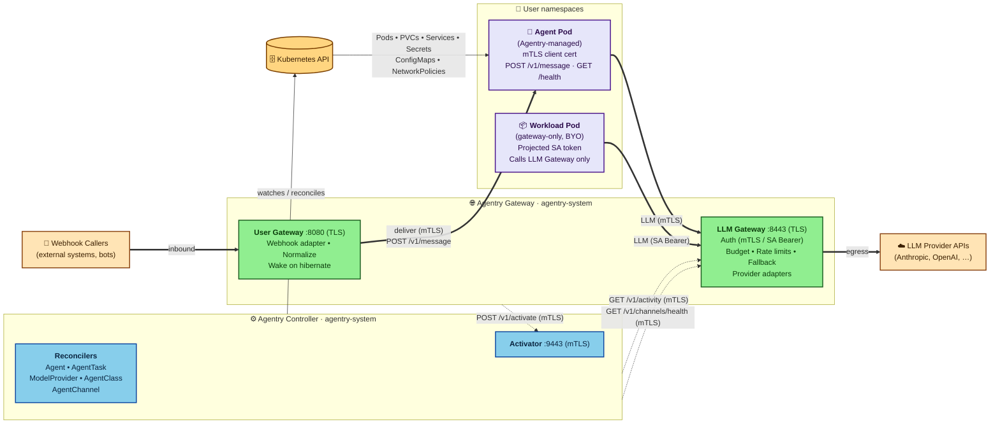

# Agentry — Architecture Overview

This document describes the high-level architecture of Agentry: the control plane, the data plane, and the integration points with the surrounding ecosystem. Agentry is single-cluster in v1; multi-cluster federation is out of scope.

## Documentation Map

| Document | Contents |
|---|---|
| [VISION.md](./VISION.md) | Problem statement, design principles, v1 scope |
| [STORIES.md](./STORIES.md) | Personas and user scenarios driving the design |
| [ARCHITECTURE.md](./ARCHITECTURE.md) | This file — system topology, control/data plane, deployment |
| [API_RESOURCES.md](./API_RESOURCES.md) | CRD specs: AgentClass, ModelProvider, Agent, AgentTask, AgentChannel |
| [API_ENDPOINTS.md](./API_ENDPOINTS.md) | Gateway HTTP endpoints and agent-implemented contracts |
| [GATEWAY_LLM.md](./GATEWAY_LLM.md) | LLM Gateway: routing, budget, fallback, TLS, credentials |
| [GATEWAY_USER.md](./GATEWAY_USER.md) | User Gateway: webhook delivery, activator, activity tracking |
| [CONTROLLER_RECONCILERS.md](./CONTROLLER_RECONCILERS.md) | Operator structure, five reconcilers, error handling |
| [CONTROLLER_LIFECYCLE.md](./CONTROLLER_LIFECYCLE.md) | State machines for Agent and AgentTask, finalizers |
| [SECURITY.md](./SECURITY.md) | Trust model, RBAC, credential lifecycle, TLS, isolation |
| [DEPLOYMENT.md](./DEPLOYMENT.md) | Helm chart contents, prerequisites, certificate lifecycle, tiered on-ramp |
| [RUNTIME_CONTRACT.md](./RUNTIME_CONTRACT.md) | The contract a container image must satisfy to run as an Agent or AgentTask |
| [STARTER_TEMPLATES.md](./STARTER_TEMPLATES.md) | Go and Python starter templates implementing the runtime contract |
| [OBSERVABILITY.md](./OBSERVABILITY.md) | Aggregated metrics catalog, dashboards, alerting (TODO) |

## System Topology

The dashed edges are the three internal control-plane RPCs between Controller and Gateway. All three are [mTLS with SAN-based authorization](./SECURITY.md#internal-endpoint-authentication-activator--activity-api).

## Control Plane

The Agentry control plane consists of a single operator (Go, built on `controller-runtime`) running as a Deployment in a dedicated namespace (`agentry-system`). The operator hosts five reconcilers:

1. [**Agent Reconciler**](./CONTROLLER_RECONCILERS.md#agentreconciler) — watches `Agent` resources. Translates each Agent into a Pod, PVC, Service, and ConfigMap, and drives the [persistent-agent state machine](./CONTROLLER_LIFECYCLE.md#agent-persistent-mode) (idle detection, hibernation, wake-on-demand).

2. [**AgentTask Reconciler**](./CONTROLLER_RECONCILERS.md#agenttaskreconciler) — watches `AgentTask` resources. Creates a Pod to execute the task, monitors the [completion condition](./CONTROLLER_LIFECYCLE.md#agenttask) (`agentReported` or `exitCode`), and tears down resources on completion or timeout.

3. [**ModelProvider Reconciler**](./CONTROLLER_RECONCILERS.md#modelproviderreconciler) — watches `ModelProvider` resources. Validates provider configuration, verifies the referenced Secret exists and is well-formed, maintains provider health status, and manages per-namespace spend state.

4. [**AgentClass Reconciler**](./CONTROLLER_RECONCILERS.md#agentclassreconciler) — watches `AgentClass` resources. Validates that referenced ModelProviders exist, maintains usage counts, and updates status conditions.

5. [**AgentChannel Reconciler**](./CONTROLLER_RECONCILERS.md#agentchannelreconciler) — watches `AgentChannel` resources. Validates that the referenced Agent exists and has a Service, validates channel credentials, and monitors channel health (the controller polls the gateway via [`GET /v1/channels/health`](./GATEWAY_LLM.md#per-path-client-auth-enforcement) on the gateway's `:8443` listener). The gateway watches AgentChannel resources directly for platform connection management.

The controller does **not** host admission webhooks. Field-level validation uses CEL expressions in CRD schemas; [cross-resource validation](./API_RESOURCES.md#cross-resource-validation) (reference resolution, image allowlists, provider access) is handled at reconcile time and surfaced as status conditions rather than admission errors.

The controller exposes an internal ClusterIP Service (`agentry-controller.agentry-system.svc.cluster.local`, default port 9443) for the activator endpoint (`POST /v1/activate/{namespace}/{agentName}`). The same listener on each controller Pod also serves `/healthz` and `/readyz` for kubelet probes, which target the Pod directly rather than going through the Service. The activator endpoint requires [**mTLS**](./SECURITY.md#internal-endpoint-authentication-activator--activity-api): the controller serves TLS with the `agentry-controller-tls` certificate, and the gateway must present its `agentry-gateway-tls` client cert with a SAN matching the gateway Service DNS — any other CA-signed cert is rejected. The listener uses the same [mixed client-auth pattern as the gateway's `:8443`](./GATEWAY_LLM.md#per-path-client-auth-enforcement) — `tls.VerifyClientCertIfGiven` at the handshake so cert-less kubelet probes succeed, with per-path HTTP middleware enforcing mTLS-with-SAN on `/v1/activate` only. Both certificates are issued by the `agentry-ca-issuer` `ClusterIssuer` (see [Deployment Model](#deployment-model)) and rotated by cert-manager.

The activator handler is served on **every** controller replica, not only the leader: the handler patches `agentry.io/wake=true` on the target Agent, and the leader's existing Agent watch fires the manual-wake path in the reconciler. This keeps the Service round-robin behavior correct without any leader-aware endpoint plumbing.

The gateway uses this Service to send wake requests when a channel message arrives for a hibernated agent. The activator returns 202 Accepted as soon as the wake annotation patch is committed; the gateway observes wake completion by polling the agent's Service for readiness, not by waiting on the [activator response](./GATEWAY_USER.md#activator) (steps 3–4).

The reverse direction — controller → gateway — is the [**activity API**](./GATEWAY_USER.md#activity-tracking-api) (`GET /v1/activity?namespace={ns}`), used by the AgentReconciler to read per-namespace last-activity timestamps for idle and hibernation transitions. It is served on the gateway's `:8443` LLM listener (**not** the User listener on `:8080`, so an Ingress fronting `:8080` cannot route untrusted traffic to it). Per-path middleware on this listener enforces [mTLS-with-SAN](./GATEWAY_LLM.md#per-path-client-auth-enforcement) on `/v1/activity` — the controller presents `agentry-controller-tls`, and only client certs whose SAN matches the controller Service DNS are admitted (Agent/AgentTask certs are rejected with 403). The controller dials each gateway Pod IP directly rather than the Service, since [activity timestamps are in-memory per replica](#the-agentry-gateway).

Leader election is enabled so the operator can run with multiple replicas for availability.

The controller's [RBAC surface](./SECURITY.md#operator-serviceaccount) covers cluster-scoped CRD watches, child-resource management, and dynamic per-channel roles.

## Data Plane

The data plane is what actually runs when an Agent is created. For each Agent in `Running` state, the controller provisions:

- **One Pod** containing the user's agent container. The Pod runs under the [RuntimeClass](./SECURITY.md#runtimeclass) specified by its AgentClass (runc, gVisor, or Kata).
- **One PVC** if the [Agent spec requests persistence](./API_RESOURCES.md#spec-2), mounted into the agent container at a configured path.
- **One Service** (ClusterIP) exposing the agent's HTTPS endpoint for intra-cluster traffic. The gateway uses this Service to deliver channel messages via [`POST /v1/message`](./API_ENDPOINTS.md#post-v1message-agent-only--agent-implemented) over TLS; direct external exposure remains the developer's responsibility.
- **One [cert-manager `Certificate`](./SECURITY.md#lifecycle-of-an-agent-tls-serving-certificate)** (and the Secret it writes) holding a per-agent TLS cert (`server auth, client auth`) signed by the `agentry-ca-issuer` `ClusterIssuer` and rotated continuously by cert-manager; the same cert serves the agent's HTTPS listener and is presented client-side on every agent→gateway call. The Agentry CA bundle is projected into Pods at `/var/run/agentry/ca.crt` from the `agentry-ca` ConfigMap maintained by trust-manager, and kubelet refreshes the volume when the ConfigMap changes.
- **One ConfigMap** holding non-sensitive agent configuration (gateway endpoint, feature flags).
- **One NetworkPolicy** synthesized from the AgentClass network policy and the gateway's egress allow rule. This is the load-bearing primitive cited in the [gateway architecture analysis](./GATEWAY_LLM.md#architecture-option-analysis) for keeping LLM credentials inside `agentry-system` — see the [full rule set](./CONTROLLER_RECONCILERS.md#agentreconciler) (AgentReconciler step 6). **NetworkPolicy enforcement by the cluster CNI is a required prerequisite of Agentry's trust model.** On the message path, the synthesized ingress rule is **layered with the [agent-side mTLS check on `POST /v1/message`](./SECURITY.md#in-cluster-tls-bidirectional)** (specified in [RUNTIME_CONTRACT.md](./RUNTIME_CONTRACT.md), bullet 4) — a misconfigured per-Agent NP does not open delivery to arbitrary in-cluster callers. The synthesized egress rule remains the sole control preventing agents from calling provider IPs directly, which is why CNI enforcement of NetworkPolicy is still a hard prerequisite. Clusters running default kindnet or default flannel do not enforce NetworkPolicy and are not supported deployment targets. See also [Recommendation #4](./SECURITY.md#recommendations-for-deployment).

There is no sidecar container. The **Agentry Gateway** in `agentry-system` handles all LLM traffic and inbound channel messages as a shared cluster-level service.

For AgentTask, the data plane is the same minus the Service (tasks do not typically receive channel messages); a `{taskName}-completion` ConfigMap is pre-created when [`completion.condition: agentReported`](./CONTROLLER_LIFECYCLE.md#agenttask) so the gateway can write the completion payload.

## The Agentry Gateway

The gateway is a replicated Deployment in `agentry-system`. It exposes two TLS listeners — `:8443` for outbound LLM traffic and internal mTLS endpoints, `:8080` for inbound channel webhooks — together hosting four classes of traffic, grouped below by call class:

[**LLM Gateway**](./GATEWAY_LLM.md#llm-gateway--request-flow) (outbound, agent → provider).
- Serves TLS on port 8443; agent containers connect via `$AGENTRY_GATEWAY_ENDPOINT` (HTTPS, always injected)
- [Identifies the source namespace](./GATEWAY_LLM.md#namespace-identification) via mTLS client-cert SAN (Agentry-managed Agent/AgentTask Pods) or `TokenReview`-validated ServiceAccount bearer token (gateway-only tier), with a source-IP → Pod cross-check from the informer cache as defense in depth
- [Resolves the target ModelProvider](./GATEWAY_LLM.md#provider-routing) from the qualified `provider/model` name and the Agent's `spec.providers`, then [validates model and namespace access](./GATEWAY_LLM.md#request-format-detection)
- Enforces soft budget guardrails and per-namespace rate limits
- Routes to the upstream provider; on failure, walks the [fallback chain](./GATEWAY_LLM.md#fallback-logic)
- [Extracts token usage](./GATEWAY_LLM.md#provider-adapters) and [updates spend counters](./GATEWAY_LLM.md#budget-state-management)
- Returns structured [error responses](./API_ENDPOINTS.md#llm-gateway-error-responses) (JSON with `error.type`) on failure

[**User Gateway**](./GATEWAY_USER.md#user-gateway--request-flow) (inbound, channel → agent).
- Watches `AgentChannel` resources directly (rather than reading routing data published by the controller) so inbound webhook routing reflects channel changes without controller-mediated propagation latency. The gateway [routes only to channels](./GATEWAY_USER.md#user-gateway--request-flow) whose `status.conditions[Ready].status == True` (step 4), so controller validation (path conflicts, bad references) still gates traffic
- Listens on port 8080 over [TLS](./GATEWAY_USER.md#tls-and-ingress) (backend re-encrypt vs TLS pass-through)
- Normalizes inbound webhook payloads into the Agentry message envelope and resolves the target Agent via the AgentChannel resource
- If the agent is `Hibernated`, signals the controller to wake it via the [mTLS-authenticated activator endpoint](./GATEWAY_USER.md#activator) and waits until the Pod is ready (bounded by `wakeTimeout`)
- Delivers the message to the agent container via [`POST /v1/message`](./API_ENDPOINTS.md#post-v1message-agent-only--agent-implemented)
- Supports per-AgentChannel sync (default) and async response modes — [configuration](./API_RESOURCES.md#spec-4) and [callback/polling protocol](./API_ENDPOINTS.md#async-webhook-response-gateway-managed)
- v1 supports webhook channels only; Discord and WhatsApp adapters are planned for v1.1

**Gateway-Internal API** (mTLS on `:8443`) — these endpoints are not part of the LLM proxy or webhook flows but share the LLM Gateway listener so that mTLS-authenticated callers (agents, AgentTasks, controller) reach them without standing up a separate listener. [Reserved](./API_ENDPOINTS.md#reserved-gateway-paths) under the `/v1/` prefix.
- [`POST /v1/task/complete`](./API_ENDPOINTS.md#post-v1taskcomplete-agenttask-only) (agent → gateway): the AgentTask agent reports completion; the gateway updates the pre-existing `{taskName}-completion` ConfigMap referenced under [Data Plane](#data-plane).
- [`POST /v1/agent/heartbeat`](./API_ENDPOINTS.md#post-v1agentheartbeat-agent-only) (agent → gateway): liveness signal feeding the `agentHeartbeat` activity source.
- [`GET /v1/activity?namespace={ns}`](./GATEWAY_USER.md#activity-tracking-api) (controller → gateway): per-namespace activity timestamps for idle and hibernation transitions.
- [`GET /v1/channels/health`](./API_ENDPOINTS.md#get-v1channelshealth-internal--controller-use-only) (controller → gateway): per-channel platform-connection health.

All four enforce [mTLS-with-SAN at the path layer](./GATEWAY_LLM.md#per-path-client-auth-enforcement).

[LLM provider credentials](./SECURITY.md#lifecycle-of-an-llm-api-key) are stored as Secrets in `agentry-system` and read directly by the gateway. They never leave the `agentry-system` namespace.

The gateway's [RBAC surface](./SECURITY.md#gateway-serviceaccount-permissions) covers cluster-scoped `create` on `tokenreviews` for the gateway-only tier and the Pod/AgentChannel watches for routing.

**Multi-replica state.** The gateway runs as multiple replicas, and each piece of per-namespace state has a defined cross-replica reconciliation path rather than living per-replica only:

- [**Spend counters**](./GATEWAY_LLM.md#budget-state-management): each replica server-side-applies its partials to the `agentry-budget-{providerName}` ConfigMap in `agentry-system` (keyed by Pod name); the [ModelProviderReconciler](./CONTROLLER_RECONCILERS.md#modelproviderreconciler) sums partials, prunes stale-replica entries, and writes a `_canonical` total that replicas re-initialize from on startup (step 3). Bounded overspend is accepted as a soft-guardrail trade-off.
- [**Rate-limit token buckets**](./GATEWAY_LLM.md#rate-limiting): each replica divides the configured cluster-wide ceiling by the live replica count from its Pod informer and adjusts on the next refill cycle when replicas scale.
- [**Activity timestamps**](./GATEWAY_USER.md#activity-tracking-api): kept in-memory per replica (no etcd writes per request). The gateway records two signal sources separately per agent — `gatewayTraffic` (LLM-gateway requests and inbound channel-message deliveries observed by that replica) and `agentHeartbeat` (agent-emitted heartbeats); the controller selects which to use per-Agent via `spec.lifecycle.activitySource` (`gatewayTraffic`, `agentHeartbeat`, or `both`, where `both` takes the max of the two timestamps) when evaluating idle and hibernation transitions. The [AgentReconciler](./CONTROLLER_RECONCILERS.md#agentreconciler) enumerates gateway Pods via its Pod informer in `agentry-system` and fans out one `GET /v1/activity?namespace={ns}` per Pod IP, takes the most-recent timestamp per agent per source across responses, and caches the result in a short reconciler-local window to bound query load (step 8). Activity state is ephemeral; each replica's response includes its own `startedAt`, which the controller compares against the Agent's `status.phaseTransitionTime` — a recently-restarted replica's missing data is treated as unknown while fresher data from peers is still used, and idle/hibernation transitions are deferred only when no replica has been up for `idleTimeout`. Replicas that fail to respond (connection refused, timeout) are skipped; the controller uses the data from the remaining replicas. If every replica is unreachable, the controller preserves the agent's current phase rather than transitioning.

## Observability

Both the controller and the gateway expose Prometheus metrics on dedicated ports. The metric catalogs and emit-points are documented per-component:

- [Controller metrics](./CONTROLLER_RECONCILERS.md#observability) — reconcile counts/duration/queue depth, agent/task phase counts, hibernation/wake/budget events.
- [LLM Gateway metrics](./GATEWAY_LLM.md#observability) — request counts/duration, token usage, spend, fallback events, budget utilization.
- [User Gateway metrics](./GATEWAY_USER.md#observability) — channel message counts/duration, hibernation wakes triggered.

Aggregated dashboards, alerting recommendations, and log/trace conventions will live in [OBSERVABILITY.md](./OBSERVABILITY.md) (TODO).

## Agent Runtime Contract

Agentry is BYO-image: any container can be an Agent provided it implements a small contract — an HTTPS health endpoint on `$AGENTRY_HEALTH_PORT`, graceful SIGTERM handling, authenticated calls to `$AGENTRY_GATEWAY_ENDPOINT` (mTLS for Agentry-managed Pods, `TokenReview`-validated SA token for the gateway-only tier), an optional `POST /v1/message` handler when an AgentChannel is in use, and `messageId`-based deduplication when hibernation is enabled.

The full contract — required env vars, TLS reload semantics, dedup buffer, optional heartbeat and task-completion endpoints — is specified in [RUNTIME_CONTRACT.md](./RUNTIME_CONTRACT.md). Working implementations of the contract ship as [Go and Python starter templates](./STARTER_TEMPLATES.md).

## Integration Points

### Agent Sandbox (optional backend — v1.1)

An `AgentClass` will be able to specify [`spec.runtime.backend: agentSandbox`](./API_RESOURCES.md#spec) (v1.1). When set, the Agent Reconciler will create `Sandbox` custom resources (from the SIG Apps Agent Sandbox project) instead of raw Pods. This will give Agentry agents access to Agent Sandbox's warm pools and enhanced isolation without reimplementing those features. In v1, the only supported backend is `pod` — the CRD schema rejects `agentSandbox` at apply time.

### MCP (Model Context Protocol)

Agentry does not mandate MCP but is compatible with it. Agent containers are free to connect to MCP servers for tool access. AgentClass may declare a list of [`allowedMCPServers`](./API_RESOURCES.md#spec) that the agent container can reach via NetworkPolicy constraints. MCP server provisioning itself is out of scope for v1.

### LLM Providers

Agentry supports any HTTP-based LLM provider. Out of the box, the gateway understands Anthropic, OpenAI, Google Vertex, and OpenAI-compatible endpoints (including Ollama, vLLM, LiteLLM gateways). Adding a new provider type is a [plugin-style extension in the gateway](./GATEWAY_LLM.md#provider-adapters).

### Channel Platforms

The User Gateway ships with a **generic webhook adapter** in v1 (inbound HTTP POST with configurable auth). Discord and WhatsApp adapters are planned for v1.1 — they require persistent connections and platform-specific reconnection logic. Additional platform adapters follow the same plugin pattern as LLM provider adapters.

## Scoping Summary

| Concern | Where it lives |
|---|---|
| Policy (who can use what, at what cost) | AgentClass, ModelProvider (cluster-scoped) |
| Workload definition | Agent, AgentTask (namespace-scoped) |
| Channel integration | AgentChannel (namespace-scoped) |
| Lifecycle orchestration | Agentry Controller (cluster-level) |
| Runtime isolation | RuntimeClass via AgentClass, or Sandbox backend |
| LLM traffic / spend tracking | LLM Gateway in agentry-system (shared) |
| Channel message routing | User Gateway in agentry-system (shared) |
| Tool access | MCP (external, not managed by Agentry in v1) |
| External exposure | Ingress/Gateway (user-managed, not Agentry) |
| Observability | Controller + Gateway Prometheus metrics; see Observability section |

## Deployment Model

Agentry ships as a Helm chart. **cert-manager, trust-manager, and an NP-enforcing CNI are required prerequisites** — see [SECURITY.md § Network Policy](./SECURITY.md#network-policy) and the NetworkPolicy bullet under [Data Plane](#data-plane). The chart supports a two-tier on-ramp: a **gateway-only** tier (existing workloads point at the gateway via projected ServiceAccount tokens for LLM traffic and spend tracking, with no AgentClass or Agent resources) and a **full agent lifecycle** tier (Agents, AgentTasks, AgentChannels, hibernation and wake-on-demand, mTLS via per-agent certificates).

At a type level, the chart deploys:

- 5 CRDs (AgentClass, ModelProvider, Agent, AgentTask, AgentChannel)
- Controller and Gateway Deployments (the Gateway with a PodDisruptionBudget and a rolling-update strategy), plus their ServiceAccounts, ClusterRoles, and ClusterRoleBindings
- cert-manager `ClusterIssuer`s (a self-signed root and `agentry-ca-issuer`) and `Certificate`s for the gateway and controller serving certs (per-Agent and per-AgentTask `Certificate`s are issued at reconcile time, not by the chart)
- A trust-manager `Bundle` projecting the `agentry-ca` ConfigMap into non-system namespaces
- A default `standard` AgentClass and an optional `sandboxed` AgentClass example

For the full chart contents, the certificate inventory, the operational Helm values (`gateway.replicas`, `gateway.callbackUrl.allowlist`, `controller.networkPolicy.dnsSelector`, `gateway.externalHostnames`, `gateway.maxFallbackDepth`, `trustManager.bundleSelector`), and the per-tier setup details, see [DEPLOYMENT.md](./DEPLOYMENT.md).
