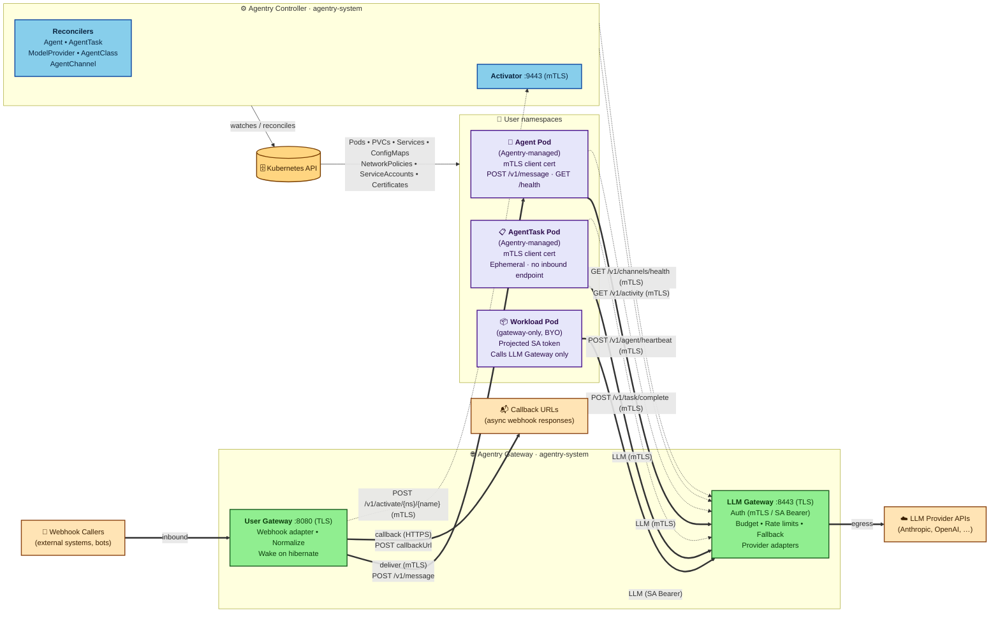

# Agentry — Architecture Overview

This document describes the high-level architecture of Agentry: the control plane, the per-Agent and per-Task workload resources, the shared Agentry Gateway, and the integration points with the surrounding ecosystem. Agentry is single-cluster in v1; multi-cluster federation is out of scope.

## Documentation Map

| Document | Contents |
|---|---|
| [VISION.md](./VISION.md) | Problem statement, design principles, v1 scope |
| [STORIES.md](./STORIES.md) | Personas and user scenarios driving the design |
| [ARCHITECTURE.md](./ARCHITECTURE.md) | This file — system topology, control plane, per-Agent/per-Task resources, gateway, deployment |
| [API_RESOURCES.md](./API_RESOURCES.md) | CRD specs: AgentClass, ModelProvider, Agent, AgentTask, AgentChannel |
| [API_ENDPOINTS.md](./API_ENDPOINTS.md) | Gateway HTTP endpoints and agent-implemented contracts |
| [GATEWAY_LLM.md](./GATEWAY_LLM.md) | LLM Gateway: routing, budget, fallback, TLS, credentials |
| [GATEWAY_USER.md](./GATEWAY_USER.md) | User Gateway: webhook delivery, activator, activity tracking |
| [CONTROLLER_RECONCILERS.md](./CONTROLLER_RECONCILERS.md) | Operator structure, five reconcilers, error handling |
| [CONTROLLER_LIFECYCLE.md](./CONTROLLER_LIFECYCLE.md) | State machines for Agent and AgentTask, finalizers |
| [SECURITY.md](./SECURITY.md) | Trust model, RBAC, credential lifecycle, TLS, isolation |
| [DEPLOYMENT.md](./DEPLOYMENT.md) | Helm chart contents, prerequisites, certificate lifecycle, tiered on-ramp |
| [RUNTIME_CONTRACT.md](./RUNTIME_CONTRACT.md) | The contract a container image must satisfy to run as an Agent or AgentTask |
| [STARTER_TEMPLATES.md](./STARTER_TEMPLATES.md) | Go and Python starter templates implementing the runtime contract |
| [OBSERVABILITY.md](./OBSERVABILITY.md) | Aggregated metrics catalog, dashboards, alerting (TODO) |

## System Topology

The dashed edges are internal mTLS RPCs — all require mTLS-with-SAN at the listener and reject the LLM proxy's `TokenReview`-validated SA-bearer alternative. Four are served on the Gateway's `:8443` listener (`/v1/activity`, `/v1/channels/health`, `/v1/task/complete`, `/v1/agent/heartbeat`); the activator wake is served on the Controller's `:9443`. See [The Agentry Gateway](#the-agentry-gateway) for the consolidated path → SAN mapping on `:8443` (including the handler-level Agent-vs-AgentTask split layered on the shared admission), [Control Plane](#control-plane) for the activator's SAN policy, and [SECURITY.md](./SECURITY.md#internal-endpoint-authentication-activator-activity-channel-health) for the underlying [per-path middleware](./GATEWAY_LLM.md#per-path-client-auth-enforcement) pattern.

## Adoption Tiers

Agentry can be adopted at two depths. Several behaviors throughout this document branch on which tier a workload belongs to:

- **Gateway-only tier.** Existing workloads call the gateway via projected ServiceAccount tokens for LLM traffic and spend tracking, with no Agent / AgentClass / AgentChannel resources. Provider access is gated by `ModelProvider.allowedNamespaces` alone, since there is no Agent or AgentClass to consult.
- **Full lifecycle tier.** Agents, AgentTasks, and AgentChannels managed by the operator, with hibernation, wake-on-demand, and per-Pod mTLS via cert-manager-issued certificates.

The chart-level framing — Helm values, prerequisites, on-ramp ordering — is in [Deployment Model](#deployment-model).

## Control Plane

The Agentry control plane consists of a single operator (Go, built on `controller-runtime`) running as a Deployment in a dedicated namespace (`agentry-system`). The operator hosts five reconcilers:

1. [**Agent Reconciler**](./CONTROLLER_RECONCILERS.md#agentreconciler) — watches `Agent` resources. Translates each Agent into a Pod, PVC, Service, and ConfigMap, and drives the [persistent-agent state machine](./CONTROLLER_LIFECYCLE.md#agent-persistent-mode) (idle detection, hibernation, wake-on-demand).

2. [**AgentTask Reconciler**](./CONTROLLER_RECONCILERS.md#agenttaskreconciler) — watches `AgentTask` resources. Creates a Pod to execute the task, monitors the [completion condition](./CONTROLLER_LIFECYCLE.md#agenttask) (`agentReported` or `exitCode`), and tears down resources on completion or timeout.

3. [**ModelProvider Reconciler**](./CONTROLLER_RECONCILERS.md#modelproviderreconciler) — watches `ModelProvider` resources. Validates provider configuration, verifies the referenced Secret exists and is well-formed, maintains provider health status, and manages per-namespace spend state.

4. [**AgentClass Reconciler**](./CONTROLLER_RECONCILERS.md#agentclassreconciler) — watches `AgentClass` resources. Validates that referenced ModelProviders exist, maintains usage counts, and updates status conditions.

5. [**AgentChannel Reconciler**](./CONTROLLER_RECONCILERS.md#agentchannelreconciler) — watches `AgentChannel` resources. Validates that the referenced Agent exists with a Service enabled, validates channel credentials and `callbackUrl` (per [validation rule 22](./API_RESOURCES.md#cross-resource-validation)), sets `status.conditions[type=Ready]` from those validations (the gate the gateway uses to admit webhook traffic), and populates `status.conditions[type=PlatformConnected]` (observational only) by polling the gateway via [`GET /v1/channels/health`](./API_ENDPOINTS.md#get-v1channelshealth-internal--controller-use-only). The gateway gates webhook routing on `Ready` alone; `PlatformConnected` is for user/operator visibility. See [GATEWAY_USER.md § Channel Health Tracking](./GATEWAY_USER.md#channel-health-tracking) for the rolling-window tri-state contract (`success` / `failure` / `empty`) and the per-replica reduction rules.

The controller does **not** host admission webhooks. Field-level validation uses CEL expressions in CRD schemas; [cross-resource validation](./API_RESOURCES.md#cross-resource-validation) (reference resolution, image allowlists, provider access) is handled at reconcile time and surfaced as status conditions rather than admission errors.

The controller exposes an internal ClusterIP Service (`agentry-controller.agentry-system.svc.cluster.local`, default port 9443) for the activator endpoint (`POST /v1/activate/{namespace}/{agentName}`). The same listener on each controller Pod also serves `/healthz` and `/readyz` for kubelet probes, which target the Pod directly rather than going through the Service. The activator endpoint requires [**mTLS**](./SECURITY.md#internal-endpoint-authentication-activator-activity-channel-health) with a SAN matching the gateway Service DNS — the controller presents `agentry-controller-tls` and the gateway presents `agentry-gateway-tls`, both issued by the `agentry-ca-issuer` `ClusterIssuer` (see [Deployment Model](#deployment-model)) and rotated by cert-manager. The handshake mode (which lets cert-less kubelet probes coexist with the mTLS-with-SAN gate) and the per-path middleware are documented in [SECURITY.md § Internal Endpoint Authentication](./SECURITY.md#internal-endpoint-authentication-activator-activity-channel-health) and [GATEWAY_LLM.md § Per-path client-auth enforcement](./GATEWAY_LLM.md#per-path-client-auth-enforcement).

The activator handler is served on **every** controller replica, not only the leader: the handler patches `agentry.io/wake=true` on the target Agent, and the leader's existing Agent watch fires the manual-wake path in the reconciler. This keeps the Service round-robin behavior correct without any leader-aware endpoint plumbing.

The gateway uses this Service to send wake requests when a channel message arrives for a hibernated agent. The activator returns 202 Accepted as soon as the wake annotation patch is committed; the gateway observes wake completion by polling the agent's Service for readiness, not by waiting on the [activator response](./GATEWAY_USER.md#activator) (steps 3–4).

The reverse direction — controller → gateway — is the [**activity API**](./GATEWAY_USER.md#activity-tracking-api) (`GET /v1/activity?namespace={ns}`), used by the AgentReconciler to read per-namespace last-activity timestamps for idle and hibernation transitions. It is served on the gateway's `:8443` LLM listener (**not** the User listener on `:8080`, so an Ingress fronting `:8080` cannot route untrusted traffic to it). Per-path middleware enforces mTLS-with-SAN on `/v1/activity` — only the controller's `agentry-controller-tls` SAN is admitted; Agent/AgentTask certs are rejected with 403. The controller dials each gateway Pod IP directly rather than the Service, since [activity timestamps are in-memory per replica](#the-agentry-gateway); see [GATEWAY_USER.md § Activity Tracking API](./GATEWAY_USER.md#activity-tracking-api) for the TLS-handshake detail required to make per-Pod-IP dialing work against a Service-DNS-scoped SAN. The same fan-out pattern is reused by channel-health — see [GATEWAY_USER.md § Channel Health Tracking](./GATEWAY_USER.md#channel-health-tracking).

Leader election is enabled so the operator can run with multiple replicas for availability.

The controller's [RBAC surface](./SECURITY.md#operator-serviceaccount) covers cluster-scoped CRD watches, child-resource management (including cluster-wide Pod read/list/watch for managing Agent/AgentTask Pods in user namespaces and for fanning out activity and channel-health queries to gateway Pods in `agentry-system`), scoped ConfigMap read/write/delete in `agentry-system` (ModelProviderReconciler reconciles the per-provider budget ConfigMap; AgentChannelReconciler prunes expired `agentry-async-*` response ConfigMaps and sweeps the channel's remaining ones in its finalizer, since cross-namespace ownerRefs do not trigger Kubernetes GC), and dynamic per-channel and per-task `Role`/`RoleBinding`s in user namespaces.

## Multi-tenancy

v1 assumes a single platform team owns the cluster-scoped policy resources (AgentClass, ModelProvider) while individual tenants operate at namespace boundaries via Agent, AgentTask, and AgentChannel. Cross-tenant access to providers is gated by `ModelProvider.allowedNamespaces` and `AgentClass.allowedProviders` — both must pass for an Agent to use a provider (see [API_RESOURCES.md § AgentClass](./API_RESOURCES.md#agentclass)). Gateway-only-tier callers (no Agent or AgentClass involved) are gated by `ModelProvider.allowedNamespaces` alone — see [Adoption Tiers](#adoption-tiers). Webhook paths on AgentChannel are namespace-prefixed by a CRD-level CEL rule (`/channels/{namespace}/...`), so cross-tenant path collisions are impossible by construction (see [API_RESOURCES.md § AgentChannel](./API_RESOURCES.md#agentchannel)).

## Per-Agent and Per-Task Resources

For each Agent in `Running` state, the controller provisions:

- **One Pod** containing the user's agent container. The Pod runs under the [RuntimeClass](./SECURITY.md#runtimeclass) specified by its AgentClass (runc, gVisor, or Kata).
- **One PVC** if the [Agent spec requests persistence](./API_RESOURCES.md#spec-2), mounted into the agent container at a configured path.
- **One Service** (ClusterIP) if [`spec.service.enabled`](./API_RESOURCES.md#spec-2) (default `true`), exposing the agent's HTTPS endpoint for intra-cluster traffic. The gateway uses this Service to deliver channel messages via [`POST /v1/message`](./API_ENDPOINTS.md#post-v1message-agent-only--agent-implemented) over TLS; direct external exposure remains the developer's responsibility. Agents with the Service disabled are outbound-only — they have no inbound delivery path and cannot be referenced by an AgentChannel (validated by AgentChannelReconciler with `Ready=False, reason=AgentServiceDisabled`).
- **One [cert-manager `Certificate`](./SECURITY.md#lifecycle-of-an-agent-tls-serving-certificate)** (and the Secret it writes) holding a per-agent TLS cert (`server auth, client auth`) signed by the `agentry-ca-issuer` `ClusterIssuer` and rotated continuously by cert-manager; the same cert serves the agent's HTTPS listener and is presented client-side on every agent→gateway call. The Agentry CA bundle is projected into Pods at `/var/run/agentry/ca.crt` from the `agentry-ca` ConfigMap maintained by trust-manager, and kubelet refreshes the volume when the ConfigMap changes.
- **One ConfigMap** holding non-sensitive agent configuration (gateway endpoint, feature flags).
- **One ServiceAccount** (`agent-{agentName}`, no RoleBindings by default — the agent has no Kubernetes API access unless the platform team or developer explicitly grants it; see [SECURITY.md § Agent Pod ServiceAccount](./SECURITY.md#agent-pod-serviceaccount)).
- **One NetworkPolicy** synthesized from the AgentClass network policy and the gateway's egress allow rule. This is the load-bearing primitive cited in the [gateway architecture analysis](./GATEWAY_LLM.md#architecture-option-analysis) for keeping LLM credentials inside `agentry-system` — see the [full rule set](./CONTROLLER_RECONCILERS.md#agentreconciler) (AgentReconciler step 6). **NetworkPolicy enforcement by the cluster CNI is a required prerequisite of Agentry's trust model.** On the message path, the synthesized ingress rule is **layered with the [agent-side mTLS check on `POST /v1/message`](./SECURITY.md#in-cluster-tls-bidirectional)** (specified in [RUNTIME_CONTRACT.md](./RUNTIME_CONTRACT.md), bullet 4) — a misconfigured per-Agent NP does not open delivery to arbitrary in-cluster callers. The synthesized egress rule is the **only Agentry-managed** control preventing agents from calling provider IPs directly. This synthesis applies only to Agentry-managed Pods (Agents and AgentTasks); gateway-only-tier workloads receive no synthesized NetworkPolicy and platform teams adopting that tier must apply their own egress posture — see [Deployment Model](#deployment-model). Because NetworkPolicy is additive, this guarantee assumes the developer trust tier defined in [SECURITY.md § Trust Model](./SECURITY.md#trust-model) — platform teams who treat developers as untrusted should also restrict `networkpolicies` create/patch in user namespaces via cluster RBAC. CNI enforcement of NetworkPolicy is still a hard prerequisite. Clusters running default kindnet or default flannel do not enforce NetworkPolicy and are not supported deployment targets. See also [Recommendation #4](./SECURITY.md#recommendations-for-deployment).

All of the above resources live in the same namespace as the Agent CR and carry an ownerRef back to it; full Agent deletion cascade-GCs them.

On `Hibernated`, only the Pod is deleted; the PVC, per-Agent `Certificate` (and its Secret), Service (with no endpoints), ConfigMap, ServiceAccount, and NetworkPolicy are retained so wake-on-demand can recreate the Pod against unchanged identity and storage. See [CONTROLLER_LIFECYCLE.md § Hibernation mechanics](./CONTROLLER_LIFECYCLE.md#hibernation-mechanics).

There is no sidecar container. The **Agentry Gateway** in `agentry-system` handles all LLM traffic and inbound channel messages as a shared cluster-level service.

For each AgentTask, the controller provisions a parallel set of resources tailored to its ephemeral, no-inbound nature (see [AgentTaskReconciler](./CONTROLLER_RECONCILERS.md#agenttaskreconciler) for the authoritative step list):

- **One Pod** containing the user's task container, under the AgentClass [RuntimeClass](./SECURITY.md#runtimeclass).
- **One PVC** if the task spec requests persistence.
- **One [cert-manager `Certificate`](./SECURITY.md#lifecycle-of-an-agenttask-tls-client-certificate)** (and its Secret) holding a per-task TLS cert with `usages: client auth` only — the task uses it to authenticate outbound calls (LLM proxy, `/v1/task/complete`); there is no server-auth EKU because the task does not expose an HTTPS listener.
- **One ServiceAccount** (`task-{taskName}`, no RoleBindings by default — same opt-in posture as Agent Pods; see [SECURITY.md § Agent Pod ServiceAccount](./SECURITY.md#agent-pod-serviceaccount)).
- **One NetworkPolicy** synthesized from the AgentClass and the gateway's egress allow rule. AgentTask Pods have no listener and no Service, so the synthesized policy carries the standard egress allow set with **no ingress allow rules** — default-deny ingress is the posture, made explicit in the synthesized YAML (see [AgentTaskReconciler](./CONTROLLER_RECONCILERS.md#agenttaskreconciler)). In contrast, Agent Pods receive `/v1/message` from the gateway and thus carry an explicit gateway → agent ingress allow rule on `$AGENTRY_HEALTH_PORT`.
- When [`completion.condition: agentReported`](./CONTROLLER_LIFECYCLE.md#agenttask), additionally: a pre-created `{taskName}-completion` ConfigMap (initial `data: {}`) where the gateway writes the completion payload, plus a per-task `Role` and `RoleBinding` granting the gateway ServiceAccount name-scoped `update`/`patch` on that ConfigMap.

There is no Service (tasks do not receive channel messages and have no stable endpoint) and no generic configuration ConfigMap (task config is delivered via env vars and Pod spec). All resources are owner-referenced to the AgentTask for cascade GC.

## The Agentry Gateway

The gateway is a replicated Deployment in `agentry-system`. It exposes two TLS listeners — `:8443` for the LLM proxy and internal mTLS endpoints, `:8080` for inbound channel webhooks and the async response polling endpoint — together hosting three classes of traffic, grouped below by call class:

[**LLM Gateway**](./GATEWAY_LLM.md#llm-gateway--request-flow) (outbound, agent → provider).
- Serves TLS on port 8443; agent containers connect via `$AGENTRY_GATEWAY_ENDPOINT` (HTTPS, always injected)
- [Identifies the source namespace](./GATEWAY_LLM.md#namespace-identification) via mTLS client-cert SAN (Agentry-managed Agent/AgentTask Pods) or `TokenReview`-validated ServiceAccount bearer token (gateway-only tier), with a source-IP → Pod cross-check from the informer cache as defense in depth
- [Resolves the target ModelProvider](./GATEWAY_LLM.md#provider-routing) from the qualified `provider/model` name and the Agent's `spec.providers`, then [validates model and namespace access](./GATEWAY_LLM.md#request-format-detection); gateway-only-tier callers (no Agent resource) are gated by `ModelProvider.allowedNamespaces` alone, since there is no Agent or AgentClass to consult
- Enforces soft budget guardrails and per-namespace rate limits
- Routes to the upstream provider; on failure, walks the [fallback chain](./GATEWAY_LLM.md#fallback-logic)
- [Extracts token usage](./GATEWAY_LLM.md#provider-adapters) and [updates spend counters](./GATEWAY_LLM.md#budget-state-management)
- Returns structured [error responses](./API_ENDPOINTS.md#llm-gateway-error-responses) (JSON with `error.type`) on failure

[**User Gateway**](./GATEWAY_USER.md#user-gateway--request-flow) (inbound, channel → agent).
- Watches `AgentChannel` resources directly (rather than reading routing data published by the controller) so inbound webhook routing reflects channel changes without controller-mediated propagation latency. The gateway [routes only to channels](./GATEWAY_USER.md#user-gateway--request-flow) whose `status.conditions[Ready].status == True` (step 4), so controller validation (path conflicts, bad references) still gates traffic
- Listens on port 8080 over [TLS](./GATEWAY_USER.md#tls-and-ingress) (backend re-encrypt vs TLS pass-through)
- Hosts two path families on `:8080`: webhook intake under `/channels/{namespace}/...` and the async polling endpoint at `GET /v1/channels/responses/{requestId}?channelPath={url-encoded-webhook-path}` — see [API_ENDPOINTS.md § Reserved Gateway Paths](./API_ENDPOINTS.md#reserved-gateway-paths) and [§ Async Webhook Response](./API_ENDPOINTS.md#async-webhook-response-gateway-managed)
- Normalizes inbound webhook payloads into the Agentry message envelope and resolves the target Agent via the AgentChannel resource
- On delivery, posts to the Agent's Service. The gateway dials with a bounded connect timeout (`gateway.agentDeliveryConnectTimeout`); any connect-phase failure inside that window is the hibernation signal — a hibernated Agent's Service is retained but unpopulated, so the connect either RSTs or times out depending on kube-proxy mode (per-mode breakdown in [GATEWAY_USER.md § Activator](./GATEWAY_USER.md#activator)). On that signal the gateway calls the [mTLS-authenticated activator endpoint](./GATEWAY_USER.md#activator) and waits until the Pod is ready (bounded by `wakeTimeout`). The gateway intentionally does **not** keep an Endpoint or EndpointSlice watch to gate the wake call — the connect-fail signal is a deliberate simplification (rationale in [GATEWAY_USER.md § Activator](./GATEWAY_USER.md#activator)). Transient network failures fall through the same path; on a still-`Running` Agent the [AgentReconciler manual-wake handler](./CONTROLLER_RECONCILERS.md#agentreconciler) (step 9) removes the annotation immediately and emits a `WakeIgnored` warning event without changing phase — purpose-built so stale annotations cannot trigger spurious wakes (see [CONTROLLER_LIFECYCLE.md § Wake trigger](./CONTROLLER_LIFECYCLE.md#wake-trigger), bullet "non-`Hibernated` phase"). Wake-on-demand is therefore a **hard control-plane dependency**: while the controller's activator endpoint is unreachable (connection refused, TLS handshake failure, client-cert authorization rejection, or 5xx after one internal retry), hibernated Agents cannot receive new messages — sync callers receive `504` with `error.type: controller_unavailable`, async callers receive a `controller_unavailable` error payload at their `callbackUrl` or polling endpoint; already-`Running` Agents are unaffected. See [GATEWAY_USER.md § Activator](./GATEWAY_USER.md#activator) (steps 4–5) and [CONTROLLER_LIFECYCLE.md § Activity Detection](./CONTROLLER_LIFECYCLE.md#activity-detection)
- Delivers the message to the agent container via [`POST /v1/message`](./API_ENDPOINTS.md#post-v1message-agent-only--agent-implemented)
- Supports per-AgentChannel sync (default) and async response modes. In async mode the gateway returns `202 Accepted` with a `requestId` immediately and runs delivery and response handling in the background — [configuration](./API_RESOURCES.md#spec-4), [request flow](./GATEWAY_USER.md#user-gateway--request-flow), [response schemas](./API_ENDPOINTS.md#async-webhook-response-gateway-managed)
- Async responses are delivered via **callback** (gateway POSTs the agent's reply to the AgentChannel's `spec.webhook.callbackUrl`) or **polling** (the gateway stores the reply in a per-request ConfigMap in `agentry-system`; callers GET `/v1/channels/responses/{requestId}`). Callback is the gateway's **third outbound egress class** — alongside LLM provider egress and intra-cluster delivery to agent Services — and brings its own controls: `https://` only, deny-by-default to loopback / link-local / RFC1918 / unique-local IPv6 / cloud-metadata, an optional `gateway.callbackUrl.allowlist`, and **DNS-rebinding defense via host re-resolve before every dial attempt** (per [AgentChannel rule 22](./API_RESOURCES.md#cross-resource-validation)). Each callback POST is signed using the AgentChannel's `spec.webhook.callbackAuth` (bearer or HMAC) so receivers can reject forged callbacks — `callbackAuth` is required by [rule 25](./API_RESOURCES.md#cross-resource-validation) whenever `callbackUrl` is set, and the wire contract is in [API_ENDPOINTS.md § Callback authentication](./API_ENDPOINTS.md#async-webhook-response-gateway-managed). Callback delivery retries with a bounded backoff schedule; on permanent callback failure the response is stored at the polling endpoint so callers whose `callbackUrl` was unreachable across all retries can recover it by polling within the response's bounded TTL — callback is best-effort, not guaranteed delivery, and the polling endpoint is the receiver-driven fallback (see [STORIES.md § S15](./STORIES.md#s15-async-webhook-for-a-long-running-coding-agent)). See [GATEWAY_USER.md § Request Flow](./GATEWAY_USER.md#user-gateway--request-flow) (steps 5a, 6a, 8) for the full behavior
- v1 supports webhook channels only; Discord and WhatsApp adapters are planned for v1.1

**Gateway-Internal API** (mTLS on `:8443`) — these endpoints are not part of the LLM proxy or webhook flows but share the LLM Gateway listener so that mTLS-authenticated callers (agents, AgentTasks, controller) reach them without standing up a separate listener. [Reserved](./API_ENDPOINTS.md#reserved-gateway-paths) under the `/v1/` prefix.
- [`POST /v1/task/complete`](./API_ENDPOINTS.md#post-v1taskcomplete-agenttask-only) (agent → gateway): the AgentTask agent reports completion; the gateway updates the pre-existing `{taskName}-completion` ConfigMap referenced under [Per-Agent and Per-Task Resources](#per-agent-and-per-task-resources).
- [`POST /v1/agent/heartbeat`](./API_ENDPOINTS.md#post-v1agentheartbeat-agent-only) (agent → gateway): liveness signal feeding the `agentHeartbeat` activity source.
- [`GET /v1/activity?namespace={ns}`](./GATEWAY_USER.md#activity-tracking-api) (controller → gateway): per-namespace activity timestamps for idle and hibernation transitions.
- [`GET /v1/channels/health`](./API_ENDPOINTS.md#get-v1channelshealth-internal--controller-use-only) (controller → gateway): per-channel platform-connection health.

**`:8443` listener auth profile** (consolidated; all paths share the same listener and serve TLS, while client-auth requirements vary per path):

| Path family | Client auth |
|---|---|
| LLM proxy (`/v1/messages`, `/v1/chat/completions`, provider-specific paths) | mTLS with Agent/AgentTask SAN, **or** `TokenReview`-validated SA bearer token (gateway-only tier) |
| `POST /v1/task/complete`, `POST /v1/agent/heartbeat` | mTLS, Agent/AgentTask SAN required |
| `GET /v1/activity`, `GET /v1/channels/health` | mTLS, Controller SAN required (Agent/AgentTask certs rejected with 403) |

The Agent/AgentTask SAN distinction is not enforced at the listener middleware; per-endpoint caller-type enforcement happens at the handler — `/v1/task/complete` rejects non-AgentTask callers with `403`, and `/v1/agent/heartbeat` symmetrically rejects non-Agent callers with `403`. See [API_ENDPOINTS.md § /v1/task/complete](./API_ENDPOINTS.md#post-v1taskcomplete-agenttask-only) and [§ /v1/agent/heartbeat](./API_ENDPOINTS.md#post-v1agentheartbeat-agent-only).

The mTLS-with-SAN enforcement is implemented as [per-path middleware on the listener](./GATEWAY_LLM.md#per-path-client-auth-enforcement); a routing bug here would let agent-cert holders reach controller-only paths, so the path → auth mapping is the most security-load-bearing detail in the gateway.

**`:8080` listener auth profile.** The User Gateway listener serves only externally-reachable channel traffic and uses **per-AgentChannel** webhook auth (bearer or HMAC, configured on each AgentChannel) on both path families:

| Path family | Client auth |
|---|---|
| Webhook intake (`/channels/{namespace}/{channel-path}`) | Per-AgentChannel `spec.webhook.auth` (bearer **or** HMAC) |
| Async polling endpoint (`GET /v1/channels/responses/{requestId}?channelPath={url-encoded-webhook-path}`) | Caller supplies the originating AgentChannel's path; the gateway picks that channel's `spec.webhook.auth` policy and asserts it matches the stored response's channel labels — see [API_ENDPOINTS.md § Async Webhook Response](./API_ENDPOINTS.md#async-webhook-response-gateway-managed) |

See [API_ENDPOINTS.md § Async Webhook Response](./API_ENDPOINTS.md#async-webhook-response-gateway-managed) for the polling endpoint's channel-match check. No mTLS-authenticated paths live on `:8080`; the listener split keeps an Ingress fronting `:8080` from routing untrusted traffic to controller-only endpoints.

[LLM provider credentials](./SECURITY.md#lifecycle-of-an-llm-api-key) are stored as Secrets in `agentry-system` and read directly by the gateway. They never leave the `agentry-system` namespace.

The gateway's [RBAC surface](./SECURITY.md#gateway-serviceaccount-permissions) covers `create` on `tokenreviews` (for the gateway-only tier), cluster-wide watches on Agentry CRDs and Pods (provider routing, source-IP → Pod cross-check), scoped Secret and ConfigMap access in `agentry-system` (LLM credentials, internal config, async response storage), and dynamic per-channel and per-task Roles in user namespaces, both issued at reconcile time and cascade-deleted with their owners — **per-channel:** `get, watch` `resourceNames`-scoped to the AgentChannel's webhook auth Secret(s) — `spec.webhook.auth.secretRef` (inbound, bearer or HMAC) and, when `callbackUrl` is set, also `spec.webhook.callbackAuth.secretRef` (outbound callback signing, required by [rule 25](./API_RESOURCES.md#cross-resource-validation)); **per-task:** `update, patch` `resourceNames`-scoped to the pre-created `{taskName}-completion` ConfigMap (the `create` verb is intentionally excluded — `resourceNames` does not constrain `create`, which would silently widen access to all ConfigMaps in the namespace).

**Multi-replica state.** The gateway runs as multiple replicas. Each piece of cross-replica state uses one of four reconciliation strategies — cross-replica ConfigMap with a controller-side reducer (spend), local recomputation against a cluster-wide ceiling (rate limits), per-replica in-memory state merged controller-side at read time (activity, channel health), or per-request cross-replica ConfigMap with controller-side TTL pruning (async webhook responses) — across five pieces of state:

- [**Spend counters**](./GATEWAY_LLM.md#budget-state-management): each replica server-side-applies its partials to the `agentry-budget-{providerName}` ConfigMap in `agentry-system` (keyed by Pod name); the [ModelProviderReconciler](./CONTROLLER_RECONCILERS.md#modelproviderreconciler) sums partials, prunes stale-replica entries, and writes a `_canonical` total that replicas re-initialize from on startup (step 3). Bounded overspend is accepted as a soft-guardrail trade-off.
- [**Rate-limit token buckets**](./GATEWAY_LLM.md#rate-limiting): each replica divides the configured cluster-wide ceiling by the live replica count from its Pod informer and adjusts on the next refill cycle when replicas scale.
- [**Activity timestamps**](./GATEWAY_USER.md#activity-tracking-api): kept in-memory per replica (no etcd writes per request). The gateway records two signal sources separately per agent — `gatewayTraffic` (LLM-gateway requests and inbound channel-message deliveries observed by that replica) and `agentHeartbeat` (agent-emitted heartbeats); the controller selects which to use per-Agent via `spec.lifecycle.activitySource` (`gatewayTraffic`, `agentHeartbeat`, or `both`). The [AgentReconciler](./CONTROLLER_RECONCILERS.md#agentreconciler) (step 8) fans out one `GET /v1/activity?namespace={ns}` per gateway Pod IP and merges the per-source timestamps. Replica-restart awareness, partial-unreachability handling, and the synchronized-restart deferral semantics are documented in [CONTROLLER_LIFECYCLE.md § Activity Detection](./CONTROLLER_LIFECYCLE.md#activity-detection).
- [**Channel-health observations**](./GATEWAY_USER.md#channel-health-tracking): kept in-memory per replica using the same strategy as activity (no etcd writes per request). Each replica maintains a bounded in-window observation list per registered channel path; the [AgentChannelReconciler](./CONTROLLER_RECONCILERS.md#agentchannelreconciler) (step 4) fans out `GET /v1/channels/health` to every gateway Pod IP and reduces the per-replica `success`/`failure`/`empty` states into `status.conditions[type=PlatformConnected]` using the tri-state rule documented in [GATEWAY_USER.md § Channel Health Tracking](./GATEWAY_USER.md#channel-health-tracking). Replica-startup and all-replicas-unreachable handling mirror the activity path.
- [**Async webhook responses**](./GATEWAY_USER.md#user-gateway--request-flow): for AgentChannels in `responseMode: async` whose response will not be delivered via callback — either because no `callbackUrl` is configured, or because the bounded callback-retry schedule was exhausted — the receiving replica writes the agent's response (or a delivery error) to a per-request ConfigMap `agentry-async-{requestId}` in `agentry-system`, labeled with the originating channel's namespace and name and annotated with a bounded expiry. The gateway rejects agent responses exceeding `gateway.maxAsyncResponseBytes` with a `response_too_large` error returned to the caller (sync) or delivered to `callbackUrl` / the polling endpoint (async). Any replica answers a [polling-endpoint GET](./API_ENDPOINTS.md#async-webhook-response-gateway-managed) by reading this ConfigMap, so polling is replica-agnostic and no in-memory routing is required. The [AgentChannelReconciler](./CONTROLLER_RECONCILERS.md#agentchannelreconciler) prunes expired entries by label selector on reconcile passes (bounded by the [reconciler's requeue interval](./CONTROLLER_RECONCILERS.md#reconcile-interval-and-performance), so worst-case lingering is bounded by that interval past expiry); on AgentChannel delete, the [finalizer](./CONTROLLER_LIFECYCLE.md#finalizers) sweeps the channel's remaining `agentry-async-*` ConfigMaps in one shot — load-bearing because Kubernetes GC does not follow cross-namespace ownerRefs.

## Observability

Both the controller and the gateway expose Prometheus metrics on dedicated ports. The metric catalogs and emit-points are documented per-component:

- [Controller metrics](./CONTROLLER_RECONCILERS.md#observability) — reconcile counts/duration/queue depth, agent/task phase counts, hibernation/wake/budget events.
- [LLM Gateway metrics](./GATEWAY_LLM.md#observability) — request counts/duration, token usage, spend, fallback events, budget utilization.
- [User Gateway metrics](./GATEWAY_USER.md#observability) — channel message counts/duration, hibernation wakes triggered.

Aggregated dashboards, alerting recommendations, and log/trace conventions will live in [OBSERVABILITY.md](./OBSERVABILITY.md) (TODO).

## Agent Runtime Contract

Agentry is BYO-image: any container can be an Agent provided it implements a small contract — an HTTPS health endpoint on `$AGENTRY_HEALTH_PORT`, graceful SIGTERM handling, authenticated mTLS calls to `$AGENTRY_GATEWAY_ENDPOINT`, an optional `POST /v1/message` handler when an AgentChannel is in use, and `messageId`-based deduplication when hibernation is enabled.

The full contract — required env vars, TLS reload semantics, dedup buffer, optional heartbeat and task-completion endpoints — is specified in [RUNTIME_CONTRACT.md](./RUNTIME_CONTRACT.md). Working implementations of the contract ship as [Go and Python starter templates](./STARTER_TEMPLATES.md).

## Integration Points

### Agent Sandbox (optional backend — v1.1)

An `AgentClass` will be able to specify [`spec.runtime.backend: agentSandbox`](./API_RESOURCES.md#spec) (v1.1). When set, the Agent Reconciler will create `Sandbox` custom resources (from the SIG Apps Agent Sandbox project) instead of raw Pods. This will give Agentry agents access to Agent Sandbox's warm pools and enhanced isolation without reimplementing those features. In v1, the only supported backend is `pod` — the CRD schema rejects `agentSandbox` at apply time.

### MCP (Model Context Protocol)

Agentry does not mandate MCP but is compatible with it. Agent containers are free to connect to MCP servers for tool access. AgentClass governs egress to MCP servers via [`network.egress.allowedCIDRs`](./API_RESOURCES.md#spec) (portable, every NP-capable CNI) and `network.egress.allowedHosts` (FQDN-policy CNIs only, e.g. Cilium / Calico Enterprise) — see [API_RESOURCES.md § AgentClass design notes](./API_RESOURCES.md#design-notes). MCP server provisioning itself is out of scope for v1.

### LLM Providers

Agentry supports any HTTP-based LLM provider. Out of the box, the gateway understands Anthropic, OpenAI, Google Vertex, and OpenAI-compatible endpoints (including Ollama, vLLM, LiteLLM gateways). Adding a new provider type is a [plugin-style extension in the gateway](./GATEWAY_LLM.md#provider-adapters).

### Channel Platforms

The User Gateway ships with a **generic webhook adapter** in v1 (inbound HTTP POST with configurable auth). Discord and WhatsApp adapters are planned for v1.1 — they require persistent connections and platform-specific reconnection logic. Additional platform adapters follow the same plugin pattern as LLM provider adapters.

## Scoping Summary

| Concern | Where it lives |
|---|---|
| Policy (who can use what, at what cost) | AgentClass, ModelProvider (cluster-scoped) |
| Workload definition | Agent, AgentTask (namespace-scoped) |
| Channel integration | AgentChannel (namespace-scoped) |
| Lifecycle orchestration | Agentry Controller (cluster-level) |
| Runtime isolation | RuntimeClass via AgentClass, or Sandbox backend |
| LLM traffic / spend tracking | LLM Gateway in agentry-system (shared) |
| Channel message routing | User Gateway in agentry-system (shared) |
| Tool access | MCP (external, not managed by Agentry in v1) |
| External exposure | Kubernetes Ingress / Gateway API (user-managed, not Agentry) |
| Observability | Controller + Gateway Prometheus metrics; see Observability section |
| In-cluster TLS issuance | cert-manager + trust-manager (prerequisite); see [DEPLOYMENT.md](./DEPLOYMENT.md) |
| Network policy enforcement | NP-capable CNI (prerequisite); see [SECURITY.md § Network Policy](./SECURITY.md#network-policy) |

## Deployment Model

Agentry ships as a Helm chart. **cert-manager, trust-manager, and an NP-enforcing CNI are required prerequisites** — see [SECURITY.md § Network Policy](./SECURITY.md#network-policy) and the NetworkPolicy bullet under [Per-Agent and Per-Task Resources](#per-agent-and-per-task-resources). The chart supports the two-tier on-ramp described in [Adoption Tiers](#adoption-tiers): the gateway-only tier requires only the gateway and provider Secrets in `agentry-system`, while the full lifecycle tier additionally enables the operator's Agent / AgentTask / AgentChannel reconcilers and the cert-manager / trust-manager prerequisites for per-Pod mTLS.

**Gateway-only-tier egress is the platform team's responsibility.** Agentry synthesizes per-Pod NetworkPolicies only for Agentry-managed Pods (Agent, AgentTask). Workload Pods in the gateway-only tier are not Agentry-managed, so the egress NetworkPolicy that the [Per-Agent and Per-Task Resources](#per-agent-and-per-task-resources) section identifies as the sole control preventing direct LLM-provider egress is not synthesized for them. Budget enforcement, rate limiting, and provider-access gating only hold for gateway-only-tier workloads if the platform team applies their own NetworkPolicies in those namespaces denying egress to provider IPs except via the gateway Service. The full lifecycle tier is unaffected — its NetworkPolicies are synthesized.

At a type level, the chart deploys:

- 5 CRDs (AgentClass, ModelProvider, Agent, AgentTask, AgentChannel)
- Controller and Gateway Deployments — both default to `replicas: 2` with a PodDisruptionBudget (`minAvailable: 1`), a `maxUnavailable: 1` rolling-update strategy, and pod anti-affinity (`topologyKey: kubernetes.io/hostname`) so the two replicas land on different nodes. The Controller's two-replica default is what makes the wake-on-demand "hard control-plane dependency" claim under [The Agentry Gateway](#the-agentry-gateway) survive both voluntary disruptions (drains) and single-replica involuntary failures: the activator handler runs on every replica, so the surviving replica continues serving wake requests while the failed one reschedules. The Gateway enforces a ≥2 floor — at one replica `minAvailable: 1` blocks all voluntary eviction (drains stall) and `maxUnavailable: 1` rolling updates have no headroom, so chart upgrades would briefly take the gateway offline for both LLM and inbound webhook traffic. The Controller likewise enforces a ≥2 floor via the same `failTemplate` guard pattern — single-replica is functionally valid in isolation (leader election and the activator both work with one replica), but it breaks the wake-on-demand availability claim under any disruption. See [DEPLOYMENT.md](./DEPLOYMENT.md) for the chart's enforcement and override values.
- Per-Deployment `ServiceAccount`s, `ClusterRole`s, and `ClusterRoleBinding`s
- cert-manager `ClusterIssuer`s (a self-signed root and `agentry-ca-issuer`) and `Certificate`s for the gateway and controller serving certs (per-Agent and per-AgentTask `Certificate`s are issued at reconcile time, not by the chart)
- A trust-manager `Bundle` projecting the `agentry-ca` ConfigMap into non-system namespaces
- A default `standard` AgentClass and an optional `sandboxed` AgentClass example

For the full chart contents, the certificate inventory, the operational Helm values (`gateway.replicas`, `gateway.callbackUrl.allowlist`, `controller.networkPolicy.dnsSelector`, `gateway.externalHostnames`, `gateway.maxFallbackDepth`, `gateway.channelHealthWindow`, `gateway.agentDeliveryConnectTimeout`, `gateway.maxAsyncResponseBytes`, `trustManager.bundleSelector`), and the per-tier setup details, see [DEPLOYMENT.md](./DEPLOYMENT.md).
