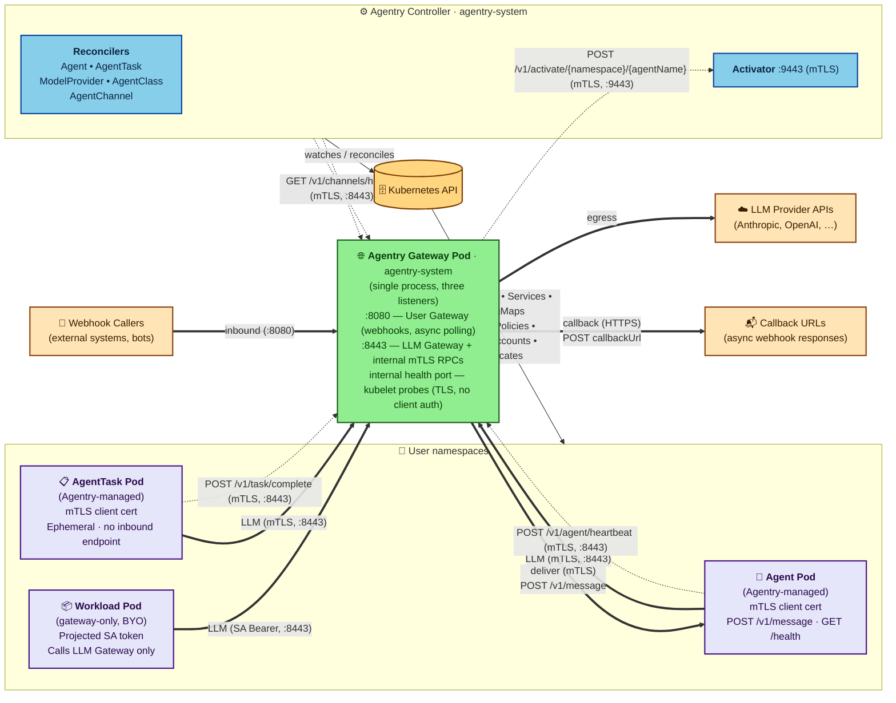

# Agentry — Architecture Overview

This document describes the high-level architecture of Agentry: the control plane, the per-Agent and per-Task workload resources, the shared Agentry Gateway, and the integration points with the surrounding ecosystem. Agentry is single-cluster in v1; multi-cluster federation is out of scope.

## Documentation Map

| Document | Contents |
|---|---|
| [VISION.md](./VISION.md) | Problem statement, design principles, v1 scope |
| [STORIES.md](./STORIES.md) | Personas and user scenarios driving the design |
| [ARCHITECTURE.md](./ARCHITECTURE.md) | This file — system topology, control plane, per-Agent/per-Task resources, gateway, deployment |
| [API_RESOURCES.md](./API_RESOURCES.md) | CRD specs: AgentClass, ModelProvider, Agent, AgentTask, AgentChannel |
| [API_ENDPOINTS.md](./API_ENDPOINTS.md) | Gateway HTTP endpoints and agent-implemented contracts |
| [GATEWAY_LLM.md](./GATEWAY_LLM.md) | LLM Gateway: routing, budget, fallback, TLS, credentials |
| [GATEWAY_USER.md](./GATEWAY_USER.md) | User Gateway: webhook delivery, activator, activity tracking |
| [CONTROLLER_RECONCILERS.md](./CONTROLLER_RECONCILERS.md) | Operator structure, five reconcilers, error handling |
| [CONTROLLER_LIFECYCLE.md](./CONTROLLER_LIFECYCLE.md) | State machines for Agent and AgentTask, finalizers |
| [SECURITY.md](./SECURITY.md) | Trust model, RBAC, credential lifecycle, TLS, isolation |
| [DEPLOYMENT.md](./DEPLOYMENT.md) | Helm chart contents, prerequisites, certificate lifecycle, Adoption Tiers |
| [RUNTIME_CONTRACT.md](./RUNTIME_CONTRACT.md) | The contract a container image must satisfy to run as an Agent or AgentTask |
| [STARTER_TEMPLATES.md](./STARTER_TEMPLATES.md) | Go and Python starter templates implementing the runtime contract |
| [OBSERVABILITY.md](./OBSERVABILITY.md) | Aggregated metrics catalog, dashboards, alerting (TODO) |

## Custom Resources

Agentry workloads come in two shapes. An **Agent** is a long-lived workload that the controller can hibernate and wake on demand; an Agent may have an inbound webhook channel attached via an AgentChannel. An **AgentTask** is an ephemeral one-shot job — no inbound endpoint, no hibernation, torn down on completion. Both run as Pods under the policy template defined by an AgentClass.

| Kind | Scope | Tier | Purpose |
|---|---|---|---|
| AgentClass | Cluster | Full lifecycle only (chart default in both) | Policy template — runtime, isolation, allowed providers, network egress |
| ModelProvider | Cluster | Both | LLM provider config — credentials Secret, allowed namespaces, fallback chain |
| Agent | Namespace | Full lifecycle only | Long-lived agent workload |
| AgentTask | Namespace | Full lifecycle only | Ephemeral task workload |
| AgentChannel | Namespace | Full lifecycle only | Inbound webhook channel binding to an Agent |

Spec details for each CRD are in [API_RESOURCES.md](./API_RESOURCES.md).

## System Topology

The dashed edges are internal mTLS RPCs — all require mTLS-with-SAN via per-path middleware on the listener and reject the LLM proxy's `TokenReview`-validated SA-bearer alternative. Four are served on the Gateway's `:8443` listener (`/v1/activity`, `/v1/channels/health`, `/v1/task/complete`, `/v1/agent/heartbeat`); the activator wake is served on the Controller's `:9443`. See [The Agentry Gateway](#the-agentry-gateway) for the consolidated path → SAN mapping on `:8443` (including the handler-level Agent-vs-AgentTask split layered on the shared admission), [Control Plane](#control-plane) for the activator's SAN policy, and [SECURITY.md](./SECURITY.md#internal-endpoint-authentication-activator-activity-channel-health) for the underlying [per-path middleware](./GATEWAY_LLM.md#per-path-client-auth-enforcement) pattern.

## Adoption Tiers

Agentry can be adopted at two depths. Several behaviors throughout this document branch on which tier a workload belongs to:

- **Gateway-only tier.** Existing workloads call the gateway via projected ServiceAccount tokens for LLM traffic and spend tracking, with no Agent, AgentTask, or AgentChannel resources of their own (the chart still ships a default `standard` AgentClass, but no workload references it). Provider access is gated by `ModelProvider.allowedNamespaces` alone, since there is no Agent, AgentTask, or AgentClass to consult. **Egress is the platform team's responsibility:** Agentry does not synthesize a NetworkPolicy for these Pods, so budget enforcement, rate limits, and provider-access gating only hold if the platform team applies their own NPs in those namespaces denying egress to provider IPs except via the gateway. See [Deployment Model](#deployment-model).
- **Full lifecycle tier.** Agents, AgentTasks, and AgentChannels managed by the operator, with hibernation, wake-on-demand, and per-Pod mTLS via cert-manager-issued certificates.

The chart-level framing — Helm values, prerequisites, install order — is in [Deployment Model](#deployment-model).

## Deployment Model

Agentry ships as a Helm chart. **cert-manager, trust-manager, and an NP-enforcing CNI are required prerequisites** — see [SECURITY.md § Network Policy](./SECURITY.md#network-policy) and the NetworkPolicy bullet under [Per-Agent and Per-Task Child Resources](#per-agent-and-per-task-child-resources). The chart deploys both the controller and the gateway in both [Adoption Tiers](#adoption-tiers); what differs is which CRs the platform team creates and which reconcilers are operationally exercised. The gateway-only tier requires only `ModelProvider`s and provider Secrets in `agentry-system` — the Agent, AgentTask, and AgentChannel reconcilers idle with no resources to reconcile, the AgentClassReconciler reconciles only the chart-shipped default class, and per-Agent / per-AgentTask `Certificate` issuance is not exercised. The full lifecycle tier additionally creates AgentClasses, Agents, AgentTasks, and AgentChannels, exercising those reconcilers and per-Pod mTLS via cert-manager. Both tiers depend on cert-manager (gateway and controller serving certs) and trust-manager (CA bundle projection into user namespaces). The gateway-only tier's egress responsibility is stated under [Adoption Tiers](#adoption-tiers).

At a type level, the chart deploys:

- The five CRDs introduced under [Custom Resources](#custom-resources) (AgentClass, ModelProvider, Agent, AgentTask, AgentChannel)
- Controller and Gateway Deployments — both default to two replicas with a PodDisruptionBudget, rolling-update strategy, and pod anti-affinity. The chart enforces a ≥2 floor on both so the wake-on-demand "hard control-plane dependency" claim under [The Agentry Gateway](#the-agentry-gateway) survives voluntary disruptions and single-replica involuntary failures — see [DEPLOYMENT.md](./DEPLOYMENT.md) for the operational rationale and chart-level enforcement.
- Per-Deployment `ServiceAccount`s, `ClusterRole`s, and `ClusterRoleBinding`s
- cert-manager `ClusterIssuer`s (a self-signed root and the Agentry CA issuer) and `Certificate`s for the gateway and controller serving certs (per-Agent and per-AgentTask `Certificate`s are issued at reconcile time, not by the chart)
- A trust-manager `Bundle` projecting the Agentry CA bundle into non-system namespaces
- A default `standard` AgentClass and an optional `sandboxed` AgentClass example

For the full chart contents, the certificate inventory, the operational Helm values, and the per-tier setup details, see [DEPLOYMENT.md](./DEPLOYMENT.md).

## Control Plane

The Agentry control plane consists of a single operator (Go, built on `controller-runtime`) running as a Deployment in the `agentry-system` namespace. The operator hosts five reconcilers:

1. [**Agent Reconciler**](./CONTROLLER_RECONCILERS.md#agentreconciler) — watches `Agent` resources. Translates each Agent into a Pod, PVC, Service, and ConfigMap, and drives the [persistent-agent state machine](./CONTROLLER_LIFECYCLE.md#agent-persistent-mode) (idle detection, hibernation, wake-on-demand).

2. [**AgentTask Reconciler**](./CONTROLLER_RECONCILERS.md#agenttaskreconciler) — watches `AgentTask` resources. Creates a Pod to execute the task, monitors the [completion condition](./CONTROLLER_LIFECYCLE.md#agenttask) (`agentReported` or `exitCode`), and tears down resources on completion or timeout.

3. [**ModelProvider Reconciler**](./CONTROLLER_RECONCILERS.md#modelproviderreconciler) — watches `ModelProvider` resources. Validates provider configuration, verifies the referenced Secret exists and is well-formed, maintains provider health status, and manages per-namespace spend state.

4. [**AgentClass Reconciler**](./CONTROLLER_RECONCILERS.md#agentclassreconciler) — watches `AgentClass` resources. Validates that referenced ModelProviders exist, maintains usage counts, and updates status conditions.

5. [**AgentChannel Reconciler**](./CONTROLLER_RECONCILERS.md#agentchannelreconciler) — watches `AgentChannel` resources. Validates that the referenced Agent exists with a Service enabled, validates channel credentials and `callbackUrl` (per [validation rule 22](./API_RESOURCES.md#cross-resource-validation)), sets `status.conditions[type=Ready]` from those validations (the gate the gateway uses to admit webhook traffic), and populates `status.conditions[type=PlatformConnected]` (observational only) by polling the gateway via [`GET /v1/channels/health`](./API_ENDPOINTS.md#get-v1channelshealth-internal--controller-use-only). The gateway gates webhook routing on `Ready` alone; `PlatformConnected` is for user/operator visibility. See [GATEWAY_USER.md § Channel Health Tracking](./GATEWAY_USER.md#channel-health-tracking) for the rolling-window tri-state contract and the per-replica reduction rules.

The controller does **not** host admission webhooks. Field-level validation uses CEL expressions in CRD schemas; [cross-resource validation](./API_RESOURCES.md#cross-resource-validation) (reference resolution, image allowlists, provider access) is handled at reconcile time and surfaced as status conditions rather than admission errors.

The controller exposes an internal ClusterIP Service for the activator endpoint (`POST /v1/activate/{namespace}/{agentName}`) on port `:9443`. The same listener on each controller Pod also serves `/healthz` and `/readyz` for kubelet probes, which target the Pod directly rather than going through the Service. The activator endpoint requires [**mTLS**](./SECURITY.md#internal-endpoint-authentication-activator-activity-channel-health); the controller admits only client certificates whose SAN matches the gateway Service DNS. Both controller and gateway present per-Pod TLS certs issued by the Agentry CA `ClusterIssuer` (see [Deployment Model](#deployment-model)) and rotated by cert-manager. The handshake mode (which lets cert-less kubelet probes coexist with the mTLS-with-SAN gate) and the per-path middleware are documented in [SECURITY.md § Internal Endpoint Authentication](./SECURITY.md#internal-endpoint-authentication-activator-activity-channel-health) and [GATEWAY_LLM.md § Per-path client-auth enforcement](./GATEWAY_LLM.md#per-path-client-auth-enforcement).

The activator handler is served on **every** controller replica, not only the leader: the handler patches a wake annotation on the target Agent, and the leader's existing Agent watch fires the manual-wake path in the reconciler. This keeps the Service round-robin behavior correct without any leader-aware endpoint plumbing.

The gateway uses this Service to send wake requests when a channel message arrives for a hibernated agent. The activator returns 202 Accepted as soon as the wake annotation patch is committed; the gateway observes wake completion by polling the agent's Service for readiness, not by waiting on the [activator response](./GATEWAY_USER.md#activator) (steps 3–4).

The reverse direction — controller → gateway — is the [**activity API**](./GATEWAY_USER.md#activity-tracking-api) (`GET /v1/activity?namespace={ns}`), used by the AgentReconciler to read per-namespace last-activity timestamps for idle and hibernation transitions. It is served on the gateway's `:8443` LLM listener (**not** the User listener on `:8080`, so an Ingress fronting `:8080` cannot route untrusted traffic to it). Per-path middleware enforces mTLS-with-SAN on `/v1/activity` — only the controller's SAN is admitted; Agent/AgentTask certs are rejected with 403. The controller dials each gateway Pod IP directly rather than the Service, since [activity timestamps are in-memory per replica](#the-agentry-gateway); replica IPs are enumerated from the controller's gateway-Pod informer over `agentry-system` (the same informer that backs the channel-health fan-out and is the operational reason for the cluster-wide Pod watch in the [RBAC surface](#control-plane) below). See [GATEWAY_USER.md § Activity Tracking API](./GATEWAY_USER.md#activity-tracking-api) for the TLS-handshake detail required to make per-Pod-IP dialing work against a Service-DNS-scoped SAN. The same fan-out pattern is reused by channel-health — see [GATEWAY_USER.md § Channel Health Tracking](./GATEWAY_USER.md#channel-health-tracking).

Leader election is enabled so the operator can run with multiple replicas for availability.

The controller's [RBAC surface](./SECURITY.md#operator-serviceaccount) covers cluster-scoped CRD watches, child-resource management (including cluster-wide Pod read/list/watch for managing Agent/AgentTask Pods in user namespaces and for fanning out activity and channel-health queries to gateway Pods in `agentry-system`), scoped ConfigMap read/write/delete in `agentry-system` (the per-provider budget ConfigMap, plus the per-request async-response ConfigMaps which the AgentChannelReconciler prunes on expiry and sweeps in its finalizer since cross-namespace ownerRefs do not trigger Kubernetes GC), and dynamic per-channel and per-task `Role`/`RoleBinding`s in user namespaces.

## Multi-tenancy

v1 assumes a single platform team owns the cluster-scoped policy resources (AgentClass, ModelProvider) while individual tenants operate at namespace boundaries via Agent, AgentTask, and AgentChannel — see [Custom Resources](#custom-resources) for the scope split. Tenant isolation is layered:

- **Trust tiers.** [SECURITY.md § Trust Model](./SECURITY.md#trust-model) defines four tiers: cluster admin, platform engineer (trusted with provider credentials), agent developer (trusted within namespace guardrails — the assumption the synthesized NetworkPolicy depends on), and the agent container itself (untrusted). Platform teams that need to treat developers as untrusted should restrict `networkpolicies` create/patch in user namespaces via cluster RBAC.

- **RBAC layering.** The operator ServiceAccount holds the cluster-scoped surface (CRD watches, child-resource management); the gateway ServiceAccount is scoped to `agentry-system` plus dynamic per-channel and per-task `Role`s with `resourceNames`-bounded access in user namespaces. See [SECURITY.md § RBAC Model](./SECURITY.md#rbac-model).

- **Provider access gating.** For full-lifecycle workloads, an Agent or AgentTask can use a provider only when all three of `Agent.spec.providers` / `AgentTask.spec.providers` (the per-workload declared usage list, gateway-enforced), `AgentClass.allowedProviders`, and `ModelProvider.allowedNamespaces` admit it — all three layers must pass. Gateway-only-tier callers have no Agent, AgentTask, or AgentClass to consult, so they are gated by `ModelProvider.allowedNamespaces` alone. The requested model must additionally exist in `ModelProvider.spec.models`; that check is a model-resolution prerequisite enforced at the gateway, not a tenancy boundary, and applies to callers in both tiers — see [The Agentry Gateway](#the-agentry-gateway). See [API_RESOURCES.md § AgentClass](./API_RESOURCES.md#agentclass) and [API_RESOURCES.md § Cross-Resource Validation](./API_RESOURCES.md#cross-resource-validation) (rules 4–5).

- **Per-namespace throughput and spend isolation.** Gateway rate-limit token buckets are keyed on (namespace, model) against the cluster-wide ceiling in `ModelProvider.spec.rateLimits`, and budget counters track spend per namespace, so one tenant cannot exhaust a shared provider's rate-limit or spend ceiling on behalf of another. Both controls apply to gateway-only-tier callers as well, since they are enforced at the gateway from the namespace identified on every request (mTLS SAN or `TokenReview`-validated SA token). See [The Agentry Gateway](#the-agentry-gateway) for the per-request enforcement points and [Multi-replica state](#multi-replica-state) for the cross-replica reconciliation strategies.

- **NetworkPolicy as the cross-tenant boundary.** Synthesized per-Pod NetworkPolicies confine Agentry-managed Pods to gateway-mediated egress (see [Per-Agent and Per-Task Child Resources](#per-agent-and-per-task-child-resources)). Gateway-only-tier Pods are not Agentry-managed and inherit no synthesized policy — see the caveat under [Adoption Tiers](#adoption-tiers).

- **Webhook path namespace-prefixing.** AgentChannel webhook paths are namespace-prefixed by a CRD-level CEL rule (`/channels/{namespace}/...`), so cross-tenant path collisions are impossible by construction. `AgentChannel.spec.agentRef` is name-only and binds to an Agent in the AgentChannel's own namespace; cross-namespace channel→Agent binding is not supported. See [API_RESOURCES.md § AgentChannel](./API_RESOURCES.md#agentchannel).

- **Tenant-level resource limits.** Per-Pod resource caps live in `AgentClass.spec.maxLimits`. Agentry does not synthesize ResourceQuota or LimitRange — platform teams should apply standard namespace-level ResourceQuota and LimitRange to bound aggregate tenant footprint.

The cross-tenant attack surface and per-attack mitigation walkthrough are in [SECURITY.md § Threat Model](./SECURITY.md#threat-model).

## Per-Agent and Per-Task Child Resources

For each Agent, the controller provisions the following resources. The Pod is the only state-coupled resource — it is created on the transition into `Running` and deleted on the transition into `Hibernated`; every other resource below is provisioned on first reconcile and persists across hibernation (retention details below, after the resource list).

- **One Pod** containing the user's agent container, present only while the Agent is `Running`. The Pod runs under the [RuntimeClass](./SECURITY.md#runtimeclass) specified by its AgentClass (runc, gVisor, or Kata).
- **One PVC** if the [Agent spec requests persistence](./API_RESOURCES.md#spec-2), mounted into the agent container at a configured path.
- **One Service** (ClusterIP) if [`spec.service.enabled`](./API_RESOURCES.md#spec-2) (default `true`), exposing the agent's HTTPS endpoint for intra-cluster traffic. The gateway uses this Service to deliver channel messages via [`POST /v1/message`](./API_ENDPOINTS.md#post-v1message-agent-only--agent-implemented) over TLS; direct external exposure remains the developer's responsibility. Agents with the Service disabled are outbound-only — they have no inbound delivery path and cannot be referenced by an AgentChannel (validated by AgentChannelReconciler with `Ready=False, reason=AgentServiceDisabled`).
- **One [cert-manager `Certificate`](./SECURITY.md#lifecycle-of-an-agent-tls-serving-certificate)** (and the Secret it writes) holding a per-agent TLS cert (`server auth, client auth`) signed by the Agentry CA `ClusterIssuer` and rotated continuously by cert-manager; the same cert serves the agent's HTTPS listener and is presented client-side on every agent→gateway call. The Agentry CA bundle is projected into Pods via trust-manager.
- **One ConfigMap** holding non-sensitive agent configuration (gateway endpoint, feature flags).
- **One ServiceAccount** — a per-Agent SA with no RoleBindings by default; the agent has no Kubernetes API access unless the platform team or developer explicitly grants it. See [SECURITY.md § Agent Pod ServiceAccount](./SECURITY.md#agent-pod-serviceaccount).
- **One NetworkPolicy** synthesized from the AgentClass network policy and the gateway's egress allow rule. This is the load-bearing primitive cited in the [gateway architecture analysis](./GATEWAY_LLM.md#architecture-option-analysis) for keeping LLM credentials inside `agentry-system` — see the [full rule set](./CONTROLLER_RECONCILERS.md#agentreconciler) (AgentReconciler step 6). **NetworkPolicy enforcement by the cluster CNI is a required prerequisite of Agentry's trust model.** On the message path, the synthesized ingress rule is **layered with the [agent-side mTLS check on `POST /v1/message`](./SECURITY.md#in-cluster-tls-bidirectional)** (specified in [RUNTIME_CONTRACT.md](./RUNTIME_CONTRACT.md), bullet 4) — a misconfigured per-Agent NP does not open delivery to arbitrary in-cluster callers. The synthesized egress rule is the **only Agentry-managed** control preventing agents from calling provider IPs directly. This synthesis applies only to Agentry-managed Pods (Agents and AgentTasks); the gateway-only tier's egress responsibility is stated under [Adoption Tiers](#adoption-tiers). Because NetworkPolicy is additive, this guarantee assumes the developer trust tier defined in [SECURITY.md § Trust Model](./SECURITY.md#trust-model). CNI enforcement of NetworkPolicy is still a hard prerequisite — clusters running default kindnet or default flannel do not enforce NetworkPolicy and are not supported deployment targets. See also [Recommendation #4](./SECURITY.md#recommendations-for-deployment).

All of the above resources live in the same namespace as the Agent CR and carry an ownerRef back to it; full Agent deletion cascade-GCs them.

On `Hibernated`, only the Pod is deleted; the PVC, per-Agent `Certificate` (and its Secret), Service (with no endpoints), ConfigMap, ServiceAccount, and NetworkPolicy are retained so wake-on-demand can recreate the Pod against unchanged identity and storage. See [CONTROLLER_LIFECYCLE.md § Hibernation mechanics](./CONTROLLER_LIFECYCLE.md#hibernation-mechanics).

**AgentClass changes propagate to live workloads.** When the platform team mutates an in-use AgentClass, the controller re-derives the [child-resource set](#per-agent-and-per-task-child-resources) for every Agent referencing the class — recreate-and-clamp (re-derive the Pod spec under the new invariants — e.g., clamping `resources.limits` to the new `maxLimits` — then delete and recreate the Pod, preserving PVC, Service, ConfigMap, and Certificate) where the new invariants can be applied, or transition to `Degraded` where they cannot (e.g., the Agent's `image` is no longer in `allowedImages`). In-flight AgentTasks are not interrupted: they finish under their original class spec, and the new invariants apply only when the task next provisions a Pod (a backoff retry or a subsequent AgentTask CR). This makes AgentClass a live policy lever for Agents without disrupting one-shot task work. Bulk-impact and rollout guidance: [CONTROLLER_LIFECYCLE.md § AgentClass change handling](./CONTROLLER_LIFECYCLE.md#agentclass-change-handling-running-agent).

By contrast, **ModelProvider mutations propagate via the gateway's CRD and Secret watches** and take effect per-request — `allowedNamespaces`, `spec.models`, fallback-chain edits, and credential rotations on `secretRef` apply on the next routed call without any Pod-level side effect. No `Degraded` transition or recreate-and-clamp is involved because ModelProvider governs routing rather than Pod identity (see [GATEWAY_LLM.md](./GATEWAY_LLM.md) for routing and credential mechanics).

There is no sidecar container. The **Agentry Gateway** in `agentry-system` handles all LLM traffic and inbound channel messages as a shared cluster-level service.

For each AgentTask, the controller provisions a parallel set of resources tailored to its ephemeral, no-inbound nature (see [AgentTaskReconciler](./CONTROLLER_RECONCILERS.md#agenttaskreconciler) for the authoritative step list):

- **One Pod** containing the user's task container, under the AgentClass [RuntimeClass](./SECURITY.md#runtimeclass).
- **One PVC** if the task spec requests persistence.
- **One [cert-manager `Certificate`](./SECURITY.md#lifecycle-of-an-agenttask-tls-client-certificate)** (and its Secret) holding a per-task TLS cert with `usages: client auth` only — the task uses it to authenticate outbound calls (LLM proxy, `/v1/task/complete`); there is no server-auth EKU because the task does not expose an HTTPS listener.
- **One ServiceAccount** — a per-task SA with no RoleBindings by default, matching the opt-in posture of Agent Pods. See [SECURITY.md § Agent Pod ServiceAccount](./SECURITY.md#agent-pod-serviceaccount).
- **One NetworkPolicy** synthesized from the AgentClass and the gateway's egress allow rule. AgentTask Pods have no listener and no Service, so the synthesized policy carries the standard egress allow set with **no ingress allow rules** — default-deny ingress is the posture, made explicit in the synthesized YAML (see [AgentTaskReconciler](./CONTROLLER_RECONCILERS.md#agenttaskreconciler)). In contrast, Agent Pods receive `/v1/message` from the gateway and thus carry an explicit gateway → agent ingress allow rule on the agent's HTTPS listener port.
- When [`completion.condition: agentReported`](./CONTROLLER_LIFECYCLE.md#agenttask), additionally: a pre-created per-task completion ConfigMap (initial `data: {}`) where the gateway writes the completion payload, plus a per-task `Role` and `RoleBinding` granting the gateway ServiceAccount name-scoped `update`/`patch` on that ConfigMap.

There is no Service (tasks do not receive channel messages and have no stable endpoint) and no generic configuration ConfigMap (task config is delivered via env vars and Pod spec). All resources are owner-referenced to the AgentTask for cascade GC.

## The Agentry Gateway

The gateway is a replicated Deployment in `agentry-system`. It exposes two TLS listeners — `:8443` for the LLM proxy and internal mTLS endpoints, `:8080` for inbound channel webhooks and the async response polling endpoint — plus a separate internal health port for kubelet probes (described at the end of this section), together hosting three call surfaces, grouped below by call surface:

[**LLM Gateway**](./GATEWAY_LLM.md#llm-gateway--request-flow) (outbound, agent → provider).
- Serves TLS on port 8443; the gateway endpoint is injected into Agent and AgentTask Pods so agent containers always reach it over HTTPS
- [Identifies the source namespace and workload (name and kind)](./GATEWAY_LLM.md#namespace-identification) via mTLS client-cert SAN (Agentry-managed Agent/AgentTask Pods), or namespace only via `TokenReview`-validated ServiceAccount bearer token (gateway-only tier), with a source-IP → Pod cross-check from the informer cache as defense in depth. The workload-identity half of the SAN underpins downstream workload-level checks (`spec.providers`, the per-task ConfigMap targeting, and the Agent-vs-AgentTask handler-level split below); gateway-only callers carry no workload identity, which is the structural reason their tenancy chain in [Multi-tenancy § Provider access gating](#multi-tenancy) reduces to `ModelProvider.allowedNamespaces` alone
- [Resolves the target ModelProvider](./GATEWAY_LLM.md#provider-routing) from the qualified `provider/model` name. Three tenancy gates must admit the request — the workload's `spec.providers` (Agent or AgentTask), `AgentClass.allowedProviders`, and `ModelProvider.allowedNamespaces`; gateway-only callers have no Agent, AgentTask, or AgentClass and are gated by `ModelProvider.allowedNamespaces` alone. Independent of tenancy, the requested model must exist in `ModelProvider.spec.models` (a model-resolution check applied to all callers). The model and namespace checks themselves are described in [Request Format Detection](./GATEWAY_LLM.md#request-format-detection); see [Multi-tenancy § Provider access gating](#multi-tenancy) for the canonical tenancy chain
- Enforces soft budget guardrails and per-namespace rate limits
- Routes to the upstream provider; on failure, walks the [fallback chain](./GATEWAY_LLM.md#fallback-logic)
- [Extracts token usage](./GATEWAY_LLM.md#provider-adapters) and [updates spend counters](./GATEWAY_LLM.md#budget-state-management)
- Returns structured [error responses](./API_ENDPOINTS.md#llm-gateway-error-responses) (JSON with `error.type`) on failure

[**User Gateway**](./GATEWAY_USER.md#user-gateway--request-flow) (channel ↔ external; webhook intake plus async callback delivery).
- Watches `AgentChannel` resources directly (rather than reading routing data published by the controller) so inbound webhook routing reflects channel changes without controller-mediated propagation latency. The gateway [routes only to channels](./GATEWAY_USER.md#user-gateway--request-flow) whose `status.conditions[Ready].status == True` (step 4), so controller validation (path conflicts, bad references) still gates traffic
- Listens on port 8080 over TLS. External webhook callers reach this listener via a user-provisioned Ingress / Gateway API resource fronting the gateway Service — applicable only in the full-lifecycle tier, since the gateway-only tier has no inbound external path. Backend re-encrypt vs. TLS pass-through trade-offs and the SAN configuration are in [GATEWAY_USER.md § TLS and Ingress](./GATEWAY_USER.md#tls-and-ingress)
- Hosts two path families on `:8080`: webhook intake under `/channels/{namespace}/...` and the async polling endpoint at `GET /v1/channels/responses/{requestId}?channelPath={url-encoded-webhook-path}` — see [API_ENDPOINTS.md § Reserved Gateway Paths](./API_ENDPOINTS.md#reserved-gateway-paths) and [§ Async Webhook Response](./API_ENDPOINTS.md#async-webhook-response-gateway-managed)
- Normalizes inbound webhook payloads into the Agentry message envelope and resolves the target Agent via the AgentChannel resource
- On delivery, the gateway posts to the Agent's Service with a bounded connect timeout; any connect-phase failure is treated as the hibernation signal (response-phase failures — non-2xx from a reachable Pod — go to the delivery retry pipeline, not the activator; no separate Endpoint or EndpointSlice watch — rationale in [GATEWAY_USER.md § Activator](./GATEWAY_USER.md#activator)). On that signal the gateway calls the controller's [mTLS-authenticated activator endpoint](#control-plane) and polls the Agent's Service for readiness, bounded by a wake timeout. Wake-on-demand is therefore a **hard control-plane dependency**: while the controller's activator endpoint is unreachable, hibernated Agents cannot receive new messages and callers receive a `controller_unavailable` error (sync `504` / async error payload at `callbackUrl` or the polling endpoint); already-`Running` Agents are unaffected. Full mechanics — kube-proxy-mode connect-fail behavior, the manual-wake `WakeIgnored` path for transient failures, and the wire-level error contract — are in [GATEWAY_USER.md § Activator](./GATEWAY_USER.md#activator) and [CONTROLLER_LIFECYCLE.md § Activity Detection](./CONTROLLER_LIFECYCLE.md#activity-detection)
- Delivers the message to the agent container via [`POST /v1/message`](./API_ENDPOINTS.md#post-v1message-agent-only--agent-implemented). Delivery is **bidirectional mTLS**: the gateway presents its per-Pod cert (client) and verifies the agent's per-Agent cert against the Agentry CA; the agent verifies the gateway's client cert via the same CA (specified in [RUNTIME_CONTRACT.md](./RUNTIME_CONTRACT.md)). This is layered with the synthesized [NetworkPolicy gateway → agent ingress allow rule](#per-agent-and-per-task-child-resources). See [GATEWAY_USER.md § Request Flow step 6](./GATEWAY_USER.md#user-gateway--request-flow).
- Supports per-AgentChannel sync (default) and async response modes. In async mode the gateway returns `202 Accepted` with a `requestId` immediately and runs delivery and response handling in the background — [configuration](./API_RESOURCES.md#spec-4), [request flow](./GATEWAY_USER.md#user-gateway--request-flow), [response schemas](./API_ENDPOINTS.md#async-webhook-response-gateway-managed)
- Async responses are delivered via **callback** (gateway POSTs the agent's reply to the AgentChannel's `spec.webhook.callbackUrl`) or **polling** (the gateway stores the reply in a per-request ConfigMap in `agentry-system`; callers GET `/v1/channels/responses/{requestId}`). Callback is the gateway's **third outbound traffic class** — alongside LLM provider egress and intra-cluster delivery to agent Services — and brings its own controls: `https://` only, deny-by-default to loopback / link-local / RFC1918 / unique-local IPv6 / cloud-metadata, an optional callback-URL allowlist, and **DNS-rebinding defense via host re-resolve before every dial attempt** (per [AgentChannel rule 22](./API_RESOURCES.md#cross-resource-validation)). Each callback POST is signed using the AgentChannel's `spec.webhook.callbackAuth` (bearer or HMAC) so receivers can reject forged callbacks — `callbackAuth` is required by [rule 25](./API_RESOURCES.md#cross-resource-validation) whenever `callbackUrl` is set, and the wire contract is in [API_ENDPOINTS.md § Callback authentication](./API_ENDPOINTS.md#async-webhook-response-gateway-managed). Callback delivery retries with a bounded backoff schedule; on permanent callback failure the response is stored at the polling endpoint so callers whose `callbackUrl` was unreachable across all retries can recover it by polling within the response's bounded TTL — callback is best-effort, not guaranteed delivery, and the polling endpoint is the receiver-driven fallback (see [STORIES.md § S15](./STORIES.md#s15-async-webhook-for-a-long-running-coding-agent)). See [GATEWAY_USER.md § Request Flow](./GATEWAY_USER.md#user-gateway--request-flow) (steps 5a, 6a, 8) for the full behavior
- v1 supports webhook channels only; Discord and WhatsApp adapters are planned for v1.1

**Gateway-Internal API** (mTLS on `:8443`) — these endpoints are not part of the LLM proxy or webhook flows but share the LLM Gateway listener so that mTLS-authenticated callers (agents, AgentTasks, controller) reach them without standing up a separate listener. [Reserved](./API_ENDPOINTS.md#reserved-gateway-paths) under the `/v1/` prefix.
- [`POST /v1/task/complete`](./API_ENDPOINTS.md#post-v1taskcomplete-agenttask-only) (agent → gateway): the AgentTask agent reports completion; the gateway updates the pre-existing per-task completion ConfigMap referenced under [Per-Agent and Per-Task Child Resources](#per-agent-and-per-task-child-resources).
- [`POST /v1/agent/heartbeat`](./API_ENDPOINTS.md#post-v1agentheartbeat-agent-only) (agent → gateway): liveness signal feeding the agent-heartbeat activity source.
- [`GET /v1/activity?namespace={ns}`](./GATEWAY_USER.md#activity-tracking-api) (controller → gateway): per-namespace activity timestamps for idle and hibernation transitions.
- [`GET /v1/channels/health`](./API_ENDPOINTS.md#get-v1channelshealth-internal--controller-use-only) (controller → gateway): per-channel platform-connection health.

**`:8443` listener auth profile** (consolidated; all paths share the same listener and serve TLS, while client-auth requirements vary per path):

| Path family | Client auth |
|---|---|
| LLM proxy (`/v1/messages`, `/v1/chat/completions`, provider-specific paths) | mTLS with Agent/AgentTask SAN, **or** `TokenReview`-validated SA bearer token (gateway-only tier) |
| `POST /v1/task/complete` | mTLS, Agent/AgentTask SAN admitted at listener; AgentTask only at handler — Agent callers rejected with 403 |
| `POST /v1/agent/heartbeat` | mTLS, Agent/AgentTask SAN admitted at listener; Agent only at handler — AgentTask callers rejected with 403 |
| `GET /v1/activity`, `GET /v1/channels/health` | mTLS, Controller SAN required (Agent/AgentTask certs rejected with 403) |

See [API_ENDPOINTS.md § /v1/task/complete](./API_ENDPOINTS.md#post-v1taskcomplete-agenttask-only) and [§ /v1/agent/heartbeat](./API_ENDPOINTS.md#post-v1agentheartbeat-agent-only) for the handler-level caller-type checks.

The mTLS-with-SAN enforcement is implemented as [per-path middleware on the listener](./GATEWAY_LLM.md#per-path-client-auth-enforcement); a routing bug here would let agent-cert holders reach controller-only paths, so the path → auth mapping is the most security-load-bearing detail in the gateway.

**`:8080` listener auth profile.** The User Gateway listener serves only externally-reachable channel traffic and uses **per-AgentChannel** webhook auth (bearer or HMAC, configured on each AgentChannel) on both path families:

| Path family | Client auth |
|---|---|
| Webhook intake (`/channels/{namespace}/{channel-path}`) | Per-AgentChannel `spec.webhook.auth` (bearer **or** HMAC) |
| Async polling endpoint (`GET /v1/channels/responses/{requestId}?channelPath={url-encoded-webhook-path}`) | Caller supplies the originating AgentChannel's path; the gateway picks that channel's `spec.webhook.auth` policy and asserts it matches the stored response's channel labels — see [API_ENDPOINTS.md § Async Webhook Response](./API_ENDPOINTS.md#async-webhook-response-gateway-managed) |

See [API_ENDPOINTS.md § Async Webhook Response](./API_ENDPOINTS.md#async-webhook-response-gateway-managed) for the polling endpoint's channel-match check. No mTLS-authenticated paths live on `:8080`; the listener split keeps an Ingress fronting `:8080` from routing untrusted traffic to controller-only endpoints.

Kubelet liveness/readiness probes for the gateway terminate on a separate **internal health port** (TLS, no client auth; `GET /healthz`, `GET /readyz`) rather than on `:8443` or `:8080`, so they sit outside the listener auth profiles above. The gateway uses a dedicated health port — rather than handshake-mode coexistence on `:8443`/`:8080`, the pattern used by the controller's `:9443` (see [Control Plane](#control-plane)) — because both gateway listeners are reachable beyond the trust boundary that makes cert-less probe coexistence safe on the controller's purely internal `:9443`: `:8080` sits behind a user-provisioned Ingress in the full-lifecycle tier, and `:8443` is reachable by every mTLS-authenticated agent. See [GATEWAY_LLM.md § Gateway Readiness](./GATEWAY_LLM.md#gateway-readiness).

[LLM provider credentials](./SECURITY.md#lifecycle-of-an-llm-api-key) are stored as Secrets in `agentry-system` and read directly by the gateway. They never leave the `agentry-system` namespace.

The gateway's [RBAC surface](./SECURITY.md#gateway-serviceaccount-permissions) covers `create` on `tokenreviews` (for the gateway-only tier), cluster-wide watches on Agentry CRDs and Pods (provider routing, source-IP → Pod cross-check), scoped Secret and ConfigMap access in `agentry-system` (LLM credentials, internal config, async response storage), and dynamic per-channel and per-task Roles in user namespaces, both issued at reconcile time and cascade-deleted with their owners — **per-channel:** `get, watch` `resourceNames`-scoped to the AgentChannel's webhook auth Secret(s) — `spec.webhook.auth.secretRef` (inbound, bearer or HMAC) and, when `callbackUrl` is set, also `spec.webhook.callbackAuth.secretRef` (outbound callback signing, required by [rule 25](./API_RESOURCES.md#cross-resource-validation)); **per-task:** `update, patch` `resourceNames`-scoped to the per-task completion ConfigMap (the `create` verb is intentionally excluded — `resourceNames` does not constrain `create`, which would silently widen access to all ConfigMaps in the namespace).

### Multi-replica state

The gateway runs as multiple replicas. Each piece of cross-replica state uses one of four reconciliation strategies — cross-replica ConfigMap with a controller-side reducer (spend), local recomputation against a cluster-wide ceiling (rate limits), per-replica in-memory state merged controller-side at read time (activity, channel health), or per-request cross-replica ConfigMap with controller-side TTL pruning (async webhook responses) — across five pieces of state:

- [**Spend counters**](./GATEWAY_LLM.md#budget-state-management): each replica server-side-applies its partials to a per-provider budget ConfigMap in `agentry-system`; the [ModelProviderReconciler](./CONTROLLER_RECONCILERS.md#modelproviderreconciler) sums partials, prunes stale-replica entries, and writes a canonical total that replicas re-initialize from on startup (step 3). Bounded overspend is accepted as a soft-guardrail trade-off.
- [**Rate-limit token buckets**](./GATEWAY_LLM.md#rate-limiting): each replica divides the configured cluster-wide ceiling by the live replica count from its Pod informer and adjusts on the next refill cycle when replicas scale.
- [**Activity timestamps**](./GATEWAY_USER.md#activity-tracking-api): kept in-memory per replica (no etcd writes per request). The gateway records two signal sources separately per agent — gateway-traffic (LLM-gateway requests and inbound channel-message deliveries observed by that replica) and agent-heartbeat (agent-emitted heartbeats); each Agent selects which source(s) to use via its lifecycle spec. The [AgentReconciler](./CONTROLLER_RECONCILERS.md#agentreconciler) (step 8) fans out one `GET /v1/activity?namespace={ns}` per gateway Pod IP and merges the per-source timestamps. Replica-restart awareness, partial-unreachability handling, and the synchronized-restart deferral semantics are documented in [CONTROLLER_LIFECYCLE.md § Activity Detection](./CONTROLLER_LIFECYCLE.md#activity-detection).
- [**Channel-health observations**](./GATEWAY_USER.md#channel-health-tracking): kept in-memory per replica using the same strategy as activity (no etcd writes per request). Each replica maintains a bounded in-window observation list per registered channel path; the [AgentChannelReconciler](./CONTROLLER_RECONCILERS.md#agentchannelreconciler) (step 4) fans out `GET /v1/channels/health` to every gateway Pod IP and reduces the per-replica `success`/`failure`/`empty` states into `status.conditions[type=PlatformConnected]` using the tri-state rule documented in [GATEWAY_USER.md § Channel Health Tracking](./GATEWAY_USER.md#channel-health-tracking). Replica-startup and all-replicas-unreachable handling mirror the activity path.
- [**Async webhook responses**](./GATEWAY_USER.md#user-gateway--request-flow): for AgentChannels in `responseMode: async` whose response will not be delivered via callback — either because no `callbackUrl` is configured, or because the bounded callback-retry schedule was exhausted — the receiving replica writes the agent's response (or a delivery error) to a per-request response ConfigMap in `agentry-system`, labeled with the originating channel's namespace and name and annotated with a bounded expiry. The gateway rejects agent responses above a configured size limit with a `response_too_large` error returned to the caller (sync) or delivered to `callbackUrl` / the polling endpoint (async). Any replica answers a [polling-endpoint GET](./API_ENDPOINTS.md#async-webhook-response-gateway-managed) by reading this ConfigMap, so polling is replica-agnostic and no in-memory routing is required. The [AgentChannelReconciler](./CONTROLLER_RECONCILERS.md#agentchannelreconciler) prunes expired entries by label selector on reconcile passes (bounded by the [reconciler's requeue interval](./CONTROLLER_RECONCILERS.md#reconcile-interval-and-performance), so worst-case lingering is bounded by that interval past expiry); on AgentChannel delete, the [finalizer](./CONTROLLER_LIFECYCLE.md#finalizers) sweeps the channel's remaining response ConfigMaps in one shot — load-bearing because Kubernetes GC does not follow cross-namespace ownerRefs.

## Observability

Both the controller and the gateway expose Prometheus metrics on dedicated ports. The metric catalogs and emit-points are documented per-component:

- [Controller metrics](./CONTROLLER_RECONCILERS.md#observability) — reconcile counts/duration/queue depth, agent/task phase counts, hibernation/wake/budget events.
- [LLM Gateway metrics](./GATEWAY_LLM.md#observability) — request counts/duration, token usage, spend, fallback events, budget utilization.
- [User Gateway metrics](./GATEWAY_USER.md#observability) — channel message counts/duration, hibernation wakes triggered.

Aggregated dashboards, alerting recommendations, and log/trace conventions will live in [OBSERVABILITY.md](./OBSERVABILITY.md) (TODO).

## Agent Runtime Contract

Agentry is BYO-image: any container can be an Agent provided it implements a small contract — an HTTPS health endpoint on the injected health port, graceful SIGTERM handling, authenticated mTLS calls to the injected gateway endpoint, an optional `POST /v1/message` handler when an AgentChannel is in use, and `messageId`-based deduplication when hibernation is enabled.

The full contract — required env vars, TLS reload semantics, dedup buffer, optional heartbeat and task-completion endpoints — is specified in [RUNTIME_CONTRACT.md](./RUNTIME_CONTRACT.md). Working implementations of the contract ship as [Go and Python starter templates](./STARTER_TEMPLATES.md).

## Integration Points

### Agent Sandbox (optional backend — v1.1)

An `AgentClass` will be able to specify [`spec.runtime.backend: agentSandbox`](./API_RESOURCES.md#spec) (v1.1). When set, the Agent Reconciler will create `Sandbox` custom resources (from the SIG Apps Agent Sandbox project) instead of raw Pods. This will give Agentry agents access to Agent Sandbox's warm pools and enhanced isolation without reimplementing those features. In v1, the only supported backend is `pod` — the CRD schema rejects `agentSandbox` at apply time.

### MCP (Model Context Protocol)

Agentry does not mandate MCP but is compatible with it. Agent containers are free to connect to MCP servers for tool access. AgentClass governs egress to MCP servers via [`network.egress.allowedCIDRs`](./API_RESOURCES.md#spec) (portable, every NP-capable CNI) and `network.egress.allowedHosts` (FQDN-policy CNIs only, e.g. Cilium / Calico Enterprise) — see [API_RESOURCES.md § AgentClass design notes](./API_RESOURCES.md#design-notes). MCP server provisioning itself is out of scope for v1.

### LLM Providers

Agentry supports any HTTP-based LLM provider. Out of the box, the gateway understands Anthropic, OpenAI, Google Vertex, and OpenAI-compatible endpoints (including Ollama, vLLM, LiteLLM gateways). Adding a new provider type is a [plugin-style extension in the gateway](./GATEWAY_LLM.md#provider-adapters).

### Channel Platforms

The User Gateway ships with a **generic webhook adapter** in v1 (inbound HTTP POST with configurable auth). Discord and WhatsApp adapters are planned for v1.1 — they require persistent connections and platform-specific reconnection logic. Additional platform adapters follow the same plugin pattern as LLM provider adapters.

## Scoping Summary

| Concern | Where it lives |
|---|---|
| Policy (who can use what, at what cost) | AgentClass, ModelProvider (cluster-scoped) |
| Workload definition | Agent, AgentTask (namespace-scoped) |
| Channel integration | AgentChannel (namespace-scoped) |
| Lifecycle orchestration | Agentry Controller (cluster-level) |
| Runtime isolation | RuntimeClass via AgentClass, or Sandbox backend |
| LLM traffic / spend tracking | LLM Gateway in agentry-system (shared) |
| Channel message routing | User Gateway in agentry-system (shared) |
| Tool access | MCP (external, not managed by Agentry in v1) |
| External exposure | Kubernetes Ingress / Gateway API (user-managed, not Agentry) |
| Observability | Controller + Gateway Prometheus metrics; see Observability section |
| In-cluster TLS issuance | cert-manager + trust-manager (prerequisite); see [DEPLOYMENT.md](./DEPLOYMENT.md) |
| Network policy enforcement | NP-capable CNI (prerequisite); see [SECURITY.md § Network Policy](./SECURITY.md#network-policy) |
