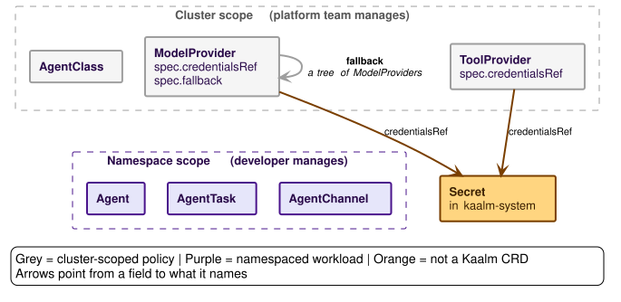

# Core concepts

This page introduces every term the rest of the book uses. Later chapters define nothing new; they go deeper on what is named here.

## The custom resources

Kaalm has two kinds of workload. An **Agent** is a long-lived workload that the controller can hibernate and wake on demand, and that can receive inbound messages through AgentChannels. An **AgentTask** is a one-shot job: no inbound endpoint, no hibernation, and a terminal phase at the end, after which it is retained until its TTL expires. Both run as Pods under the policy template an AgentClass defines.

| Kind | Scope | Tier | Purpose |
|---|---|---|---|
| AgentClass | Cluster | Full lifecycle only (the chart ships one in both) | Policy template: runtime, isolation, allowed providers, network egress |
| ModelProvider | Cluster | Both | LLM provider: credential Secret, allowed namespaces, budgets, fallback tree |
| ToolProvider | Cluster | Both | External tool server: endpoint, credential Secret, tool catalog, allowed namespaces |
| Agent | Namespace | Full lifecycle only | Long-lived agent workload |
| AgentTask | Namespace | Full lifecycle only | One-shot task workload |
| AgentChannel | Namespace | Full lifecycle only | Inbound channel (webhook, Discord, or WhatsApp) bound to an Agent |

In plain language:

- **AgentClass** is a platform-team policy resource, analogous to StorageClass: it decides how a category of agents is allowed to run, not what any one agent does.
- **ModelProvider** wraps one LLM provider: it holds the API key Secret so individual teams never do, and says which namespaces may use the provider.
- **ToolProvider** wraps one external tool server the same way, so agents call tools through the gateway the way they call models.
- **Agent** is the developer's resource for one long-running agent: its image, its persistence, which AgentClass governs it, and which providers and tools it may call.
- **AgentTask** is the developer's Job-like resource for a goal-driven agent that runs once, reports a defined completion condition, and hands back artifacts.
- **AgentChannel** connects a running Agent to a user-facing channel, so people outside the cluster can message it.

The resources form one reference graph, split along the scope boundary in the table: the platform team creates the cluster-scoped policy resources, and developers point namespaced workload resources at them. The four figures draw the same six boxes each time, grey for cluster-scoped policy and purple for namespaced workloads, and add one kind of reference at a time. Arrows point from a field to what it names.

**What a workload is.** Every Agent and AgentTask names exactly one AgentClass, and the class is what the platform team's policy attaches to. An AgentChannel names one Agent by name in its own namespace; a task has no channel, because it is not a resident to talk to.

![The model-provider gates. AgentClass names ModelProviders through spec.allowedProviders, and Agent and AgentTask each name a ModelProvider through spec.providers[].providerRef, so two separate edges converge on ModelProvider.](../diagrams/crd-references-model-gates.svg)

**Who may call a model.** The two red edges into ModelProvider are separate gates, not one list. An Agent may call a provider only when its AgentClass lists the provider in `allowedProviders` (the platform team's decision), the Agent names it in `providers[].providerRef` (the developer's decision), and the ModelProvider admits the Agent's namespace in `allowedNamespaces`. The third gate is not a reference, so no figure draws it; it is [rule 4](../resources/validation-and-defaulting.md#cross-resource-validation), beside rules 3 and 5 for the two edges shown.

![The tool-provider gates, drawn the same way: AgentClass names ToolProviders through spec.allowedToolProviders, and Agent and AgentTask each name a ToolProvider through spec.tools[].providerRef.](../diagrams/crd-references-tool-gates.svg)

**Who may call a tool.** The same three gates govern tools: `allowedToolProviders` on the class, `tools[].providerRef` on the workload, and `allowedNamespaces` on the ToolProvider, as rules 35 to 37.

**What a provider needs.** A provider names its credential Secret in `kaalm-system`, never in a workload namespace, which is how the credential stays out of every agent's reach; a ToolProvider whose server needs no credential omits the reference. The grey self-edge is ModelProvider's alone: `spec.fallback` points at ModelProviders, so a provider's fallbacks form a tree the gateway walks depth-first, and rule 11 rejects cycles in it.

## The two gateways

Both gateways are call surfaces of one replicated Deployment in `kaalm-system`. Its two TLS listeners split by exposure: the cluster listener on `:8443` serves in-cluster callers, and the user listener on `:8080` serves the Ingress-fronted channel surface ([Gateway overview](../gateways/overview.md)).

The **LLM Gateway** is the model-proxy surface. Every agent-to-provider call goes through it, and the [tool plane](../gateways/tool-plane.md) brokers tool calls beside it.

The **User Gateway** is the inbound surface and its return path: it receives a message from a webhook caller or a channel platform, normalizes it into one envelope, delivers it to the agent over mTLS, and returns the reply. It supports three channel types, all inbound HTTP: the generic webhook, Discord, and WhatsApp.

## Adoption tiers

Kaalm can be adopted at two depths, and behavior throughout this book branches on the tier a workload belongs to.

In the **gateway-only tier**, existing workloads keep their Deployments and point their LLM traffic at the gateway, authenticating with projected ServiceAccount tokens, to gain spend tracking and budgets. They have no Agent, AgentTask, or AgentChannel of their own, and only `ModelProvider.allowedNamespaces` gates their provider access.

In the **full lifecycle tier**, the operator manages Agents, AgentTasks, and AgentChannels, with hibernation, wake-on-demand, and per-Pod mTLS with cert-manager-issued certificates.

What each tier is responsible for, and what the gateway-only tier gives up, is on [Adoption tiers](tenancy-and-tiers.md#adoption-tiers); the chart-level setup is [Tiered on-ramp](../operations/deployment.md#tiered-on-ramp).

## Workload identity in brief

The gateway authenticates a calling workload in one of two modes, one per tier. **Mode 1** is an mTLS client certificate, the zero-config path for Kaalm-managed Pods: the gateway verifies it against the Kaalm CA and reads the namespace and workload from its SAN. **Mode 2** is a projected ServiceAccount bearer token, the path for gateway-only-tier workloads: the gateway validates it with `TokenReview` and takes the namespace from the validated username. Kaalm-managed Pods cannot use Mode 2. In both modes a source-IP cross-check confirms that the Pod at the request's source IP is in the namespace the credential identified. The SAN shapes and every enforcement rule are on [Workload identity](../gateways/llm/workload-identity.md).

## Lifecycle phases

An Agent moves through `Pending`, `Provisioning`, `Running`, `Idle`, `Hibernating`, `Hibernated`, `Resuming`, `Degraded`, `Failed`, and `Terminating`. `Degraded` is the recoverable phase for an Agent whose spec is irreconcilable with its AgentClass, a ModelProvider, or a ToolProvider; the controller records the prior phase in `status.preDegradedPhase` and restores it once the mismatch clears.

An AgentTask moves through `Pending`, `Provisioning`, `Running`, `Completing`, and one of `Succeeded`, `Failed`, or `TimedOut`, then `Terminating` when it is deleted or its TTL expires.

The state machines, the transition triggers, and the edge cases are on [Agent lifecycle](../controller/agent-lifecycle.md) and [Task lifecycle](../controller/task-lifecycle.md).

## Response modes

A webhook-type AgentChannel selects `spec.webhook.responseMode`: **sync** (the default), where the caller holds the connection open and receives the agent's reply in the HTTP response, or **async**, where the gateway answers `202 Accepted` with a `requestId` at once and returns the reply later by callback or polling ([Async webhook responses](../gateways/api/async-responses.md)). Discord and WhatsApp channels have no mode: the platform never waits, and every reply goes back through the platform's API.
