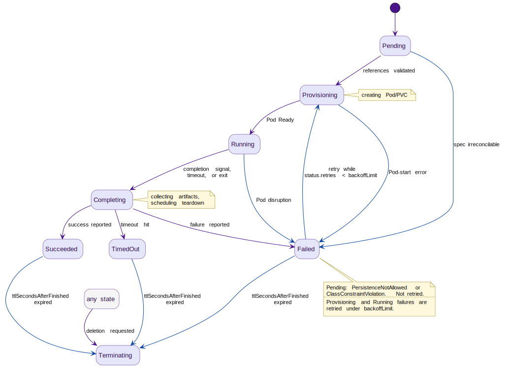

# AgentTask Lifecycle

An [AgentTask](../resources/agenttask.md) is a run-to-completion workload: the operator provisions a Pod, the Pod does its work, the operator collects the result and tears the Pod down. Unlike an Agent, which is long-lived and hibernates between requests, an AgentTask always settles in a terminal phase.

This page covers the AgentTask state machine, how the operator decides a task is done, how artifacts get from the container into `status`, and what happens on a retry.

## State machine

## Transition triggers

| From -> To | Trigger |
|---|---|
| Pending -> Provisioning | References valid |
| Provisioning -> Running | Pod Ready. `status.startTime` is stamped in the same status write. |
| Provisioning -> Failed | Unrecoverable Pod-start error. Retryable under `backoffLimit`. |
| Running -> Completing | Agent reports completion, container exits, or timeout hits |
| Running -> Failed | Involuntary Pod disruption mid-run (eviction, out-of-band delete, node loss). Retryable under `backoffLimit`. |
| Completing -> Succeeded | Completion reported success AND artifacts collected |
| Completing -> Failed | Completion reported failure OR artifact collection failed OR container exited non-zero |
| Failed -> Provisioning | `backoffLimit > 0` AND `status.retries < backoffLimit` (retry, see [Retry mechanics](#retry-mechanics)) |
| Completing -> TimedOut | Timeout hit before completion reported AND `spec.completion.onTimeout: Fail` (the default) |
| Pending -> Failed | Reconcile-time validation determines the spec is irreconcilable with its referenced AgentClass |
| Succeeded/Failed/TimedOut -> Terminating | TTL expired OR deletion requested |

The rest of this section expands the rows whose reasoning does not fit in a table cell.

### Provisioning -> Running: the clock starts here

`spec.completion.timeout` measures from `status.startTime`, and `startTime` is stamped only when the Pod becomes Ready. Scheduling and image-pull time therefore never count against the task's wall-clock budget.

### Provisioning -> Failed: three distinct causes

- **Fatal config errors** (for example `InvalidImageName`) fail immediately.
- **A Pod that reaches a terminal phase before ever becoming Ready** fails immediately. The container started and exited, and under `restartPolicy: Never` one crash is terminal, so there is nothing to wait for.
- **An image-pull or scheduling failure** fails after persisting past a fixed **5-minute provisioning deadline**. This is a documented constant, not a spec field.

All three are normal retryable failures, subject to the `Failed -> Provisioning` backoff below.

### Running -> Failed: completion beats disruption

The Pod can vanish mid-run: evicted, deleted out-of-band, or its node lost. That is a normal retryable failure under `backoffLimit`. But the operator must not classify the loss until it has checked whether the task actually finished first.

**Precedence rule.** For an `agentReported` task, the reconciler first reads the `{taskName}-completion` ConfigMap:

- A valid completion already stamped through the identity gate (the write passed `status.currentPodUID` before the Pod departed) **wins**, and drives `Running -> Completing` normally.
- Only an **empty mailbox** classifies the loss as `Failed`.

Without this ordering, an eviction landing just after a successful `/v1/task/complete` would wipe a valid result in the retry sequence and re-run a finished task.

`exitCode` mode needs no carve-out. An evicted Pod reaches `status.phase: Failed` with **no** container exit code, so terminal-without-exit-code is treated as failure rather than waiting for an exit status that will never appear.

### Completing -> Failed: what "artifact collection failed" means

Artifact collection fails on a ConfigMap read error, or on the defensive reconciler-side artifact-name re-check tripping. Note that the gateway already rejects name mismatches synchronously with `400 invalid_request` before they can reach this state, so the re-check firing here would indicate something has drifted.

### Completing -> TimedOut: why timeouts are their own phase

With `spec.completion.onTimeout: Succeed`, the same trigger settles in `Succeeded` instead of `TimedOut`. `TimedOut` is deliberately distinct from `Failed` so that timeouts are attributable and exempt from `backoffLimit` retries (see [Retry mechanics](#retry-mechanics)).

### Pending -> Failed: irreconcilable spec

Reconcile-time validation can determine the AgentTask spec cannot be satisfied by its referenced AgentClass:

- `reason=PersistenceNotAllowed` per [rule 24](../resources/validation-and-defaulting.md#cross-resource-validation).
- `reason=ClassConstraintViolation` for an image/provider/namespace mismatch detected during initial provisioning. These are the same conditions that send an Agent to `Degraded`.

This is terminal because AgentTask has no `Degraded` phase. It mirrors the existing class-drift handling for backoff retries against a tightened class (see [AgentClass change handling](change-propagation.md#agentclass-change-handling) and [AgentTaskReconciler](reconcilers.md#agenttaskreconciler)).

### Completing is a pass-through, not a decision point

`Completing` is a brief artifact-collection state. The eventual terminal phase (`Succeeded` / `Failed` / `TimedOut`) is determined by the trigger that caused the `Running -> Completing` transition, not by a separate event inside `Completing`.

Timeout-triggered transitions still pass through `Completing` so any partial agent-reported payload can be picked up best-effort before settling in the phase `spec.completion.onTimeout` selects: `TimedOut` for `Fail` (the default), `Succeeded` for `Succeed`.

## Completion detection

How the operator learns a task is done depends on `spec.completion.condition`.

### agentReported

The gateway receives [POST /v1/task/complete](../gateways/api/task-complete.md) from the agent container. The gateway updates the pre-existing `{taskName}-completion` ConfigMap in the task's namespace (created by the AgentTaskReconciler at provisioning time) with the completion payload: status, message, and artifact key-values. The reconciler watches the ConfigMap for changes and transitions to `Completing` once the payload is populated.

Using a ConfigMap rather than a Pod annotation ensures completion data survives Pod crashes or eviction between the agent's completion call and the reconciler's next pass. This is what makes the precedence rule above possible.

The reconciler stamps `AgentTask.status.currentPodUID = Pod.UID` whenever the agent's Pod is created (initial provisioning and `backoffLimit` retries). The gateway's `/v1/task/complete` admission uses this field as the identity gate: see [POST /v1/task/complete](../gateways/api/task-complete.md) 403 cases (c) `StalePodCompletion` and (d) `TaskAlreadyCompleted`.

### exitCode

The reconciler watches Pod phase: exit 0 -> `Succeeded`, non-zero -> `Failed`.

This mode depends on task Pods being created with `restartPolicy: Never`, which the AgentTaskReconciler pins unconditionally because Agentry owns retries via `backoffLimit`. With `Always` or `OnFailure`, the kubelet restarts the exited container in place and the Pod phase never reaches `Succeeded`/`Failed`, so completion would never be observed. In-place kubelet restarts would also bypass `status.retries` accounting and blur the one-run-per-`currentPodUID` assumption.

Agent Pods, by contrast, are pinned `restartPolicy: Always`. Crash-loop detection there reads `containerStatuses` restart counts (CrashLoopBackOff), not Pod phase.

## Artifact collection

In `agentReported` mode, artifact values are embedded in the completion payload written by the agent. The reconciler reads them from the `{taskName}-completion` ConfigMap and writes them to `status.artifactValues`. No exec into the container is required.

Artifact-name conformance against `spec.artifacts` is enforced synchronously at the gateway: `400 invalid_request` is returned to the agent before the ConfigMap is patched (see [POST /v1/task/complete](../gateways/api/task-complete.md)). The reconciler re-checks defensively when reading the ConfigMap, as belt-and-suspenders against any future RBAC drift on the per-task `update, patch` Role, but under normal operation the re-check is a no-op.

Oversize artifacts are rejected at the gateway with HTTP 413:

- more than **4 KiB per artifact**, or
- more than **32 KiB total**.

Agents must externalize large outputs (object storage, Git, etc.) and pass a reference URL inline. There is no auto-spill mechanism and no `status.artifactRefs` field.

## Retry mechanics

When [`spec.completion.backoffLimit`](../resources/agenttask.md) is `> 0` and the task transitions to `Failed` with `status.retries` below the limit:

1. The reconciler increments `status.retries`.
2. The reconciler clears `status.currentPodUID = ""`.
3. The existing Pod is deleted (it has already exited or will be terminated).
4. The `{taskName}-completion` ConfigMap is reset to `data: {}`.
5. The PVC is retained, so the retry runs with the same scratch storage.
6. The task transitions back to `Provisioning` and a new Pod is created.
7. The reconciler observes the new Pod via the informer and stamps `status.currentPodUID = newPod.UID`.
8. If the retry also fails and `status.retries` equals `backoffLimit`, the task remains in `Failed` as a terminal state.

Steps 2 and 7 bracket the run: clearing the UID closes the in-flight stale-write window, and re-stamping it re-opens the gate for the new Pod. In between, no Pod can write a completion.

**On step 1 (when the counter moves).** The increment happens at the start of each retry cycle, before the [pre-Pod cross-check in AgentTaskReconciler step 1](reconcilers.md#agenttaskreconciler) runs. A retry whose new Pod fails the cross-check (`reason=ClassConstraintViolation` or `reason=PersistenceNotAllowed`) therefore consumes one unit of `backoffLimit` even though the failure cause is admin misconfiguration of the AgentClass or ModelProvider rather than the workload. Operators that have aligned the class spec mid-backoff and want a clean retry should delete and recreate the AgentTask. A `kubectl apply` of the same or modified spec does not reset `status.retries`, since status is controller-owned and Kubernetes apply patches only `spec`. The new AgentTask starts at `status.retries = 0` against the now-aligned class.

**On step 2 (clearing the UID).** Any `/v1/task/complete` from the terminated old Pod arriving after this point fails the gateway's identity gate with `403 StalePodCompletion` instead of overwriting the new Pod's data.

**On step 4 (resetting the mailbox).** The reconciler patches the ConfigMap back to empty rather than deleting and re-creating it, so the existing ownerRef and the gateway's name-scoped `update, patch` Role remain valid for the retry.

**On step 7 (re-stamping the UID).** There is a narrow informer-lag window (typically <100ms versus seconds of agent startup) where the new Pod's first `/v1/task/complete` may race the stamp and receive `403 StalePodCompletion`. Agents handle this per [/v1/task/complete](../runtime/contract.md) with a bounded retry on `StalePodCompletion`.

### Timeouts are not retried

Only `Failed` transitions trigger backoff retries. `TimedOut` is terminal. A timeout indicates the workload's wall-clock budget was insufficient, not a transient failure: retrying with the same `timeout` would re-time-out without progress. Tasks that genuinely need a longer budget should raise `spec.completion.timeout` and re-apply the CR.
