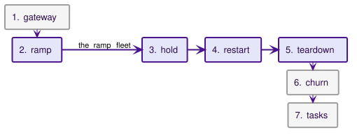

# Load and scale

This page states the load harness, the environment it runs on, and the baseline it produced. The numbers are a baseline, not a pass mark: a release runs the same harness on the same environment and compares against it, and the page states what a real cluster changes.

## What the harness measures

`make load` creates a dedicated k3d cluster and installs the chart with the mock provider trusted for upstream and callbacks and the pprof listeners open; the console and tracing stay off. The harness (`test/load`) then applies `test/load/testdata/infra.yaml`, which holds the load namespace, the mock provider, and the three ModelProviders the legs select (`load-fast`, `load-slow`, `load-hard`), and runs seven phases in order. Each phase writes its own block of the summary JSON. The ramp leaves its fleet up for the hold, restart, and teardown phases; every other phase cleans up its own objects.




The harness drives one load profile: non-streaming chat completions, no tool calls, one AgentClass, three ModelProviders, and one namespace. Streaming and the tool plane are not measured.

1. **Gateway steady state.** An in-cluster load generator calls the LLM proxy at fixed concurrency in four legs: the ServiceAccount-token tier against a mock provider that answers immediately, then the mTLS path (the load generator presents the certificate of a real Agent, so the gateway sees a Kaalm-managed workload calling from its own namespace) against an immediate provider, a 50 ms provider, and an immediate provider under hard budget enforcement. Each leg records client-observed latency, the gateway's own request histogram, and the gateway's peak CPU and memory. The immediate legs isolate the gateway's per-request cost; the hard leg isolates what synchronous ledger admission adds.
2. **Max-active ramp.** Agents are created in waves of 50, with persistence and hibernation off, and none are retired. The ramp stops at the target or at the environment's first limit: agent Pods crash-looping on probe timeouts, host memory below a floor, a node reporting memory pressure, the scheduler refusing a Pod, or a wave that misses Ready within `-wave-timeout` (default six minutes). The wave that hits the limit is trimmed, so the later phases run on the largest fleet that came up clean. Each wave records time-to-Ready (creation to the Ready condition) and its breakdown (certificate issuance, Pod start, start to Ready), the controller's reconcile histogram and queue depth, the operator components' memory, and the host's available memory, which yields the memory cost per running agent.
3. **Hold and serve.** At the peak fleet, every active agent receives one message per interval through its own async webhook channel, with replies pushed to the mock's callback receiver. The phase records accepted messages, every delivery attempt by outcome, callback counts, message latency, and whether any agent lost readiness or restarted. Around the hold it reads what the operator asked of the control plane: both components' client-side request counters by method, the apiserver's own request counters by verb and resource, and from those the writes per agent per minute. During the hold it samples goroutines, heap, and RSS from both components once a minute, so a long hold (`-hold-duration 60m`) is the soak.
4. **Restart under load.** With the fleet up, a rolling restart of the controller (rollout wall time, then time to the first reconcile of the new leader, leader handoff included), then a rolling restart of the gateway under a 60 s token-tier LLM leg, counting the requests that fail while it rolls.
5. **Fleet teardown.** Deleting the whole ramp fleet and timing until its Pods are gone.
6. **Hibernation churn.** A persistence-enabled subset with short idle timers. The harness waits for every agent's first hibernation, reads the same control-plane counters over an idle window with the whole subset hibernated, then sends each agent one message per cycle, with the cycle longer than a hibernation cycle so every message is a cold wake. It records the wake latency distribution from the gateway's wake histogram, wakes and hibernations from the controller's counters, and delivery outcomes.
7. **Concurrent tasks.** Submitting the task batch at once (`KAALM_TASK_AUTOCOMPLETE=success` makes each task report success on startup) and recording provisioning latency, run time, makespan, throughput, and retries.

Timings that come from API objects (time-to-Ready, task completion) have one-second granularity, so the distributions come from the Prometheus histograms and the objects supply the coarse per-agent numbers. Two kinds of percentile appear in the tables: client-side percentiles are exact, from every sample the load generator recorded; gateway-side and delivery percentiles are interpolated from histogram bucket bounds, so they can sit above the client figure for the same leg, and a value at the top finite bucket reads as that bucket's bound.

## Run the harness

```bash
make load                       # fresh cluster, images, chart, the full run
make load-run LOAD_FLAGS='-phases gateway -gateway-duration 30s'   # inner loop on the existing cluster
make load-run LOAD_FLAGS='-phases ramp,hold,teardown -hold-duration 60m'   # the soak
make load-down                  # delete the cluster
```

`make load` takes about 45 minutes on the baseline machine. Results land in `test/load/results/` as JSON, which is not committed; the published baseline lives in `test/load/baseline/`. The flags in `test/load/config.go` change the fleet size, the wave size, the phase list, and every duration. The defaults are the baseline settings, so a baseline re-run is the one-line command. The load deploy also opens the [Profiling](observability.md#profiling) listeners on both components (`LOAD_PPROF_PORT`, default `6060`), so a profile can be taken during any phase. `make bench` runs the Go benchmarks for the pure functions on the gateway's request paths with no cluster at all; save two runs and compare them with `benchstat` before and after a change to one of those paths.

The harness checks one host prerequisite before it starts: `fs.inotify.max_user_instances` of at least 512 and `fs.inotify.max_user_watches` of at least 524288. The k3d nodes share the host kernel, and a few hundred Pods exhaust the defaults with confusing symptoms. It also records the node count, allocatable Pods, and kubelet version without enforcing them; `make load-up` creates one server and two agents at 250 Pods each, because the kubelet default of 110 caps a fleet long before memory does.

The harness is a release-time local gate, listed in the release checklist, not a CI job: its numbers mean something only against the baseline on the same environment, which shared CI runners cannot reproduce.

## The baseline environment

| Item | Baseline |
|---|---|
| Host | one machine: 16 CPUs and 16 GiB in a WSL2 VM (Linux 6.18), Windows idle, nothing else running |
| Cluster | k3d v5.8.3, one server and two agents, kubelet `max-pods` 250 per node, Kubernetes v1.31.5+k3s1 (flannel, kube-router NetworkPolicy, local-path storage, one CoreDNS) |
| Chart | 2 gateway replicas, 2 controller replicas, no resource limits, the mock provider trusted for upstream and callbacks, pprof on, console and tracing off |
| Agent image | the e2e starter-go agent (the Go base image plus the starter handler), BestEffort |
| Product code | `74e4c93`, the #174 pass complete (the #173, #176, and #179 fixes) |
| Run | September 12, 2026, `make load` with every default |
| Baseline file | `test/load/baseline/2026-09-12.json`, one run |

## Baseline numbers

Every table except the soak is from the single `make load` run of September 12, 2026, reproduced from the baseline file as printed. The run-to-run spread on this machine is stated where it matters.

### Gateway

Four legs of 60 s at 32 concurrent callers in an in-cluster load generator:

| Leg | rps | Client p50 / p95 / p99 (ms) | Gateway-side p50 / p95 / p99 (ms) | Gateway peak |
|---|---|---|---|---|
| Token tier, soft budget, immediate upstream | 13482 | 1.9 / 5.2 / 7.3 | 2.5 / 4.8 / 7.4 | 5.9 cores, 52 MiB |
| mTLS, soft budget, immediate upstream | 14684 | 1.8 / 4.8 / 6.7 | 2.5 / 4.8 / 6.3 | 6.2 cores, 54 MiB |
| mTLS, soft budget, 50 ms upstream | 615 | 51.9 / 53.2 / 54.0 | 75.0 / 97.5 / 99.5 | 6.0 cores, 56 MiB |
| mTLS, hard budget, immediate upstream | 15176 | 1.7 / 4.6 / 6.4 | 2.5 / 4.8 / 5.1 | 5.8 cores, 55 MiB |

The immediate legs isolate the gateway's per-request cost, about 0.4 ms of CPU per request. The provider-facing transport holds 256 idle connections per host, so at 32 callers a request reuses a connection instead of dialing and running a TLS handshake. The 50 ms leg is bound by the 32 callers times the upstream delay. The immediate legs vary between runs on this machine, from about 13,500 to 17,500 requests per second across the three `make load` runs of September 12.

### Max-active ramp

Waves of 50 agents, persistence and hibernation off, until the environment's first limit:

| Wave | Fleet Ready | Wall (s) | Time-to-Ready p50 / p95 / max (s) | Certificate p50 / p95 (s) | Pod start p50 (s) | Start-to-Ready p50 / p95 (s) | Reconcile p50 / p99 (ms) | Controller / gateway MiB | Host available MiB |
|---|---|---|---|---|---|---|---|---|---|
| 0 | 50 | 65 | 35 / 59 / 61 | 31 / 48 | 33 | 1 / 11 | 3.3 / 232.8 | 48 / 44 | 11610 |
| 1 | 100 | 56 | 36 / 53 / 53 | 30 / 51 | 31 | 1 / 11 | 3.5 / 233.9 | 54 / 47 | 11005 |
| 2 | 150 | 69 | 43 / 63 / 66 | 35 / 53 | 36 | 1 / 10 | 3.4 / 230.1 | 61 / 49 | 10283 |
| 3 | 200 | 63 | 34 / 54 / 60 | 30 / 50 | 31 | 1 / 10 | 3.4 / 231.2 | 66 / 53 | 9612 |
| 4 | 250 | 61 | 33 / 52 / 58 | 27 / 47 | 29 | 1 / 11 | 3.5 / 230.9 | 67 / 59 | 8838 |
| 5 | 300 | 65 | 30 / 52 / 60 | 26 / 50 | 28 | 2 / 10 | 3.5 / 231.3 | 78 / 64 | 8045 |
| 6 | 350 | 57 | 31 / 51 / 54 | 27 / 48 | 29 | 2 / 10 | 3.6 / 233.0 | 79 / 69 | 7208 |
| 7 | 400 | 71 | 38 / 59 / 65 | 32 / 52 | 33 | 2 / 11 | 3.5 / 234.1 | 85 / 71 | 6563 |
| 8 | 425, trimmed to 400 | 170 | 40 / 150 / 155 | 27 / 45 | 29 | 11 / 106 | 3.4 / 234.6 | 110 / 93 | 5472 |

The ramp stopped in wave 8 at agent Pods crash-looping on probe timeouts, and the fleet the later phases ran on is the 400 agents of waves 0 to 7. Memory per running agent is 16.6 MiB of host memory (the starter agent, BestEffort). Time-to-Ready is certificate issuance: the certificate column is the bulk of every wave's p50, and Pod start to Ready is about a second. Reconcile p50 is 3.5 ms, because a pass that changes nothing writes nothing. The reconcile count per wave is flat at about 1,100 as the fleet grows: a class's in-use count and a provider's spend counters do not re-enqueue every agent that references them.

### Hold and serve

One message per agent per minute for three minutes, through each agent's async webhook channel, replies pushed to the mock's callback receiver:

| Measure | Value |
|---|---|
| Delivered / failed | 1171 / 30 (97.5% delivered, 2.5% failed after four attempts) |
| Delivery attempts by outcome | connect 300, ok 1171, timeout 69 |
| Callbacks delivered | 1201 |
| Delivery time | p50 3.5 ms, p95 10000 ms |
| Channels active | all 400 in 11 s |
| Fleet during the hold | 400 Ready before, 400 after, 0 container restarts, 0 readiness flaps |
| Gateway peak | 102 mCPU, 152 MiB |
| Controller peak | 253 mCPU, 126 MiB |

The delivery tail is the environment. Every failed attempt is counted by the layer that failed, and the retried attempts are TCP connects that go unanswered for 10 s or more on fresh flows to the same destination, alongside about 1250 retransmit timeouts on established connections per three-minute hold on the busy gateway Pod, while conntrack and bridge counters on the nodes stay clean: this is the 16-core WSL2 box delaying packets under 400 agent Pods. The failure count swings between runs (5 to 163 of 1,200 across the five holds of September 12), so read it as a range. The gateway's own cost on this path is fixed: a dropped packet costs one connect bound rather than a whole attempt, connections are pooled per agent, the agent is resolved once per attempt, and nothing leaks. Channel activation for 400 channels takes seconds, because the channel reconciler writes status and its RoleBindings only when they change.

### Control-plane traffic

What the operator asked of the apiserver, read from both components' client-side request counters and the apiserver's own counters, over the hold and over an idle window with the churn fleet fully hibernated:

| Window | Controller | Gateway | Largest apiserver rows |
|---|---|---|---|
| Hold, 400 active agents, 225 s | 2.6 req/s, 0.34 writes per agent per minute | 8.0 req/s, 0.99 writes per agent per minute | POST configmaps 1202, PUT agentchannels/status 399, PUT leases 342, APPLY configmaps 276, GET configmaps 276, GET leases 71 |
| Idle, 100 hibernated agents, 181 s | 1.1 req/s, 0.46 writes per agent per minute | 1.7 req/s, 0.24 writes per agent per minute | PUT leases 276, GET configmaps 219, APPLY configmaps 72, GET leases 57, PUT agentchannels/status 48, GET endpoints 18 |

The per-agent rates divide every write the component made by the fleet size, including writes that do not scale with agents (leader-election leases are the largest controller row in both windows, and the gateway's budget exchange is per provider per replica), so a small fleet shows a higher per-agent figure than a large one. Per agent, the gateway's hold traffic is one ConfigMap create per async message, which the design specifies. The controller's is channel status writes: the channel reconciler visits every channel once a minute and writes `PlatformConnected` whenever its status, reason, or message changes, and the message carries the latest attempt's error text, so the write count tracks failed delivery attempts (369 in this hold), not final failures.

### Restart under load

A rolling restart of each component with the ramp fleet up:

| Measure | Value |
|---|---|
| Controller rollout with 400 agents up | 20 s to both replicas Ready; first reconcile of the new leader at 21 s |
| Gateway rollout under a 60 s token-tier leg | 11 s; 1 of 626838 requests failed |

The controller's number is the leader handoff as well as the rollout, since the first reconcile of the new leader is what the fleet waits for. The gateway's rollout drops the requests that were in flight on the replica being replaced; with two replicas and the default `maxUnavailable` that is a handful per roll.

### Fleet teardown

Deleting all 400 agents and their channels: 400 agents gone in 63 s.

### Hibernation churn

A persistence-enabled fleet of 100 with a 10 s idle timer, one message per agent per 90 s for ten minutes, so every message is a cold wake:

| Measure | Value |
|---|---|
| Fleet up | all 100 in 197 s; time-to-Ready p50 107 s, p95 179 s |
| First hibernation | Ready to Hibernated p50 16 s, p95 30 s; all hibernated 30 s after the last came up. The floor is the controller's 15 s activity cache, not the 10 s idle timer |
| Messages | 667 sent at 1.11 per second, delivered 668, 668 callbacks |
| Wakes | 667 (by result ready 667); 667 hibernations followed |
| Wake latency | p50 4.0 s, p95 10.0 s |
| Teardown | 100 agents and their Pods gone in 13 s; PVC deletion is not timed |

Wake latency is the Pod's start on this machine plus the NetworkPolicy programming lag described under [What a real cluster changes](#what-a-real-cluster-changes); the breakdown is what transfers, not the value.

### Concurrent tasks

200 AgentTasks submitted at once, each reporting success on startup:

| Measure | Value |
|---|---|
| Outcome | 200 Succeeded, 0 retries |
| Makespan | 161 s for the batch, 75 tasks per minute |
| Creation to start | p50 110 s, p95 150 s |
| Start to completion | p50 5 s, p95 6 s |
| Teardown | 200 tasks gone in 18 s |

Task throughput on this environment is certificate issuance throughput: the run itself is 5 s, and the queue in front of it is two minutes at p50.

### Soak

A 60-minute hold at the peak fleet with the same settings as the three-minute hold (`make load-run LOAD_FLAGS='-phases ramp,hold,teardown -hold-duration 60m'`, September 12, 2026, product code `a828022`), sampled once a minute. The soak's result file is not committed, so these figures have no source in the repository; the next soak run is the one to commit as a baseline.

| Measure | Value |
|---|---|
| Messages | 24001 accepted at 6.7 per second; 23302 delivered, 700 failed after four attempts (2.9%); 24002 callbacks |
| Delivery attempts by outcome | ok 23302, connect 3769, timeout 1357 |
| Goroutines | gateway 1114 to 1185, controller 279 to 309, no trend over the hour |
| Heap in use | gateway 42 to 105 MiB, controller 52 to 114 MiB, rising through the hour |
| RSS | gateway 94 to 159 MiB, controller 105 to 169 MiB |
| Control plane over the hour | controller 2.7 req/s, 0.35 writes per agent per minute; gateway 7.9 req/s, 0.99 writes per agent per minute; largest apiserver rows POST configmaps 24002, PUT leases 5538, PUT agentchannels/status 5360 |
| Fleet | 400 Ready before and after, 0 container restarts, 0 readiness flaps |

The heap curves are the async records, not a leak. Every async message leaves a `kaalm-async-{requestId}` ConfigMap in `kaalm-system` for its one-hour TTL, both components hold every live record in their ConfigMap informer, and 24,000 records over the hour is about 60 MiB in each cache. The curve flattens one TTL after the load starts, at the message rate times the TTL, and nothing else in either process grew: goroutine counts are flat, and the connection pools stay at the fleet's size. The controller's remaining status writes are `PlatformConnected` updates, one per change of status, reason, or message, so they track the failed delivery attempts this environment produces (5,126 over the hour).

## What a real cluster changes

The baseline is one developer machine. The numbers that transfer are the per-unit ones (memory per running agent, the gateway's per-request cost, the wake latency breakdown); the absolute fleet ceiling does not.

- **Provider latency.** Real providers answer in hundreds of milliseconds to seconds, so the gateway's own cost, which the immediate legs isolate, is a small fraction of every request. Compare against the 50 ms leg.
- **Memory and nodes.** The ramp stops where host memory runs out on one machine. On a real cluster the fleet ceiling is the sum of node capacity divided by the per-agent figure, plus whatever the agent image itself needs beyond the starter.
- **Certificate issuance.** Every agent gates on a cert-manager Certificate before its Pod exists, so starting a fleet is paced by cert-manager's issuance rate. A production cert-manager can be tuned and scaled; the baseline runs the default single replica.
- **The CNI.** k3d's flannel enforces NetworkPolicy through kube-router, whose ipset programming lags a freshly created Pod by up to about 20 seconds, which lands inside wake latency. Cilium and Calico program policies differently and typically faster.
- **Storage.** The local-path provisioner backs the churn fleet's PVCs and provisions each volume through a helper Pod. A CSI driver changes both the provisioning latency and the hibernate-and-wake cost.
- **The apiserver.** k3s runs a single embedded apiserver on SQLite-backed storage. The controller's reconcile latency and the hold phase's callback records are apiserver-bound at scale; a multi-member etcd behaves differently under the same write rate.
- **The knobs.** `controller.maxConcurrentReconciles` (default 4) and the two replica counts are the only chart values that change throughput ([Configuration reference](deployment.md#configuration-reference)). As shipped the API client rate limits are fixed in the binaries: controller-runtime's 20 requests per second with a burst of 30 per controller replica, and 100 per second with a burst of 200 per gateway replica.

## See also

- [Observability](observability.md) for the metric catalog the harness reads.
- [Controller operations](../controller/operations.md#observability) and [LLM gateway operations](../gateways/llm/operations.md#observability) for what each metric means.
- [Vision and scope](../concepts/vision-and-scope.md) for the fleet size the design targets.
