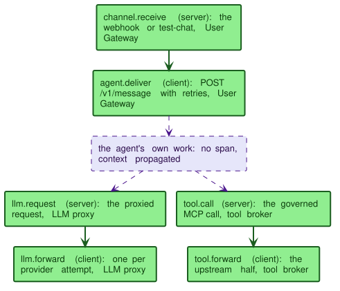

# Observability

Kaalm emits five kinds of signal:

1. **Prometheus metrics** from the controller and the gateway.
2. **Logs** from the controller, the gateway, and the console.
3. **Kubernetes Events** on the Kaalm resources.
4. **OpenTelemetry traces** from the gateway, off by default.
5. **Go profiles** from the controller and the gateway, off by default.

This page carries the full metric table, the log conventions and the PII rule, the recommended alerts, the dashboards, tracing, and profiling. Each component's own page states when a metric increments and what its label values mean: [Controller observability](../controller/operations.md#observability), [LLM Gateway observability](../gateways/llm/operations.md#observability), [User Gateway observability](../gateways/user/operations.md#observability), and [Audit and metering](../gateways/tool-plane.md#audit-and-metering) for the tool broker.


## Scope

**What ships.**

- Prometheus metrics on dedicated ports (controller `:8080/metrics`, gateway `:9090/metrics`)
- Logs from all three components with a hard PII-safety rule
- Kubernetes Events on all six Kaalm CRDs
- A small recommended-alerts set tied to architectural failure modes
- Three Grafana dashboards (per-namespace, per-provider, cluster) as importable JSON
- OpenTelemetry tracing across the gateway to agent to provider hops (default off)

**Not part of Kaalm.** Both are on the vision page's [Scope for v1](../concepts/vision-and-scope.md#scope-for-v1) list.

- An audit-log export pipeline beyond standard Kubernetes audit logging
- Cost analytics and chargeback reporting

## Metrics

### Endpoints

| Component | Port | Path | Auth | Notes |
|---|---|---|---|---|
| Controller | `:8080` | `/metrics` | None | controller-runtime's metrics port; the chart passes `--metrics-secure=false`. Every replica serves it, and the phase gauges are computed from each replica's cache |
| Gateway | `:9090` | `/metrics` | None | Plain HTTP, shared by the LLM and User Gateway paths |

Both endpoints are unauthenticated and plain HTTP, the usual Prometheus scrape arrangement, and they are ClusterIP only. The chart ships no `ServiceMonitor` or `PodMonitor`; its NetworkPolicy admits the two ports only from the `networkPolicy.metricsFrom` peers, so point that value at your Prometheus ([The operator's own NetworkPolicy](deployment.md#the-operators-own-networkpolicy), [Recommendations for deployment](../security/model.md#recommendations-for-deployment)). The console serves no metrics.

### Aggregated catalog

Standard controller-runtime reconcile metrics (counts, duration, queue depth, work-queue saturation) are emitted automatically by the controller. See [Observability](../controller/operations.md#observability) for the per-component canonical list.

The Kaalm-specific metrics across all three components. The dashboard test under `test/dashboards` reads this table and requires every row on a panel. One Kaalm metric is outside it on purpose: `kaalm_storage_migrated_objects_total{kind}`, a counter the storage-version migrator increments once per upgrade ([Storage-version migration](api-versioning.md#storage-version-migration)).

| Source | Metric | Type | Labels |
|---|---|---|---|
| Controller | `kaalm_agents` | gauge | `phase`, `namespace` |
| Controller | `kaalm_tasks` | gauge | `phase`, `namespace` |
| Controller | `kaalm_channels` | gauge | `namespace`, `phase`, `ready`, `platform_connected` |
| Controller | `kaalm_provider_budget_canonical_usd` | gauge | `provider`, `namespace`, `period` |
| Controller | `kaalm_hibernations_total` | counter | `namespace` |
| Controller | `kaalm_wakes_total` | counter | `namespace`, `trigger` (always `activator` as shipped) |
| LLM Gateway | `kaalm_llm_requests_total` | counter | `provider`, `model`, `namespace`, `status` |
| LLM Gateway | `kaalm_llm_request_duration_seconds` | histogram | `provider`, `model` |
| LLM Gateway | `kaalm_llm_tokens_total` | counter | `provider`, `model`, `namespace`, `direction` |
| LLM Gateway | `kaalm_llm_spend_usd_total` | counter | `provider`, `namespace` |
| LLM Gateway | `kaalm_llm_fallback_total` | counter | `from_provider`, `to_provider`, `reason` |
| LLM Gateway | `kaalm_llm_budget_utilization` | gauge | `provider`, `namespace`, `period` |
| LLM Gateway | `kaalm_budget_threshold_events_total` | counter | `provider`, `namespace`, `action` |
| LLM Gateway | `kaalm_llm_budget_boundary_events_total` | counter | `provider`, `namespace`, `event` |
| LLM Gateway | `kaalm_llm_server_tool_use_total` | counter | `provider`, `namespace`, `tool` |
| Tool broker | `kaalm_tool_calls_total` | counter | `provider`, `namespace`, `tool`, `status` |
| Tool broker | `kaalm_tool_call_duration_seconds` | histogram | `provider`, `tool` |
| User Gateway | `kaalm_channel_messages_total` | counter | `channel_type`, `namespace`, `status` |
| User Gateway | `kaalm_channel_message_duration_seconds` | histogram | `channel_type` |
| User Gateway | `kaalm_channel_wake_total` | counter | `namespace` |
| User Gateway | `kaalm_channel_wake_duration_seconds` | histogram | `namespace`, `result` |
| User Gateway | `kaalm_channel_delivery_attempts_total` | counter | `namespace`, `outcome` |
| User Gateway | `kaalm_channel_callback_total` | counter | `namespace`, `status` |
| User Gateway | `kaalm_channel_callback_duration_seconds` | histogram | `namespace` |
| User Gateway | `kaalm_channel_response_too_large_total` | counter | `namespace`, `mode` |
| User Gateway | `kaalm_channel_async_patch_failed_total` | counter | `namespace` |

The table holds names, types, and label names only. When each metric increments and what each label value means are stated on the component pages linked in the introduction.

### Cardinality

The `namespace` label appears on most metrics and dominates cardinality in clusters with many active tenants. The `model` and `provider` labels are bounded by `ModelProvider.spec.models` and the count of declared providers. The `tool` label is bounded by declared catalogs: on the broker metrics it carries only ids from `ToolProvider.spec.tools` (everything else collapses to `uncataloged`; see [Audit and metering](../gateways/tool-plane.md#audit-and-metering)), and on `kaalm_llm_server_tool_use_total` it carries the provider-side tool vocabulary, a handful of values per provider type. Enum labels (`status`, `result`, `mode`, `phase`, `trigger`, `action`, `direction`, `ready`, `platform_connected`) carry a handful of values each.

**No metric carries per-Agent or per-AgentTask identity as a label.** That resolution belongs in logs, Events, and the console read API backed by the gateway's [per-workload spend ledger](../gateways/llm/budgets-and-rate-limits.md#per-workload-spend), not metrics, to keep cardinality bounded as the cluster scales to thousands of agents.

## Logs

The gateway and the console write structured JSON to stdout at `info` through `log/slog`. The controller writes structured JSON to stderr at `info` through controller-runtime's zap logger. `controller.logLevel`, `gateway.logLevel`, and `console.logLevel` set each component's level ([Configuration reference](deployment.md#configuration-reference)); the controller accepts `debug`, `info`, or `error`, and the gateway and console accept `debug`, `info`, `warn`, or `error`. The chart configures no log shipping; ship the streams with a cluster log pipeline such as Fluent Bit, Vector, or Loki.

Per-line fields are per call site, not a fixed schema. The controller's lines carry controller-runtime's `controller`, `namespace`, `name`, and `reconcileID` fields. The gateway's lines carry the identifiers each path has: `requestId`, `messageId`, and `namespace` on the User Gateway, `namespace` and `provider` on the budget and fallback paths, and the audit fields on the tool broker. No line carries a `component` field; the stream tells the components apart.

### PII safety

**Hard rule: in the default build, prompt and response bodies are never logged at any level.** This holds at `info`, at `debug`, and on every code path. Specifically:

- The **LLM proxy** writes no per-request line. Its only log lines are a budget threshold crossing and a streaming relay error, both with names and counts. Request accounting is metrics ([Aggregated catalog](#aggregated-catalog)).
- The **tool broker** logs one audit record per call: caller identity, ToolProvider, tool, method, outcome, duration, and sizes ([Audit and metering](../gateways/tool-plane.md#audit-and-metering)). Arguments and results are never logged.
- The **User Gateway** logs a failed delivery attempt and each test-chat delivery, with channel, request id, status, and latency. Webhook payloads and agent replies are never logged.
- **Reconciler logs** cite resource names and condition reasons, never Secret content, channel auth tokens, or provider API keys.

This is a hard rule because logs are typically shipped to lower-trust aggregation pipelines, and prompt content can include credentials, customer data, or platform-team policy decisions surfaced through tool calls. The same rule is stated from the security side at [Audit trail](../security/model.md#audit-trail).

### Debug-build escape hatch

A separate **debug build**, gated by the Go build tag `kaalm_debug_logs` at compile time, can log prompt and response bodies on the LLM proxy paths, and tool-call request and response bodies on the MCP broker routes, for contract bring-up and integration debugging. The escape hatch exists at the build layer only:

- The published images are default builds. A debug build emits a startup banner, so an operator who runs one notices.
- There is **no runtime Helm value, environment variable, feature flag, or admin endpoint** that flips body logging on in a default build. The gate is build-time only.

In the default build the body logger compiles to a no-op, so no configuration can turn body logging on; developers use the debug build for local work against the [runtime contract](../runtime/contract.md).

## Kubernetes Events

Events are the surface for status changes that platform teams discover with `kubectl describe`. [Event emission](../controller/operations.md#event-emission) is the full table of the controller's reasons, and the gateway's three runtime Warnings are stated under [Gateway ServiceAccount permissions](../security/rbac.md#gateway-serviceaccount-permissions). The groups that matter for alerting:

- **Phase transitions** on Agent (`Normal`, `PhaseChanged`). AgentTask emits no phase Event; its settle and retry Events carry the outcome.
- **Hibernation and wake** on Agent (`Normal`, `Hibernated` and `Woken`; `Warning`, `WakeIgnored`). See [Hibernation mechanics](../controller/hibernation-and-wake.md#hibernation-mechanics).
- **Provider health** on ModelProvider and ToolProvider (`Warning`, `ProviderUnhealthy`), and the hard-enforcement margin on ModelProvider (`Warning`, reason `BoundaryMarginRaised` as shipped, where the condition's reason is `ObservedTrafficExceededMargin`).
- **Degraded entry** on Agent (`Warning`, the Degraded reason as the Event reason), emitted once when the Agent enters `Degraded` ([Degraded](../controller/agent-lifecycle.md#degraded)).
- **Task settlement and retry** on AgentTask (`Normal`, `TaskSucceeded`; `Warning`, `TaskFailed` and the timeout reasons; one `Warning` per retry).
- **Provider configuration** on ModelProvider (`Warning`, `FallbackIneligible` at reconcile time and at request time, `DegradeTargetNotCheapest`, `MaxOutputTokensUnset`) and the gateway's `CredentialsInvalid` when a provider refuses the key during a fallback walk ([Fallback logic](../gateways/llm/fallback.md)).
- **Callback rejection** on AgentChannel (`Warning`, `CallbackRejected` when a platform refuses or exhausts a reply). A `callbackUrl` that fails the pre-dial check lands on the channel's `PlatformConnected` condition with reason `CallbackInvalid`, not in an Event ([Channel health tracking](../gateways/user/platform-adapters.md#channel-health-tracking)).
- **Pod replacement** on Agent (`Normal`, `SpecDrift`; `Warning`, `PodDisrupted`). See [Change propagation](../controller/change-propagation.md).

Events persist per the cluster's standard Event retention. For long-term audit, see [Audit trail](../security/model.md#audit-trail).

## Recommended alerts

These alerts cover the failure modes this book names. The page states no PromQL or thresholds.

| Alert | Severity | Architectural hook |
|---|---|---|
| Controller all replicas unready | Page | Wake-on-demand depends on the controller. See [The activator](../gateways/user/activation-and-activity.md#the-activator) |
| Gateway all replicas unready | Page | LLM and webhook traffic blocked cluster-wide |
| Reconcile error rate elevated | Warn | Reconciler is stuck. Surface before the work queue backs up |
| LLM error rate elevated for a provider | Warn | Provider degraded; consider promoting fallback |
| Sustained fallback rate to a backup provider | Warn | Primary provider effectively down |
| Budget threshold `degrade` or `block` triggered | Warn / Page | Tenant or provider crossed the configured spend ceiling |
| Hibernation and wake churn in a namespace | Warn | An idle timeout set too short; the counters carry `namespace` only, so find the Agent from its Events. See [Agent lifecycle](../controller/agent-lifecycle.md) |
| Per-namespace rate-limit saturation | Warn | Tenant hitting the per-(namespace, model) ceiling. See [Rate limiting](../gateways/llm/budgets-and-rate-limits.md#rate-limiting) |
| Wake duration p95 elevated | Warn | [Activator](../gateways/user/activation-and-activity.md#the-activator) path slow. Watch `kaalm_channel_wake_duration_seconds` |
| Async-callback exhaustion rate elevated | Warn | Receivers' `callbackUrl` repeatedly unreachable; receivers should [poll](../gateways/api/async-responses.md) |
| `kaalm_channel_async_patch_failed_total` nonzero | Warn | An async response was dropped after `Patch` retry exhaustion; pollers see `202` then `404`. See [Response-patch failure](../gateways/api/async-responses.md#response-patch-failure) |

## Dashboards

Three Grafana dashboards ship as JSON in `config/grafana/`, one per topology level. Each file is self-contained: import it through the Grafana UI or provision it from the file, with no manual edits. The data source is chosen by a `datasource` template variable, the only import form that works unchanged on both paths (file provisioning never substitutes `__inputs`).

| File | Scope | Variables | Panels |
|---|---|---|---|
| `kaalm-namespace.json` | One tenant namespace | `datasource`, `namespace` | Agent, AgentTask, and AgentChannel counts by phase and condition; canonical spend and budget utilization per provider; budget policy actions; LLM request, rate-limited, and token rates; channel message rate and p95 duration; wake count and p95 duration; tool calls; async callbacks, oversized responses, patch failures |
| `kaalm-provider.json` | One ModelProvider | `datasource`, `provider` | Request rate, error ratio, latency p50 and p95 by model, token rates, fallback events by target and reason, budget utilization and canonical spend by namespace, spend rate, budget policy and hard-enforcement boundary events, provider-side tool use |
| `kaalm-cluster.json` | The whole cluster | `datasource`, `job` | Scrape targets up, controller leader, reconcile errors, duration, and queue depth; fleet totals by phase; hibernations and wakes; wake duration; channel messages; LLM and tool-broker traffic and latency; fallbacks; canonical spend by provider; async delivery state |

Conventions the panels follow:

- Every query is over the [Aggregated catalog](#aggregated-catalog), and every catalog metric is on at least one panel; the test under `test/dashboards` pins both directions and the import shape. The only non-catalog series are on the cluster dashboard's control-plane row: the scrape `up` series, controller-runtime's reconcile and work-queue families, and its `leader_election_master_status` gauge.
- The phase-count and budget-utilization gauges are computed on every scrape by every replica, so the panels aggregate them with `max`, never `sum`.
- The per-namespace rate-limit panel is the `rate_limited` outcome of `kaalm_llm_requests_total`; there is no separate utilization gauge for the per-(namespace, model) ceiling.
- The cluster dashboard's `job` variable matches scrape jobs whose name contains `kaalm`; a ServiceMonitor on the chart's Services resolves to such names. Every other panel is independent of how the scrape is configured.

`make dashboards-verify` proves the files against a live cluster: it installs a throwaway Prometheus and Grafana, provisions the three files unchanged, and checks that Grafana serves each dashboard, that Grafana can query the data source, that every panel query is valid PromQL against the scraped series, and that the metric families the e2e suite exercises are present.

## Tracing

OpenTelemetry tracing is off by default. When it is on, it connects one user message to the LLM and tool calls it caused, across the gateway to agent to provider hops.

**Propagation** is W3C `traceparent` and `tracestate`, and nothing else. Per-request identity travels as span attributes, not metric labels, so the [Cardinality](#cardinality) rule holds: `kaalm.message_id`, `kaalm.namespace`, `kaalm.agent`, `kaalm.workload`, `kaalm.provider`, `kaalm.model`, `kaalm.channel_type`, `kaalm.method`, and `kaalm.tool`, each where it applies.

**Span inventory.** Every span is created by the gateway; the agent hop propagates:

| Span | Kind | Where | Notes |
|---|---|---|---|
| `channel.receive` | server | User Gateway | Webhook and test-chat receipt; root unless the caller sent trace context. Covers handling through the sync reply, or through the `202` in async mode; the background delivery stays connected through the span identity without inheriting the caller's cancellation |
| `agent.deliver` | client | User Gateway | The delivery to the agent, retries included; its context travels to the agent on the delivery request |
| `llm.request` | server | LLM proxy | Parented by whatever context the agent propagated. A denial past route authorization (budget, rate limit) closes it with an error status, so a blocked request is visible in its trace |
| `llm.forward` | client | LLM proxy | One per provider attempt, fallback candidates included; the candidate is the `kaalm.provider` attribute |
| `tool.call` | server | Tool broker | The governed MCP call; broker denials carry an error status |
| `tool.forward` | client | Tool broker | The upstream half of a forwarded call |



The agent's own processing appears as the gap between `agent.deliver` and its child spans: the base images carry no OpenTelemetry SDK, and propagation alone connects the trace. The runtime forwards the delivery's trace context on every gateway call ([contract item 8](../runtime/contract.md#8-trace-context-propagation)); a framework running its own SDK reads the same context (`kaalm.trace_context()` in Python, `agentruntime.TraceContext` in Go) and fills the gap with real agent spans.

**Exporter.** OTLP over HTTP, configured by two Helm values ([Deployment](deployment.md)): `gateway.tracing.otlpEndpoint` (default `""`) and `gateway.tracing.sampleRatio` (default `1.0`, parent-based head sampling for traces the gateway starts). With no endpoint, no tracer is installed: no spans, no propagation, and request handling carries no tracing overhead, which is the default install. An `https` endpoint is verified against the gateway's upstream trust pool when one is configured, else the system roots; an `http` endpoint sends in the clear.

The controller and the console emit no spans: the traced path is the message path, and reconcile visibility remains metrics, logs, and Events. Scenario [S20](../appendix/scenarios.md#s20-follow-one-message-across-the-hops) proves the connected trace live: one webhook message, one trace, its spans read back out of a Jaeger beside the e2e cluster.

## Profiling

Both components can serve Go's `net/http/pprof` profiles, off by default. Setting `controller.pprofPort` or `gateway.pprofPort` to a port number adds the flag (`--pprof-bind-address` on the controller, `--pprof-addr` on the gateway) and a named `pprof` container port; the listener then serves CPU, heap, goroutine, mutex, and block profiles under `/debug/pprof/`. Turning it on also enables mutex and block sampling, which are off by default because each costs a little on every contended lock and blocking call.

The listener is a debugging aid, not an operations surface. It is unauthenticated, and the chart never puts it behind a Service, so the way to reach it is a port-forward for the length of a profiling session:

```bash
kubectl -n kaalm-system port-forward deploy/kaalm-gateway 6060:6060
go tool pprof -http=:8000 http://127.0.0.1:6060/debug/pprof/profile?seconds=30
```

Leave both values at `0` in production. The [load harness](load-and-scale.md) turns them on for the load cluster so a profile can be taken during any phase.

## See also

- [Controller observability](../controller/operations.md#observability): controller metric semantics
- [Event emission](../controller/operations.md#event-emission): the controller's Event reasons
- [LLM Gateway observability](../gateways/llm/operations.md#observability): LLM Gateway metric semantics
- [User Gateway observability](../gateways/user/operations.md#observability): User Gateway metric semantics
- [Audit trail](../security/model.md#audit-trail): Kubernetes audit logging guidance
