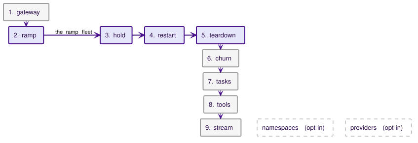

# Performance and scale

This page states the performance harness, the environment it runs on, and the baseline it produced. The numbers are a baseline, not a pass mark: a release runs the same harness on the same environment and compares against it, and the page states what a real cluster changes.

## What the harness measures

`make perf` creates a dedicated k3d cluster and installs the chart with the mock provider trusted for upstream and callbacks and the pprof listeners open; the console and tracing stay off. The harness (`test/perf`) then applies `test/perf/testdata/infra.yaml` and runs the default nine phases in order. Two more phases run only when `-phases` names them. Each phase writes its own block of the summary JSON. The ramp leaves its fleet up for the hold, restart, and teardown phases; every other phase cleans up its own objects.

The infrastructure file holds the `perf` namespace, the mock provider, two mock MCP servers, one per MCP protocol era, behind the ToolProviders `perf-mcp` (2026-07-28) and `perf-mcp-legacy` (the legacy session era), and six ModelProviders. The gateway legs select four of them: `perf-fast`, `perf-slow`, `perf-hard`, and `perf-limited`. The streaming phase adds two: `perf-anthropic`, of the Anthropic type, so its leg is relayed natively and not translated, and `perf-paced`, whose mock waits 10 ms between streamed events.




The default run drives non-streaming chat completions through the agent fleet and the gateway legs, in one namespace. The tools and stream phases add tool calls and streamed answers at the gateway. The two opt-in phases spread the fleet over many namespaces and the control plane over many providers and classes. `perf-limited` is `perf-fast` with `rateLimits.requestsPerMinute` and `tokensPerMinute` both set to 2000000000, far above any rate a leg reaches, so every request on it runs the gateway's rate limiter and none is refused.

1. **Gateway steady state.** An in-cluster load generator calls the LLM proxy at fixed concurrency in five legs: the ServiceAccount-token tier against a mock provider that answers immediately, then the mTLS path (the load generator presents the certificate of a real Agent) against an immediate provider, a 50 ms provider, an immediate provider under hard budget enforcement, and an immediate provider with rate limits on. Each leg records client-observed latency, the gateway's own request histogram, the gateway's peak CPU and memory, and the gateway's CPU per request: the gateway's process CPU over the leg, summed across replicas, divided by the requests the gateway counted. The immediate legs isolate the gateway's per-request cost; the hard leg isolates what synchronous ledger admission adds, and the rate-limits leg isolates what the request and token limiter adds.
2. **Max-active ramp.** Agents are created in waves of 50, with persistence and hibernation off, and none are retired. The ramp stops at the target or at the environment's first limit: agent Pods crash-looping on probe timeouts, host memory below a floor, a node reporting memory pressure, the scheduler refusing a Pod, or a wave that misses Ready within `-wave-timeout` (default six minutes). The wave that hits the limit is trimmed, so the later phases run on the largest fleet that came up clean. Each wave records time-to-Ready (creation to the Ready condition) and its breakdown (certificate issuance, Pod start, start to Ready), the controller's reconcile histogram and queue depth, the operator components' memory, and the host's available memory, which yields the memory cost per running agent.
3. **Hold and serve.** At the peak fleet, every active agent receives one message per interval through its own async webhook channel, with replies pushed to the mock's callback receiver. The phase records accepted messages, every delivery attempt by outcome, callback counts, message latency, and whether any agent lost readiness or restarted. Around the hold it reads what the operator asked of the apiserver, and from that the writes per agent per minute. During the hold it samples goroutines, heap, and RSS from both components once a minute, so a long hold (`-hold-duration 60m`) is the soak.
4. **Restart under load.** With the fleet up, a rolling restart of the controller (rollout time, then time to the first reconcile of the new leader), then a rolling restart of the gateway under a 60 s token-tier LLM leg, counting the requests that fail while it rolls.
5. **Fleet teardown.** Deleting the whole ramp fleet and timing until its Pods are gone.
6. **Hibernation churn.** A persistence-enabled subset with short idle timers. The harness waits for every agent's first hibernation, reads the same control-plane counters over an idle window with the whole subset hibernated, then sends each agent one message per cycle, with the cycle longer than a hibernation cycle so every message is a cold wake. It reads the control-plane counters again over the active window, from the first message to the end of a 90 s settle after the last. It records the wake latency distribution from the gateway's wake histogram, wakes and hibernations from the controller's counters, and delivery outcomes.
7. **Concurrent tasks.** Submitting the task batch at once (`KAALM_TASK_AUTOCOMPLETE=success` makes each task report success on startup) and recording provisioning latency, run time, makespan, throughput, and retries. It reads the control-plane counters over the batch, from submission until every task settles or the task timeout expires, so the window shows per-task status writes that a fleet hold cannot. The window has tasks and no agents, so it prints requests per second per component and the largest apiserver rows, with no per-agent write rates.
8. **Tool plane** (about 3.5 minutes). Three legs call `tools/call` through the broker. The token tier and mTLS legs use `POST /v1/mcp/perf-mcp` on the 2026-07-28 MCP revision. The third leg is mTLS through `POST /v1/mcp/perf-mcp-legacy` in the legacy session era: each caller opens its session once before measuring, then every `tools/call` carries the wrapped session id, which the broker checks on every call ([Session ownership](../gateways/tool-plane.md#session-ownership-legacy-revisions)). Comparing this leg with the mTLS 2026-07-28 leg shows what legacy session checking costs per call. It runs over mTLS only because legacy clients run in Kaalm-managed agents, and the first two legs already show the token-versus-mTLS cost. The mock tool servers answer only with the credential the gateway injects, so a successful call proves the injection. Each leg records client latency by auth mode, the broker's histogram (forwarded calls only), calls by status, and CPU per request. The broker figures count `tools/call` of the leg's tool only. They leave out the per-caller handshake requests and any denial the broker makes before it reads the request (namespace, grant, class, rate limit), which show only in the client's statuses. They include the warmup's one successful call, which the client's figures leave out. Each brokered call also writes the gateway's audit log line, which is part of the measured cost. The client's `statuses` map counts a 200 that carries a JSON-RPC error under `rpc_error`, not `200`.
9. **Streaming** (about 3.5 minutes). Three token-tier legs at the gateway concurrency read each stream to its end: OpenAI with an immediate mock, Anthropic with an immediate mock, and OpenAI against `perf-paced`. Each leg records time to first byte, time to last byte, requests per second, spend and missing-usage counts (the proof that usage accounting survives the stream), CPU per request, and peak gateway memory. The client's `statuses` map counts a 200 whose stream ends before `[DONE]` (OpenAI) or `message_stop` (Anthropic) under `incomplete`, not `200`.

   The immediate mock writes a whole stream at once, so on those legs time to first byte mostly measures gateway overhead. The paced mock sends the first event at once and waits 10 ms before each later one. An OpenAI stream with usage has five writes, so on that leg time to last byte sits about 40 ms above time to first byte by construction. A gap near 40 ms shows the gateway relays each event as it arrives. A gateway that buffered the stream would send the first byte only when the last event arrived, so the gap would shrink toward zero.

Two more phases run only when `-phases` names them, because each takes long enough that the default run should not grow by it unasked:

- **Many namespaces** (`-phases namespaces`, 14 minutes 21 seconds). The ramp, hold, and teardown on 400 agents spread over 20 namespaces (`-namespaces-agents` and `-namespaces-count`). It reports the same figures as those phases, so they compare with the one-namespace rows. The namespaces are `perf-00` to `perf-19`, named after `-namespace`. Each carries the label `perf.kaalm.io/phase=namespaces` and gets copies of the `perf-hook` and `perf-callback-hmac` Secrets. The phase deletes the namespaces when it ends, on failure too. It refuses to run while the ramp fleet is up, because both fleets together pass the machine's pod ceiling.
- **Many providers and classes** (`-phases providers`, 5 minutes 45 seconds). 50 ModelProviders and 50 AgentClasses (`-providers-count`), each class allowing every provider. Both sets are named `perf-many-00` to `perf-many-49`. The phase records time to Ready, the `modelprovider` and `agentclass` reconcile counts and latency, a steady control-plane audit over `-idle-duration`, and the first two gateway legs (token tier and mTLS, immediate upstream), which compare with the [gateway table](#gateway). The peak controller and gateway usage it reports covers the whole setup, from creating the providers until every class is Ready, plus the audit window, so it is not a reading taken after setup.

Timings that come from API objects (time-to-Ready, task completion) have one-second granularity, so the distributions come from the Prometheus histograms and the objects supply the coarse per-agent numbers. Client-side percentiles are exact, from every sample the load generator recorded; gateway-side and delivery percentiles are interpolated from histogram bucket bounds, so they can sit above the client figure for the same leg, and a value at the top finite bucket reads as that bucket's bound.

## Run the harness

```bash
make perf                       # fresh cluster, images, chart, the nine default phases
make perf-run PERF_FLAGS='-phases gateway -gateway-duration 30s'   # inner loop on the existing cluster
make perf-run PERF_FLAGS='-phases ramp,hold,teardown -hold-duration 60m'   # the soak
make perf-run PERF_FLAGS='-phases tools,stream'   # inner loop for the tool and streaming legs
make perf-run PERF_FLAGS='-phases namespaces'   # the fleet over 20 namespaces, needs the ramp fleet gone
make perf-run PERF_FLAGS='-phases providers'   # 50 providers and 50 classes
make perf-down                  # delete the cluster
```

`make perf` takes 56 minutes on the baseline machine, from cluster creation to the last phase (the timed run of October 8, 2026). Results land in `test/perf/results/` as JSON, which is not committed; the published baseline lives in `test/perf/baseline/`. The flags in `test/perf/config.go` change the fleet size, the wave size, the phase list, the sizes of the opt-in phases, and every duration. The defaults are the baseline settings. `make perf-deploy` also opens the [Profiling](observability.md#profiling) listeners on both components (`PERF_PPROF_PORT`, default `6060`), so a profile can be taken during any phase. `make bench` runs the Go benchmarks for the gateway's request paths with no cluster at all: the pure functions on those paths, and the whole in-process proxy path (`BenchmarkLLMProxyMTLS`, plus `BenchmarkLLMProxyMTLSRateLimited` and `BenchmarkLLMProxyMTLSRateLimitedParallel` with both limits on, sequential and with many callers on one key). Other groups cover the LLM and MCP stream relays, the buffered MCP relay, `tools/list` filtering, request body preparation, and stream usage reading. Save two runs and compare them with `benchstat` before and after a change to one of those paths.

The harness checks one host prerequisite before it starts: `fs.inotify.max_user_instances` of at least 512 and `fs.inotify.max_user_watches` of at least 524288. The k3d nodes share the host kernel, and a few hundred Pods exhaust the defaults with confusing symptoms. It also records the node count, allocatable Pods, and kubelet version without enforcing them; `make perf-up` creates one server and two agents at 250 Pods each, because the kubelet default of 110 caps a fleet long before memory does.

The harness is a local check you run at release time, listed in the [release checklist](https://github.com/win07xp/kaalm/blob/main/RELEASING.md#before-you-tag), not a CI job: its numbers mean something only against the baseline on the same environment, which shared CI runners cannot reproduce.

## The baseline environment

| Item | Baseline |
|---|---|
| Host | one machine: 16 CPUs and 16 GiB in a WSL2 VM (Linux 6.18), Windows idle, nothing else running |
| Cluster | k3d v5.8.3, one server and two agents, kubelet `max-pods` 250 per node, Kubernetes v1.31.5+k3s1 (flannel, kube-router NetworkPolicy, local-path storage, one CoreDNS) |
| Chart | 2 gateway replicas, 2 controller replicas, no resource limits, the mock provider trusted for upstream and callbacks, pprof on, console and tracing off |
| Agent image | the e2e starter-go agent (the Go base image plus the starter handler), BestEffort |
| Product code | `74e4c93` |
| Run | September 12, 2026, `make perf` with every default |
| Baseline file | `test/perf/baseline/2026-09-12.json`, one run |

The committed baseline files record the names in use when they ran: the `k3d-kaalm-load` context and node names, the `load` namespace, and `load-*` providers. A new run uses the `k3d-kaalm-perf` context, the `perf` namespace, and `perf-*` providers, so compare a new summary with them by leg name.

## Baseline numbers

Every table except the soak, the restart table, and the rate-limits leg is from the single `make perf` run of September 12, 2026, reproduced from the baseline file as printed. The restart table is from a separate run of September 29, 2026, described under it. The rate-limits leg is from a gateway-phase run of October 1, 2026, described under the gateway table. The baseline file holds no figures for the tools, stream, namespaces, and providers phases, so a run of them has no baseline row to compare against. Their tables, from [Tool plane](#tool-plane) to [Many providers and classes](#many-providers-and-classes), are from one run on October 8, 2026, on the same machine and cluster (product code `084f2ea`): `make perf` with every default, then `make perf-run PERF_FLAGS='-phases namespaces'` and `make perf-run PERF_FLAGS='-phases providers'` on the same cluster. The figures are printed as the run reported them. That run's result files are not committed, so those figures have no source in the repository.

### Gateway

Five legs of 60 s at 32 concurrent callers in an in-cluster load generator. The table holds the first four, from the September 12 run:

| Leg | rps | Client p50 / p95 / p99 (ms) | Gateway-side p50 / p95 / p99 (ms) | Gateway peak |
|---|---|---|---|---|
| Token tier, soft budget, immediate upstream | 13482 | 1.9 / 5.2 / 7.3 | 2.5 / 4.8 / 7.4 | 5.9 cores, 52 MiB |
| mTLS, soft budget, immediate upstream | 14684 | 1.8 / 4.8 / 6.7 | 2.5 / 4.8 / 6.3 | 6.2 cores, 54 MiB |
| mTLS, soft budget, 50 ms upstream | 615 | 51.9 / 53.2 / 54.0 | 75.0 / 97.5 / 99.5 | 6.0 cores, 56 MiB |
| mTLS, hard budget, immediate upstream | 15176 | 1.7 / 4.6 / 6.4 | 2.5 / 4.8 / 5.1 | 5.8 cores, 55 MiB |

The gateway's per-request cost is about 0.4 ms of CPU. The 50 ms leg is bound by the 32 callers times the upstream delay. The immediate legs vary between runs on this machine, from about 13,500 to 17,500 requests per second across the three `make perf` runs of September 12.

The fifth leg, `mtls: rate limits on, 0 ms upstream` against `perf-limited`, is not in the September 12 baseline. It was measured on October 1, 2026, in one gateway-phase run on the same perf cluster and environment (60 s legs at 32 callers, product code `463ba5b` with the rate-limiter change applied):

| Leg | rps | Client p50 / p99 (ms) | Gateway-side p99 (ms) | Gateway peak CPU | Non-200 responses |
|---|---|---|---|---|---|
| mTLS, rate limits on, immediate upstream | 17266 | 1.53 / 5.47 | 4.97 | 6.2 cores | 0 |

In the same run, the plain mTLS immediate leg served 17203 requests per second with a client p99 of 5.67 ms. Rate limits add no measurable per-request cost: the 63 requests per second between the two legs is inside the run-to-run spread stated above for the immediate legs.

### Max-active ramp

Waves of 50 agents, persistence and hibernation off, until the environment's first limit:

| Wave | Fleet Ready | Wall (s) | Time-to-Ready p50 / p95 / max (s) | Certificate p50 / p95 (s) | Pod start p50 (s) | Start-to-Ready p50 / p95 (s) | Reconcile p50 / p99 (ms) | Controller / gateway MiB | Host available MiB |
|---|---|---|---|---|---|---|---|---|---|
| 0 | 50 | 65 | 35 / 59 / 61 | 31 / 48 | 33 | 1 / 11 | 3.3 / 232.8 | 48 / 44 | 11610 |
| 1 | 100 | 56 | 36 / 53 / 53 | 30 / 51 | 31 | 1 / 11 | 3.5 / 233.9 | 54 / 47 | 11005 |
| 2 | 150 | 69 | 43 / 63 / 66 | 35 / 53 | 36 | 1 / 10 | 3.4 / 230.1 | 61 / 49 | 10283 |
| 3 | 200 | 63 | 34 / 54 / 60 | 30 / 50 | 31 | 1 / 10 | 3.4 / 231.2 | 66 / 53 | 9612 |
| 4 | 250 | 61 | 33 / 52 / 58 | 27 / 47 | 29 | 1 / 11 | 3.5 / 230.9 | 67 / 59 | 8838 |
| 5 | 300 | 65 | 30 / 52 / 60 | 26 / 50 | 28 | 2 / 10 | 3.5 / 231.3 | 78 / 64 | 8045 |
| 6 | 350 | 57 | 31 / 51 / 54 | 27 / 48 | 29 | 2 / 10 | 3.6 / 233.0 | 79 / 69 | 7208 |
| 7 | 400 | 71 | 38 / 59 / 65 | 32 / 52 | 33 | 2 / 11 | 3.5 / 234.1 | 85 / 71 | 6563 |
| 8 | 425, trimmed to 400 | 170 | 40 / 150 / 155 | 27 / 45 | 29 | 11 / 106 | 3.4 / 234.6 | 110 / 93 | 5472 |

The ramp stopped in wave 8 at agent Pods crash-looping on probe timeouts, and the fleet the later phases ran on is the 400 agents of waves 0 to 7. Memory per running agent is 16.6 MiB of host memory (the starter agent, BestEffort). Time-to-Ready is certificate issuance: the certificate column is the bulk of every wave's p50, and Pod start to Ready is about a second. Reconcile p50 is 3.5 ms. The reconcile count per wave is flat at about 1,100 as the fleet grows: a class's in-use count and a provider's spend counters do not re-enqueue every agent that references them.

### Hold and serve

One message per agent per minute for three minutes, through each agent's async webhook channel, replies pushed to the mock's callback receiver:

| Measure | Value |
|---|---|
| Delivered / failed | 1171 / 30 (97.5% delivered, 2.5% failed after four attempts) |
| Delivery attempts by outcome | connect 300, ok 1171, timeout 69 |
| Callbacks delivered | 1201 |
| Delivery time | p50 3.5 ms, p95 10000 ms |
| Channels active | all 400 in 11 s |
| Fleet during the hold | 400 Ready before, 400 after, 0 container restarts, 0 readiness flaps |
| Gateway peak | 102 mCPU, 152 MiB |
| Controller peak | 253 mCPU, 126 MiB |

The delivery tail is the environment, not the gateway. The retried attempts are TCP connects that go unanswered for 10 s or more, and the nodes' conntrack and bridge counters stay clean: this is the 16-core WSL2 box delaying packets under 400 agent Pods. The failure count swings between runs (5 to 163 of 1,200 across the five holds of September 12), so read it as a range.

### Control-plane traffic

What the operator asked of the apiserver, read from both components' client-side request counters and the apiserver's own counters, over the hold and over an idle window with the churn fleet fully hibernated. The harness reads two more windows, the active churn window and the task batch ([What the harness measures](#what-the-harness-measures)), and prints them as `churn active audit` and `tasks audit`. The table holds the first two:

| Window | Controller | Gateway | Largest apiserver rows |
|---|---|---|---|
| Hold, 400 active agents, 225 s | 2.6 req/s, 0.34 writes per agent per minute | 8.0 req/s, 0.99 writes per agent per minute | POST configmaps 1202, PUT agentchannels/status 399, PUT leases 342, APPLY configmaps 276, GET configmaps 276, GET leases 71 |
| Idle, 100 hibernated agents, 181 s | 1.1 req/s, 0.46 writes per agent per minute | 1.7 req/s, 0.24 writes per agent per minute | PUT leases 276, GET configmaps 219, APPLY configmaps 72, GET leases 57, PUT agentchannels/status 48, GET endpoints 18 |

The per-agent rates divide every write the component made by the fleet size, including writes that do not scale with agents (leader-election leases are the largest controller row in both windows, and the gateway's budget exchange is per provider per replica), so a small fleet shows a higher per-agent figure than a large one. Per agent, the gateway's hold traffic is one ConfigMap create per async message, which the design specifies. The controller's is `PlatformConnected` status writes on channels, which track failed delivery attempts (369 in this hold, 5,126 in the soak), not final failures, because the condition message carries the latest attempt's error text and each change of it is a write.

### Restart under load

A rolling restart of each component with the ramp fleet up. The figures come from a separate run on the same machine, September 29, 2026 (`make perf-run PERF_FLAGS='-ramp-target 400 -phases ramp,restart'`, product code `1866257`), whose result file is `test/perf/baseline/2026-09-29-restart.json`:

| Measure | Value |
|---|---|
| Controller rollout with 400 agents up | 11 s to both replicas Ready; first reconcile of the new leader at 21 s |
| Gateway rollout under a 60 s token-tier leg | 11 s; 1 of 810505 requests failed |

The first reconcile of the new leader is what the fleet waits for. Its 21 s divides into three parts:

1. **About 11 s of rollout.** The old leader is the last old Pod to exit, and the rollout finishes when it does.
2. **About 2 s of handoff.** The old leader releases the Lease as it shuts down, so the new Pod acquires it on its next retry (2 s) instead of waiting out the Lease duration, 15 s by default.
3. **About 8 s of new-leader startup.** The controllers start on acquisition, and the first reconcile comes while the new leader loads 400 Agents.

The gateway's one failed request was a refused connection to the Service during the roll.

### Fleet teardown

Deleting all 400 agents and their channels: 400 agents gone in 63 s.

### Hibernation churn

A persistence-enabled fleet of 100 with a 10 s idle timer, one message per agent per 90 s for ten minutes, so every message is a cold wake:

| Measure | Value |
|---|---|
| Fleet up | all 100 in 197 s; time-to-Ready p50 107 s, p95 179 s |
| First hibernation | Ready to Hibernated p50 16 s, p95 30 s; all hibernated 30 s after the last came up. The floor is activity data that can be up to 15 s old, not the 10 s idle timer |
| Messages | 667 sent at 1.11 per second, delivered 668, 668 callbacks |
| Wakes | 667 (by result ready 667); 667 hibernations followed |
| Wake latency | p50 4.0 s, p95 10.0 s |
| Teardown | 100 agents and their Pods gone in 13 s; PVC deletion is not timed |

Wake latency is the Pod's start on this machine plus the NetworkPolicy programming lag described under [What a real cluster changes](#what-a-real-cluster-changes); the breakdown is what transfers, not the value.

### Concurrent tasks

200 AgentTasks submitted at once, each reporting success on startup:

| Measure | Value |
|---|---|
| Outcome | 200 Succeeded, 0 retries |
| Makespan | 161 s for the batch, 75 tasks per minute |
| Creation to start | p50 110 s, p95 150 s |
| Start to completion | p50 5 s, p95 6 s |
| Teardown | 200 tasks gone in 18 s |

Task throughput on this environment is certificate issuance throughput: the run itself is 5 s, and the queue in front of it is two minutes at p50.

### Soak

A 60-minute hold at the peak fleet with the same settings as the three-minute hold (`make perf-run PERF_FLAGS='-phases ramp,hold,teardown -hold-duration 60m'`, September 12, 2026, product code `a828022`), sampled once a minute. The soak's result file is not committed, so these figures have no source in the repository.

| Measure | Value |
|---|---|
| Messages | 24001 accepted at 6.7 per second; 23302 delivered, 700 failed after four attempts (2.9%); 24002 callbacks |
| Delivery attempts by outcome | ok 23302, connect 3769, timeout 1357 |
| Goroutines | gateway 1114 to 1185, controller 279 to 309, no trend over the hour |
| Heap in use | gateway 42 to 105 MiB, controller 52 to 114 MiB, rising through the hour |
| RSS | gateway 94 to 159 MiB, controller 105 to 169 MiB |
| Control plane over the hour | controller 2.7 req/s, 0.35 writes per agent per minute; gateway 7.9 req/s, 0.99 writes per agent per minute; largest apiserver rows POST configmaps 24002, PUT leases 5538, PUT agentchannels/status 5360 |
| Fleet | 400 Ready before and after, 0 container restarts, 0 readiness flaps |

The heap curves are the async records, not a leak. Every async message leaves a `kaalm-async-{requestId}` ConfigMap in `kaalm-system` for its one-hour TTL, both components hold every live record in their ConfigMap informer, and 24,000 records over the hour is about 60 MiB in each cache. The curve flattens one TTL after the load starts, at the message rate times the TTL. Goroutine counts are flat.

### Tool plane

Three legs of 60 s at 32 concurrent callers against an immediate tool server. The client columns are what the load generator observed; the broker columns are the broker's histogram for forwarded calls:

| Leg | rps | Client p50 / p95 / p99 (ms) | Broker p50 / p95 / p99 (ms) | Client 200 / broker ok | Gateway CPU per request (ms) | Gateway peak |
|---|---|---|---|---|---|---|
| Token tier, 2026-07-28 | 11440.3 | 2.2 / 6.6 / 9.9 | 2.6 / 4.9 / 8.8 | 686448 / 686449 | 0.401 | 4915 mCPU, 66 MiB |
| mTLS, 2026-07-28 | 14248.4 | 1.8 / 5.0 / 7.3 | 2.5 / 4.8 / 6.8 | 854931 / 854932 | 0.392 | 5625 mCPU, 68 MiB |
| mTLS, legacy session | 14540.3 | 1.8 / 5.0 / 7.2 | 2.5 / 4.8 / 7.0 | 872462 / 872463 | 0.381 | 5625 mCPU, 68 MiB |

Every call returned 200, and the mock tool server accepts calls only with the injected credential, so every success carried it. On each leg the broker counts one call more than the client, the warmup call.

### Streaming

Three token-tier legs of 60 s at 32 concurrent callers, each reading the stream to its end. Times are client-observed:

| Leg | rps | Time to first byte p50 / p95 / p99 (ms) | Time to last byte p50 / p95 / p99 (ms) | Client 200 | Usage missing | Gateway CPU per request (ms) | Gateway peak memory |
|---|---|---|---|---|---|---|---|
| OpenAI, immediate upstream | 8463.3 | 2.6 / 7.3 / 10.5 | 3.0 / 8.0 / 11.2 | 507860 | 0 | 0.829 | 82 MiB |
| Anthropic, immediate upstream | 6937.3 | 3.0 / 8.5 / 12.1 | 3.7 / 9.6 / 13.3 | 416253 | 0 | 1.052 | 82 MiB |
| OpenAI, 10 ms between events | 732.8 | 1.0 / 2.2 / 3.3 | 43.5 / 45.1 / 46.0 | 43999 | 0 | 1.863 | 73 MiB |

No stream ended without its terminator (no `incomplete` status), and no answer was settled without usage. On the paced leg the p50 time to first byte is 1.0 ms and the p50 time to last byte is 43.5 ms, the gap near 40 ms that the phase description names.

### Many namespaces

400 agents over 20 namespaces, run as `-phases namespaces` on the same cluster. The one-namespace column is the default one-namespace ramp, hold, and teardown from the same run:

| Measure | 20 namespaces | One namespace, same run |
|---|---|---|
| Ramp | 400 Ready (target 400); waves of 50 Ready in 60 to 68 s each | 400 Ready (target 500, wave 8 trimmed to 400); waves 0 to 7 Ready in 56 to 67 s each |
| Host memory per agent | 12.7 MiB | 16.8 MiB |
| Messages | 1201 at 6.7 per second | 1200 at 6.7 per second |
| Gateway statuses | delivered 1056, delivery_failed 146 | delivered 1201 |
| Delivery attempts by outcome | connect 718, ok 1056, timeout 64 | connect 22, ok 1201, timeout 13 |
| Callbacks | 1202 | 1201 |
| Delivery time | p50 3 ms, p95 10000 ms | p50 3 ms, p95 4553 ms |
| Fleet during the hold | 400 Ready before, 400 after, 0 restarts, 0 flaps | 400 Ready before, 400 after, 0 restarts, 0 flaps |
| Control plane over the hold | 249 s: controller 2.6 req/s, 0.32 writes per agent per minute; gateway 11.9 req/s, 0.90 writes per agent per minute | 216 s: controller 2.8 req/s, 0.35 writes per agent per minute; gateway 9.4 req/s, 1.08 writes per agent per minute |
| Largest apiserver rows | POST configmaps 1202, GET configmaps 591, WATCH secrets 466, GET secrets 440, PUT agentchannels/status 411, PUT leases 377 | POST configmaps 1201, GET configmaps 443, PUT agentchannels/status 400, APPLY configmaps 352, PUT leases 327, GET leases 67 |
| Teardown | 400 agents gone in 80 s | 400 agents gone in 48 s |

The 146 failed deliveries in the 20-namespace hold are connect timeouts to the agents' Service IPs (`dial tcp ... i/o timeout`) and request deadlines. They fall on 120 of the 400 agents, spread over all 20 namespaces.

The cause is k3s's embedded NetworkPolicy enforcement (kube-router), which drops some same-node traffic while policies span many namespaces. On a Cilium cluster the same fleet delivers every message. Nothing in Kaalm differs per namespace: every agent's NetworkPolicy is the same in every namespace (ingress on the agent port from the gateway Pods in `kaalm-system`).

Two more runs of `-phases namespaces` on the default perf cluster (product code `e36cbf8`, October 8, 2026), and one on a cluster created with `CNI=cilium make perf-up`, which replaces flannel and k3s's NetworkPolicy controller with Cilium, give the comparison. A failed attempt is a delivery attempt whose outcome is not `ok`; a message fails after four attempts:

| Run | Cluster CNI | Failed messages | Failed delivery attempts |
|---|---|---|---|
| October 8 run, above | flannel and kube-router | 146 | connect 718, timeout 64 |
| Second run | flannel and kube-router | 35 | 303 (connect 245, timeout 58) |
| Third run | flannel and kube-router | 0 | 45 (connect 20, timeout 25), each recovered by a retry |
| Cilium run | Cilium | 0 | 0 (1201 messages, 1202 delivery attempts, each delivered on the first attempt) |

The failures follow the gateway replica's node. In the run that labeled the gateway logs by replica, every failed attempt went from the gateway replica on the k3d server node (`k3d-kaalm-perf-server-0`) to an agent Pod on that same node. The other replica, on an agent node, reached the server node's agents without a failure, and the server-node replica reached the agents on the other two nodes without a failure. The agents were spread evenly over the three nodes, and the failing ones were 88 to 574 s old. kube-router's ipsets on the server node held both gateway Pod IPs, so the allow rules existed.

The Cilium run, with the same 400 agents over 20 namespaces:

| Measure | Cilium |
|---|---|
| Ramp | 400 Ready; 15.0 MiB host memory per agent |
| Delivery time | p50 3 ms, p95 6 ms |
| Control plane over the hold | 216 s: controller 2.8 req/s, 0.35 writes per agent per minute; gateway 10.3 req/s, 0.83 writes per agent per minute |
| Teardown | 64 s |

The result files of these three runs are not committed.

### Many providers and classes

50 ModelProviders and 50 AgentClasses, run as `-phases providers` on the same cluster. The 50 ModelProviders reach Ready in 6 s and the 50 AgentClasses in 6 s, and deleting all of them takes 8 s. The reconcile and usage figures:

| Measure | Value |
|---|---|
| `agentclass` reconciles | 150; p50 40.5 ms, p95 93.1 ms, p99 112.5 ms |
| `modelprovider` reconciles | 5911; p50 2.5 ms, p95 4.8 ms, p99 26.6 ms |
| Control plane over 181 s, no agents | controller 1.6 req/s (GET 206, PUT 90); gateway 15.6 req/s (GET 2584, PATCH 228) |
| Peak usage, setup plus audit window | controller 289 mCPU, 95 MiB; gateway 132 mCPU, 80 MiB |

The two gateway legs run with the 50 providers in place, 60 s each at 32 callers against an immediate upstream:

| Leg | rps | Client p50 / p95 / p99 (ms) | Gateway-side p50 / p95 / p99 (ms) | Client 200 | Gateway CPU per request (ms) | Gateway peak |
|---|---|---|---|---|---|---|
| Token tier, soft budget | 17499.2 | 1.5 / 4.0 / 6.3 | 2.5 / 4.8 / 5.0 | 1049965 | 0.365 | 6451 mCPU, 78 MiB |
| mTLS, soft budget | 18012.2 | 1.5 / 3.9 / 6.3 | 2.5 / 4.8 / 5.0 | 1080766 | 0.366 | 6644 mCPU, 78 MiB |

The same two legs in the [gateway table](#gateway), from the September 12 run, served 13482 and 14684 requests per second with a client p99 of 7.3 and 6.7 ms. In the default run of October 8 they served 16722.4 and 16873.6 requests per second with a client p99 of 5.8 and 5.7 ms and 0.356 and 0.363 ms of gateway CPU per request.

## What a real cluster changes

The baseline is one developer machine. The numbers that transfer are the per-unit ones (memory per running agent, the gateway's per-request cost, the wake latency breakdown); the absolute fleet ceiling does not.

- **Provider latency.** Real providers answer in hundreds of milliseconds to seconds, so the gateway's own cost, which the immediate legs isolate, is a small fraction of every request. Compare against the 50 ms leg.
- **Memory and nodes.** The ramp stops where host memory runs out on one machine. On a real cluster the fleet ceiling is the sum of node capacity divided by the per-agent figure, plus whatever the agent image itself needs beyond the starter.
- **Certificate issuance.** Every agent waits for its cert-manager Certificate to be Ready before its Pod is created, so starting a fleet is paced by cert-manager's issuance rate. A production cert-manager can be tuned and scaled; the baseline runs the default single replica.
- **The CNI.** k3s enforces NetworkPolicy with its embedded kube-router policy controller, whose ipset programming lags a freshly created Pod by up to about 20 seconds, which lands inside wake latency. It also drops some same-node traffic when policies span many namespaces, which fails deliveries that Cilium does not ([Many namespaces](#many-namespaces)). Cilium and Calico program policies differently and typically faster.
- **Storage.** The local-path provisioner backs the churn fleet's PVCs and provisions each volume through a helper Pod. A CSI driver changes both the provisioning latency and the hibernate-and-wake cost.
- **The apiserver.** k3s runs a single embedded apiserver on SQLite-backed storage. The controller's reconcile latency and the hold phase's callback records are apiserver-bound at scale; a multi-member etcd behaves differently under the same write rate.
- **The knobs.** `controller.maxConcurrentReconciles` (default 4), the two replica counts, and the API client rate limits are the chart values that change throughput ([Configuration reference](deployment.md#configuration-reference)). The rate limits are per replica: `controller.client.qps` and `controller.client.burst` default to controller-runtime's 20 requests per second with a burst of 30, and `gateway.client.qps` and `gateway.client.burst` default to 100 per second with a burst of 200.

## See also

- [Observability](observability.md) for the metric catalog the harness reads.
- [Controller operations](../controller/operations.md#observability) and [LLM gateway operations](../gateways/llm/operations.md#observability) for what each metric means.
- [Reconcile interval and performance](../controller/overview.md#reconcile-interval-and-performance) for the fleet size the design targets.
