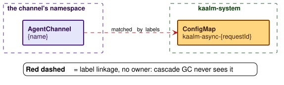

# Child resources

When you create an Agent or an AgentTask, the controller does more than start a container. It provisions a small set of Kubernetes resources around that container: storage, identity, TLS material, and a network boundary. This page is the inventory. For each resource it states which object its ownerRef names, what condition must hold for it to exist, and what happens to it when the workload hibernates or is deleted.

The two workload kinds get different sets, and the difference follows from their shape. An Agent is long-lived and can receive inbound messages, so it gets a Service, a server-auth certificate, and an ingress allow rule. An AgentTask is ephemeral and has no listener, so it gets none of those.

## Agent child resources

The controller provisions six resources for each Agent, all in the Agent's namespace and all named after it. The figure shows which object each child's ownerRef names, which is what decides what cleans it up; the table states when each exists and what happens to it on hibernation and deletion.

| Child | Name | Exists when | ownerRef names | On hibernation | On deletion |
|---|---|---|---|---|---|
| Pod | `{name}-` plus a suffix | Created during `Provisioning`, deleted on `Hibernated`, recreated on wake | Agent | Deleted | Deleted |
| Service (ClusterIP) | `{name}` | `spec.service.enabled` is `true` (the default) | Agent | Kept, with no endpoints | Deleted |
| ServiceAccount | `agent-{name}` | Always | Agent | Kept | Deleted |
| NetworkPolicy | `{name}` | Always | Agent | Kept | Deleted |
| PVC | `{name}-memory` | `spec.persistence.enabled` is `true` and no `existingClaim` is set | Agent, unless the class sets `pvcRetention: Retain`, which strips the ownerRef | Kept | Deleted, or kept under `Retain` |
| PVC (pre-existing) | `spec.persistence.existingClaim` | `existingClaim` is set | Nothing: referenced, no ownerRef | Kept | Kept |
| Certificate | `{name}-tls` | Always | Agent | Kept | Deleted |
| Secret | `{name}-tls` | Written by cert-manager from the Certificate | The Certificate (set by cert-manager) | Kept | Deleted one hop after the Certificate |

**The Pod is the only child that tracks phase.** The controller creates it on the transition into `Running` and deletes it on the transition into `Hibernated`; every other child is provisioned on the first reconcile and survives hibernation, so a wake recreates the Pod against unchanged identity, storage, and TLS material ([Hibernation mechanics](../controller/hibernation-and-wake.md#hibernation-mechanics)).

What each child is for:

- **The Pod** runs the agent container under the [RuntimeClass](../security/model.md#runtimeclass) its AgentClass names, or the cluster's default runtime when the class names none.
- **The Service** exposes the agent's HTTPS endpoint inside the cluster. The gateway delivers channel messages through it with [`POST /v1/message`](../gateways/api/agent-endpoints.md#post-v1message); exposing it outside the cluster is the developer's responsibility. An Agent with the Service disabled is outbound-only and cannot be referenced by an AgentChannel (`Ready=False, reason=AgentServiceDisabled` on the channel).
- **The ServiceAccount** carries no RoleBindings. The agent has no Kubernetes API access unless the platform team or developer grants it ([Agent Pod ServiceAccount](../security/rbac.md#agent-pod-serviceaccount)).
- **The NetworkPolicy** is synthesized from the AgentClass network policy plus the gateway's egress allow rule ([AgentReconciler](../controller/reconcilers.md#agentreconciler), step 6). Why it matters is the next section.
- **The PVC** is mounted into the agent container at the configured path ([Agent spec](../resources/agent.md#spec)).
- **The Certificate** is a per-agent TLS certificate with `server auth` and `client auth` usages, signed by the Kaalm CA `ClusterIssuer` and rotated by cert-manager ([Lifecycle of an agent TLS serving certificate](../security/tls.md#lifecycle-of-an-agent-tls-serving-certificate)). The same certificate serves the agent's HTTPS listener and is presented on every call to the gateway. The CA bundle reaches the Pod through trust-manager.

### What the synthesized NetworkPolicy protects

The per-Agent NetworkPolicy is the primitive the [gateway architecture analysis](../gateways/llm/overview.md#architecture-option-analysis) relies on to keep LLM credentials inside `kaalm-system`. **NetworkPolicy enforcement by the cluster CNI is a required prerequisite of Kaalm's trust model.**

Its two halves carry different weight:

- **The ingress rule is layered.** It is combined with the [agent-side mTLS check on `POST /v1/message`](../security/tls.md#in-cluster-tls) ([The runtime contract](contract.md), item 4), so a misconfigured per-Agent NetworkPolicy does not open delivery to arbitrary in-cluster callers.
- **The egress rule is not layered.** It is the only Kaalm-managed control that stops an agent from calling provider IPs directly.

Three caveats bound the guarantee. The synthesis applies only to Kaalm-managed Pods; the gateway-only tier's egress responsibility is stated under [Adoption tiers](../concepts/tenancy-and-tiers.md#adoption-tiers). Because NetworkPolicy is additive, the guarantee assumes the developer trust tier defined in [Trust model](../security/model.md#trust-model). And CNI enforcement is a hard prerequisite: clusters on default kindnet or default flannel do not enforce NetworkPolicy and are not supported targets ([Recommendation 4](../security/model.md#recommendations-for-deployment)).

### Ownership and deletion

Deleting an Agent removes its children through cascade garbage collection, because each one carries an ownerRef back to the Agent. Two objects sit outside that rule, and the figure draws each with its own edge style:

- **A PVC referenced by `existingClaim`** is never given an ownerRef, so it survives Agent deletion. [`pvcRetention`](../resources/agentclass.md) does not govern it either; that field applies to Kaalm-provisioned PVCs only.
- **The Secret cert-manager writes** for the per-Agent Certificate carries an ownerRef to the Certificate, set by cert-manager, not one to the Agent ([AgentReconciler](../controller/reconcilers.md#agentreconciler)). It is still removed on Agent deletion, one hop later: cascade GC deletes the Certificate, then the Secret that names it. That second hop requires cert-manager to run with `--enable-certificate-owner-ref=true`, which is not its default ([In-cluster TLS](../security/tls.md#in-cluster-tls)); the [certificate lifecycle figure](../security/tls.md#lifecycle-of-an-agent-tls-serving-certificate) draws the sequence.

A third object looks like a child and is not one. The handler ConfigMap named by [`Agent.spec.handler`](../resources/agent.md) is developer-owned: the controller never creates it, mounts it read-only, and gives it no ownerRef, exactly like an `existingClaim` PVC. It survives Agent deletion, and its content is not tracked, so an in-place edit reaches the container only on the next Pod creation, a wake from hibernation included ([Handler update semantics](base-images.md#handler-update-semantics); rule 31 in [Cross-resource validation](../resources/validation-and-defaulting.md#cross-resource-validation)).

### What Kaalm does not create

- **No configuration ConfigMap.** Non-sensitive configuration (the gateway endpoint, ports) arrives as environment variables injected at Pod creation, so a configuration change is Pod-replacing spec drift by design. The same holds for AgentTask.
- **No sidecar.** The gateway in `kaalm-system` handles all LLM traffic and inbound channel messages as a shared cluster-level service.

### AgentClass changes

An AgentClass change reaches existing Agents along one of three paths, depending on whether it constrains the derived Pod spec, excludes the Agent's stored spec, or only affects per-request routing. Which children are re-derived and which are preserved on each path is in [AgentClass change handling](../controller/change-propagation.md#agentclass-change-handling).

## AgentTask child resources

An AgentTask gets a parallel set, shaped by its ephemeral, no-inbound nature: no Service, a client-auth-only certificate, and, in `agentReported` mode, a completion mailbox. [AgentTaskReconciler](../controller/reconcilers.md#agenttaskreconciler) is the authoritative step list.

| Child | Name | Exists when | ownerRef names | On deletion |
|---|---|---|---|---|
| Pod | `{name}-` plus a suffix | The task is `Running`; recreated on each retry | AgentTask | Deleted |
| ServiceAccount | `task-{name}` | Always | AgentTask | Deleted |
| NetworkPolicy | `{name}` | Always | AgentTask | Deleted |
| PVC | `{name}-workspace` | `spec.persistence.enabled` is `true` | AgentTask | Deleted |
| Certificate | `{name}-tls` | Always | AgentTask | Deleted |
| Secret | `{name}-tls` | Written by cert-manager from the Certificate | The Certificate (set by cert-manager) | Deleted one hop after the Certificate |
| ConfigMap | `{name}-completion` | `completion.condition` is `agentReported` | AgentTask | Deleted |
| Role and RoleBinding | `kaalm-task-{name}-completion` | `completion.condition` is `agentReported` | AgentTask | Deleted |

Every child carries an ownerRef, so cascade GC removes all of them and the task finalizer only terminates the Pod gracefully; unlike the Agent and AgentChannel finalizers, it sweeps nothing and rewrites no ownerRef. The only object whose ownerRef does not name the task is, as for an Agent, the Secret cert-manager writes; its ownerRef names the Certificate.

What differs from an Agent:

- **No Service.** A task receives no channel messages and has no stable endpoint.
- **The Certificate carries `client auth` only** ([Lifecycle of an AgentTask TLS client certificate](../security/tls.md#lifecycle-of-an-agenttask-tls-client-certificate)). The task presents it on outbound calls (the LLM proxy, `/v1/task/complete`); there is no server-auth usage because the task exposes no HTTPS listener.
- **The NetworkPolicy has no ingress allow rules.** With no listener and no Service, the synthesized policy carries the standard egress allow set and makes default-deny ingress explicit ([AgentTaskReconciler](../controller/reconcilers.md#agenttaskreconciler)). An Agent's policy, by contrast, admits the gateway on the agent's HTTPS port.
- **The PVC is a workspace**, provisioned only when the task spec requests persistence; there is no `existingClaim` on a task.

### The completion mailbox

When [`completion.condition: agentReported`](../controller/task-lifecycle.md), the controller also provisions a per-task ConfigMap, pre-created with `data: {}`, where the gateway writes the completion payload, and a per-task Role and RoleBinding that grant the gateway ServiceAccount name-scoped `update` and `patch` on that one ConfigMap. The ConfigMap is a completion channel, not configuration delivery.

The reconciler stamps `status.currentPodUID` with the Pod's UID on every Pod creation, initial and retry, and clears it during the retry-reset window. The gateway reads the field from its cluster-wide AgentTask watch and rejects a completion from any other Pod at `/v1/task/complete` with `403 access_denied`, `reason=StalePodCompletion`. The reset and restamp order is in [Retry mechanics](../controller/task-lifecycle.md).

## Async response ConfigMaps are swept by label, not owned

Every child above lives in the same namespace as its parent, which is what makes an ownerRef possible. The async webhook response is the only Kaalm-managed object that does not: the gateway stores each response in a `kaalm-async-{requestId}` ConfigMap in `kaalm-system`, while the AgentChannel it belongs to lives in a user namespace.

An ownerReference cannot cross a namespace boundary. The garbage collector resolves an owner in the dependent's own namespace; a cross-namespace reference finds nothing there, and the collector deletes the dependent at once with an `OwnerRefInvalidNamespace` event. So these ConfigMaps carry no ownerRef. They carry the labels `kaalm.io/channel-namespace` and `kaalm.io/channel-name` instead, plus a `kaalm.io/expires-at` annotation for their one-hour TTL.

Because cascade GC never sees them, cleanup is two explicit paths, and this is the only child that needs a finalizer sweep:

- **On every pass**, the AgentChannelReconciler prunes expired entries by label selector.
- **On deletion**, the channel finalizer sweeps the whole label-matched set after the gateway confirms the channel is disconnected.

Both paths are specified in [Async webhook responses](../gateways/api/async-responses.md), and the deletion handshake in [Finalizers](../controller/finalizers.md#agentchannel).
