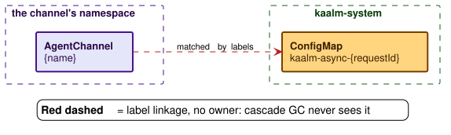

# Child resources

When you create an Agent or an AgentTask, the controller does more than start a container. It provisions a small set of Kubernetes resources around that container: storage, identity, TLS material, and a network boundary. This page is the inventory. For each resource it states which object its ownerRef names, what condition must hold for it to exist, and what happens to it when the workload hibernates or is deleted.

The two workload kinds get different sets, and the difference follows from what each one is. An Agent is long-lived and can receive inbound messages, so it gets a Service, a server-auth certificate, and an ingress allow rule. An AgentTask is ephemeral and has no listener, so it gets none of those.

## Agent child resources

Every child lives in the Agent's namespace. The figure shows which object each child's ownerRef names, which decides what cleans it up; the table states when each exists and what happens to it on hibernation and deletion.

| Child | Name | Exists when | ownerRef names | On hibernation | On deletion |
|---|---|---|---|---|---|
| Pod | `{name}-` plus a suffix | Created in `Provisioning`, deleted in `Hibernating`, recreated on wake | Agent | Deleted | Deleted |
| Service (ClusterIP) | `{name}` | `spec.service.enabled` is `true` (the default) | Agent | Kept, with no endpoints | Deleted |
| ServiceAccount | `agent-{name}` | Always | Agent | Kept | Deleted |
| NetworkPolicy | `{name}` | Always | Agent | Kept | Deleted |
| CiliumNetworkPolicy | `{name}-fqdn` | The class sets `network.egress.allowedHosts` and the CNI supports it | Agent | Kept | Deleted |
| PVC | `{name}-memory` | `spec.persistence.enabled` is `true` and no `existingClaim` is set | Agent, unless the class sets `pvcRetention: Retain`, which strips the ownerRef | Kept | Deleted, or kept under `Retain` |
| PVC (pre-existing) | `spec.persistence.existingClaim` | `existingClaim` is set | Nothing: referenced, no ownerRef | Kept | Kept |
| Certificate | `{name}-tls` | Always | Agent | Kept | Deleted |
| Secret | `{name}-tls-{uid}`, with `{uid}` the first eight characters of the workload's UID ([Agent certificate](../controller/reconcilers/agent.md#agent-certificate)) | Written by cert-manager from the Certificate | The Certificate (set by cert-manager) | Kept | Deleted one hop after the Certificate |
| Role and RoleBinding | `kaalm-agent-{name}-pullsecrets` | The class sets `image.imagePullSecrets` | Agent | Kept | Deleted |
| Role and RoleBinding | `kaalm-agent-{name}-envsecrets` | `spec.env` reads a Secret through `valueFrom.secretKeyRef` | Agent | Kept | Deleted |

**The pull-Secret and env-Secret Roles serve the operator, not the Pod.** Each pair binds the operator alone, so the operator can check the Secrets before it creates the Pod (the grants are under [Operator ServiceAccount](../security/rbac.md#operator-serviceaccount)). The env pair is removed on the next pass when `spec.env` names no Secret. A Role or RoleBinding of either name that the workload does not control sets `Ready=False, reason=ChildConflict` and is never changed.

**The Pod is the only child that tracks phase.** Every other child is provisioned on the first reconcile and survives hibernation, so a wake recreates the Pod against unchanged identity, storage, and TLS material ([Hibernation mechanics](../controller/hibernation-and-wake.md#hibernation-mechanics)).

What each child is for:

- **The Pod** runs the agent container under the [RuntimeClass](../security/model.md#runtimeclass) its AgentClass names, or the cluster's default runtime when the class names none.
- **The Service** exposes the agent's HTTPS endpoint inside the cluster. The gateway delivers channel messages through it with [`POST /v1/message`](../gateways/api/agent-endpoints.md#post-v1message); exposing it outside the cluster is the developer's responsibility. An Agent with the Service disabled is outbound-only and cannot be referenced by an AgentChannel (`Ready=False, reason=AgentServiceDisabled` on the channel).
- **The ServiceAccount** carries no RoleBindings, and the Pod does not mount its token unless the class sets `security.automountServiceAccountToken`, so by default the agent has no Kubernetes API access ([Agent Pod ServiceAccount](../security/rbac.md#agent-pod-serviceaccount)).
- **The NetworkPolicy** is synthesized from the AgentClass network policy plus the gateway's egress and ingress rules ([What the synthesized NetworkPolicy protects](#what-the-synthesized-networkpolicy-protects)).
- **The CiliumNetworkPolicy** carries the class's `allowedHosts`, which standard NetworkPolicy cannot express ([FQDN egress policy](#fqdn-egress-policy)).
- **The PVC** is mounted into the agent container at `spec.persistence.mountPath`, default `/var/agent/memory` ([Agent spec](../resources/agent.md#spec)), and the controller injects `$KAALM_MEMORY_DIR` with that path ([Memory and dedup persistence](base-images.md#memory-and-dedup-persistence)).
- **The Certificate** is a per-agent TLS certificate with `server auth` and `client auth` usages, signed by the Kaalm CA `ClusterIssuer` and rotated by cert-manager ([Lifecycle of an Agent TLS serving certificate](../security/tls.md#lifecycle-of-an-agent-tls-serving-certificate)). The same certificate serves the agent's HTTPS listener and is presented on every call to the gateway.

### What the synthesized NetworkPolicy protects

The per-Agent NetworkPolicy is the primitive the [gateway architecture analysis](../gateways/llm/overview.md#architecture-option-analysis) relies on to keep LLM credentials inside `kaalm-system`. NetworkPolicy enforcement by the cluster CNI is a required prerequisite of Kaalm's trust model.

The synthesized rules:

| Direction | Rule | Ports |
|---|---|---|
| Egress | To the gateway Pods in `kaalm-system` | The cluster listener port |
| Egress | To the cluster DNS Pods | 53 TCP and UDP |
| Egress | To each CIDR in the class's `network.egress.allowedCIDRs` | Any |
| Ingress | From the gateway Pods in `kaalm-system` | `$KAALM_HEALTH_PORT` |
| Ingress | From the other agent Pods in the Agent's namespace (`kaalm.io/workload: agent`), when the class sets `network.allowSameNamespaceIngress` | `$KAALM_HEALTH_PORT` |

The two directions carry different weight:

- **The ingress rule is layered.** It is combined with the [agent-side mTLS check on `POST /v1/message`](contract.md#client-certificate-verification-on-v1message), so a misconfigured per-Agent NetworkPolicy does not open delivery to arbitrary in-cluster callers.
- **The egress rule is not layered.** It is the only Kaalm-managed control that stops an agent from calling provider IPs directly.

Three caveats bound the guarantee. The synthesis applies only to Kaalm-managed Pods; the gateway-only tier's egress responsibility is stated under [Adoption tiers](../concepts/tenancy-and-tiers.md#adoption-tiers). Because NetworkPolicy is additive, the guarantee assumes the developer trust tier defined in [Trust model](../security/model.md#trust-model). And the guarantee holds only on a cluster whose CNI enforces NetworkPolicy; the policies have no effect without one ([Network policy prerequisite](../operations/deployment.md#network-policy-prerequisite), [Recommendation 5](../security/model.md#recommendations-for-deployment)).

### FQDN egress policy

When the class lists `network.egress.allowedHosts` and the CNI is Cilium, the controller writes a `cilium.io/v2` `CiliumNetworkPolicy` named `{name}-fqdn` beside the NetworkPolicy. It selects the same Pod labels as the NetworkPolicy and allows two kinds of egress:

| Rule | Peer | Ports |
|---|---|---|
| DNS, through Cilium's DNS proxy with `matchPattern: "*"` | The cluster DNS Pods that `controller.networkPolicy.dnsSelector` selects, the same Pods as the NetworkPolicy DNS rule | 53, any protocol |
| `toFQDNs` with one `matchName` per host, sorted | Each host in `allowedHosts` | Any |

Cilium learns the addresses behind a host name only from DNS answers its proxy sees, which is why the policy carries its own DNS rule. Cilium allows the union of this policy and the NetworkPolicy, so the workload keeps its gateway, DNS, and `allowedCIDRs` egress. For an Agent, a change to the host list updates the policy, and an empty list deletes it. For an AgentTask, the controller writes the policy when it creates the task's Pod. On a CNI without FQDN support, the controller writes no policy and the class reports `FQDNPolicySupported=False` ([AgentClass](../resources/agentclass.md#network-egress-allowedcidrs-and-allowedhosts)).

### Ownership and deletion

Deleting an Agent removes its children through cascade garbage collection, because each one carries an ownerRef back to the Agent. Two objects sit outside that rule, and the figure draws each with its own edge style:

- **A PVC referenced by `existingClaim`** is never given an ownerRef, so it survives Agent deletion. [`pvcRetention`](../resources/agentclass.md) does not govern it either; that field applies to Kaalm-provisioned PVCs only.
- **The Secret cert-manager writes** for the per-Agent Certificate carries an ownerRef to the Certificate, set by cert-manager, not one to the Agent. It is still removed on Agent deletion, one hop later: cascade GC deletes the Certificate, then the Secret that names it. That second hop requires cert-manager to run with `--enable-certificate-owner-ref=true`, which is not its default ([In-cluster TLS](../security/tls.md#in-cluster-tls)); the [certificate lifecycle figure](../security/tls.md#lifecycle-of-an-agent-tls-serving-certificate) draws the sequence. Every `AgentClass`'s `CertificateCleanup` condition ([AgentClass status](../resources/agentclass.md#status)) reports whether the flag is set.

A third object looks like a child and is not one. The handler ConfigMap named by [`Agent.spec.handler`](../resources/agent.md) is developer-owned: the controller never creates it and gives it no ownerRef, exactly like an `existingClaim` PVC, so it survives Agent deletion ([Handler update semantics](base-images.md#handler-update-semantics)).

### What Kaalm does not create

- **No configuration ConfigMap.** Non-sensitive configuration (the gateway endpoint, ports) arrives as environment variables injected at Pod creation, so a configuration change is Pod-replacing spec drift by design. The same holds for AgentTask.
- **No sidecar.** The gateway in `kaalm-system` handles all LLM traffic and inbound channel messages as a shared cluster-level service.

### AgentClass changes

Which children are re-derived and which are preserved when an AgentClass changes is in [AgentClass change handling](../controller/change-propagation.md#agentclass-change-handling).

## AgentTask child resources

An AgentTask gets a similar set, adjusted for a short-lived workload that takes no inbound traffic: no Service, a client-auth-only certificate, and, in `agentReported` mode, a completion mailbox. [AgentTaskReconciler](../controller/reconcilers/agenttask.md#what-it-checks) gives what blocks the Pod and the order the checks run in.

| Child | Name | Exists when | ownerRef names | On deletion |
|---|---|---|---|---|
| Pod | `{name}-` plus a suffix | Created in `Provisioning`; the task is `Running` once the Pod is Ready; recreated on each retry | AgentTask | Deleted |
| ServiceAccount | `task-{name}` | Always | AgentTask | Deleted |
| NetworkPolicy | `{name}` | Always | AgentTask | Deleted |
| CiliumNetworkPolicy | `{name}-fqdn` | The class sets `network.egress.allowedHosts` and the CNI supports it | AgentTask | Deleted |
| PVC | `{name}-workspace` | `spec.persistence.enabled` is `true` | AgentTask | Deleted |
| Certificate | `{name}-tls` | Always | AgentTask | Deleted |
| Secret | `{name}-tls-{uid}`, with `{uid}` the first eight characters of the workload's UID ([Agent certificate](../controller/reconcilers/agent.md#agent-certificate)) | Written by cert-manager from the Certificate | The Certificate (set by cert-manager) | Deleted one hop after the Certificate |
| ConfigMap | `{name}-completion` | `completion.condition` is `agentReported` | AgentTask | Deleted |
| Role and RoleBinding | `kaalm-task-{name}-completion` | `completion.condition` is `agentReported` | AgentTask | Deleted |
| Role and RoleBinding | `kaalm-task-{name}-pullsecrets` | The class sets `image.imagePullSecrets` | AgentTask | Deleted |
| Role and RoleBinding | `kaalm-task-{name}-envsecrets` | `spec.env` reads a Secret through `valueFrom.secretKeyRef` | AgentTask | Deleted |

Every child carries an ownerRef, so cascade GC removes all of them and the task finalizer only terminates the Pod gracefully. The only object whose ownerRef does not name the task is, as for an Agent, the Secret cert-manager writes; its ownerRef names the Certificate.

What differs from an Agent:

- **No Service.** A task receives no channel messages and has no stable endpoint.
- **The Certificate carries `client auth` only** ([Lifecycle of an AgentTask TLS client certificate](../security/tls.md#lifecycle-of-an-agenttask-tls-client-certificate)). The task presents it on outbound calls, the LLM proxy and `/v1/task/complete`; there is no server-auth usage because the task exposes no HTTPS listener.
- **The NetworkPolicy has no ingress allow rules.** With no listener and no Service, the synthesized policy carries the same egress rules as an Agent's and makes default-deny ingress explicit.
- **The PVC is a workspace**, mounted at `spec.persistence.mountPath`, default `/var/task/workspace`, and provisioned only when the task spec requests persistence; there is no `existingClaim` on a task.

### The completion mailbox

When [`completion.condition: agentReported`](../controller/task-lifecycle.md), the controller also provisions a per-task ConfigMap, pre-created with `data: {}`, where the gateway writes the completion payload, and a per-task Role and RoleBinding that grant the gateway ServiceAccount name-scoped `update` and `patch` on that one ConfigMap. The ConfigMap is a completion channel, not configuration delivery. The controller pre-creates it because RBAC cannot scope `create` to one name, so the Role carries no `create` verb ([Gateway ServiceAccount permissions](../security/rbac.md#gateway-serviceaccount-permissions)).

For an `agentReported` task, the reconciler writes the Pod's UID to `status.currentPodUID` on every Pod creation, initial and retry; a task in `exitCode` mode never has the field set. The gateway rejects a completion from any other Pod at `/v1/task/complete` with `409 stale_pod`. The order in which a retry clears and rewrites the field is in [Retry mechanics](../controller/task-lifecycle.md#retry-mechanics).

## An Agent and an AgentTask cannot share a name

An Agent and an AgentTask in the same namespace cannot share a name, because three of their children get the same name: the Certificate `{name}-tls`, the NetworkPolicy `{name}`, and, when the class sets `network.egress.allowedHosts` on a cluster with FQDN support, the CiliumNetworkPolicy `{name}-fqdn`.

Whichever of the two provisions first keeps the names. The other reports `Ready=False, reason=ChildConflict` naming one of these children, creates no Pod, and keeps its phase; an AgentTask is not failed. [Child ownership](../controller/reconcilers/agent.md#child-ownership) gives the requeue and event behavior.

The names stay taken until the other workload is deleted, not only until it stops running. A settled AgentTask keeps them until its `ttlSecondsAfterFinished` deletes it ([The class bounds timeout and retention](../resources/agenttask.md#the-class-bounds-timeout-and-retention)) or you delete it, and a hibernated Agent keeps them.

To clear the clash, delete one of the two workloads, and recreate it under another name if you still need it. Don't delete the child instead. An Agent re-creates a deleted child on its next pass (a hibernated Agent, when it wakes), and a running AgentTask's NetworkPolicy is its Pod's network boundary.

No apply-time check catches the clash, because Kaalm runs no admission webhook and a schema rule cannot see other objects ([No admission webhooks](../controller/overview.md#no-admission-webhooks)).

## Async response ConfigMaps are swept by label, not owned

Every child above lives in the same namespace as its parent, which is what makes an ownerRef possible. The async webhook response is the only Kaalm-managed object that does not: the gateway stores each response in a `kaalm-async-{requestId}` ConfigMap in `kaalm-system`, while the AgentChannel it belongs to lives in a user namespace.

An ownerReference cannot cross a namespace boundary. The garbage collector resolves an owner in the dependent's own namespace; a cross-namespace reference finds nothing there, and the collector deletes the dependent at once with an `OwnerRefInvalidNamespace` event. So these ConfigMaps carry no ownerRef. They carry the labels `kaalm.io/channel-namespace` and `kaalm.io/channel-name` instead, plus a `kaalm.io/expires-at` annotation for their one-hour TTL.

Because cascade GC never sees them, cleanup is three explicit paths, and this is the only child that needs a finalizer sweep:

- **On every pass**, valid or not, the AgentChannelReconciler prunes expired entries by label selector.
- **On deletion**, the channel finalizer sweeps the whole label-matched set.
- **Every 10 minutes**, the async orphan pruner deletes an expired entry whose channel no longer exists.

The paths are specified in [Async webhook responses](../gateways/api/async-responses.md) and [Finalizers](../controller/finalizers.md#agentchannel).
