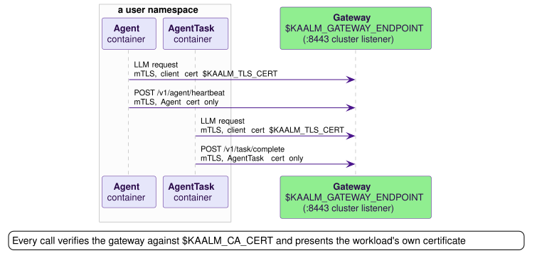

# The runtime contract

Kaalm is BYO-image: any container can run as an Agent or AgentTask, provided it implements a small contract. This page specifies that contract. It is the minimum a container image must satisfy to take part in the lifecycle: HTTPS health endpoints on the injected port, graceful SIGTERM handling, authenticated TLS calls to the injected gateway endpoint, a `POST /v1/message` handler when an AgentChannel is in use, and `messageId` deduplication on that handler.

The contract has eight numbered items. Other pages cite them by number, so the numbering is stable. For the surrounding system, see [System architecture](../concepts/system-architecture.md). The [reference base images](base-images.md) implement every item, and the [starter templates](starter-templates.md) consume that implementation.

## 1. HTTPS health endpoints

The container serves two health endpoints on `$KAALM_HEALTH_PORT` (default 8080):

| Path | Probe | Returns |
|---|---|---|
| `GET /readyz` | Readiness | `200` when the container can accept a message |
| `GET /livez` | Liveness | `200` when the process is healthy |

The controller injects probes for both paths on an Agent Pod ([AgentReconciler step 9](../controller/reconcilers.md#agentreconciler)); an AgentTask Pod gets no probes. The container serves TLS on this port with the per-workload certificate at `$KAALM_TLS_CERT` and `$KAALM_TLS_KEY`, so the injected probes use `httpGet.scheme: HTTPS`. Kubernetes does not verify certificates on `httpGet` probes, so the probe needs no CA configuration.

Both reference runtimes answer `200` on `/readyz` unconditionally, from the moment the listener is up; issue #234 tracks a readiness answer that reflects the handler's state.

## 2. Graceful SIGTERM handling

On SIGTERM, the container finishes in-flight work and exits within `terminationGracePeriodSeconds`. The Go runtime drains for up to 25 seconds; the Python runtime drains until its in-flight handlers return.

## 3. Gateway communication

The controller injects `$KAALM_GATEWAY_ENDPOINT`, an `https://` URL for the gateway's cluster listener on port 8443. It is the base URL for every call the container makes to the gateway:

| Call | Who makes it | Specified on |
|---|---|---|
| LLM requests | Agents and AgentTasks | [LLM proxy endpoints](../gateways/api/overview.md#llm-proxy-endpoints) |
| Tool calls | Agents and AgentTasks | [The tool plane](../gateways/tool-plane.md) |
| `POST /v1/agent/heartbeat` | Agents only, item 5 | [Agent endpoints](../gateways/api/agent-endpoints.md#post-v1agentheartbeat) |
| `POST /v1/task/complete` | AgentTasks only, item 6 | [Task completion](../gateways/api/task-complete.md) |

The variable is always injected, whether or not `spec.providers` is set, so a provider-less workload still reaches the gateway for its heartbeats or its completion report.

Every call in the figure is mTLS with the workload's own certificate, and the gateway cross-checks the source IP against the Pod ([Workload identity](../gateways/llm/workload-identity.md)). The two report paths have no bearer-token mode: the middleware admits either SAN form and then checks the kind against the path, so an AgentTask certificate on the heartbeat, or an Agent certificate on task completion, gets `403 access_denied` ([The :8443 listener profile](../gateways/overview.md#the-8443-listener-profile)).

### TLS requirements

Two requirements apply to every call to `$KAALM_GATEWAY_ENDPOINT`.

**Server verification.** The container trusts the Kaalm CA bundle at `$KAALM_CA_CERT` (`/var/run/kaalm/ca.crt`) to verify the gateway's certificate ([Trust bundle projection](../security/tls.md#trust-bundle-projection)).

**Client authentication.** One of two modes, depending on how the workload was provisioned. [Workload identity](../gateways/llm/workload-identity.md) is the reference for both, including the SAN shapes and how the gateway extracts the namespace.

| Mode | Applies to | The container presents |
|---|---|---|
| mTLS | Kaalm-managed Pods, the only mode accepted for them | The certificate at `$KAALM_TLS_CERT` and `$KAALM_TLS_KEY`, issued per workload by cert-manager. Its SAN is `{name}.{namespace}.svc.cluster.local` for an Agent and `{name}.{namespace}.task.kaalm.io` for an AgentTask. The task form avoids implying a Service the task does not have. |
| ServiceAccount bearer token | Gateway-only-tier workloads, which no Agent resource manages | A projected ServiceAccount token in `Authorization: Bearer {jwt}`, validated by `TokenReview`. No client certificate. |

The reference runtimes implement the mTLS mode. The bearer-token mode is for existing images configured per [Tiered on-ramp](../operations/deployment.md#tiered-on-ramp), with an audience-bound projected token and a manual `kaalm-ca` ConfigMap mount; the controller injects nothing into gateway-only Pods.

### TLS material layout

The TLS material is one projected volume at `/var/run/kaalm/`. It combines the cert-manager Secret (`tls.crt`, `tls.key`) and the trust-manager CA ConfigMap (`ca.crt`) under one kubelet-managed `..data` symlink, which is what makes one directory watch sufficient.

On rotation the kubelet writes the new files into a fresh timestamped directory and then renames `..data` onto it. No leaf file is ever written in place, which is why the watch is on the directory ([Why the watch is on the directory, not the file](starter-templates.md#why-the-watch-is-on-the-directory-not-the-file)).

## 4. Message endpoint

This item is optional: an Agent without an AgentChannel does not need it, and an AgentTask never receives messages.

An Agent that is the target of an AgentChannel serves `POST /v1/message` on `$KAALM_HEALTH_PORT` over TLS, with the same certificate as item 1. It accepts the message envelope and returns the response envelope specified in [Agent endpoints](../gateways/api/agent-endpoints.md#post-v1message). A body that is not an envelope is `400`; a handler failure is `500`. The gateway treats any answer other than a `2xx` with a usable envelope as one failed attempt and retries on its schedule, so a `400` or `500` is redelivered.

### Certificate reload on rotation

The container watches the certificate, key, and CA bundle for changes and reloads its TLS configuration for new connections without dropping existing ones ([Lifecycle of an Agent TLS serving certificate](../security/tls.md#lifecycle-of-an-agent-tls-serving-certificate)). The obligation differs by file:

- A certificate or key change reloads the serving certificate and the outbound client certificate.
- A CA-bundle change rebuilds both trust pools: the inbound `ClientCAs` pool used for the verification below, and the outbound pool that verifies the gateway.

The both-pools rule matters during a CA re-key. A stale `ClientCAs` pool rejects the gateway's re-issued client certificate and breaks delivery, exactly as a stale outbound pool breaks gateway calls. The dual-trust window is finite, so a container that misses the CA-bundle reload breaks in both directions once gateway leaves are re-issued under the new key ([CA renewal and re-key](../security/tls.md#ca-renewal-and-re-key)).

In Go, a `tls.Config.GetCertificate` callback plus `GetConfigForClient` returning a config with the fresh `ClientCAs` pool covers both, since each is consulted on every handshake. In Python, an `SSLContext` swap on the watch event does the same.

### Client-certificate verification on /v1/message

The handler verifies the gateway's client certificate. Enforcement is per path, not at the handshake: the listener shares `$KAALM_HEALTH_PORT` with `/readyz` and `/livez`, and the kubelet presents no certificate on a probe, so the TLS layer requests a client certificate but does not require one. In Go that is `tls.Config.ClientAuth = tls.VerifyClientCertIfGiven` with `ClientCAs` from `$KAALM_CA_CERT`.

| Request | Answer |
|---|---|
| `GET /readyz`, `GET /livez` | Served without a client certificate |
| `POST /v1/message` with no peer certificate | `401 Unauthorized` |
| `POST /v1/message` with a certificate whose SAN is not the gateway Service DNS | `403 Forbidden` |
| `POST /v1/message` with the gateway's certificate | Handled |

The gateway Service DNS is `kaalm-gateway.{operatorNamespace}.svc.cluster.local` or `kaalm-gateway.{operatorNamespace}.svc`. Both names are on the gateway's certificate, so either one identifies it. The controller injects the operator namespace as `$KAALM_OPERATOR_NAMESPACE`; both reference runtimes build the two names from that variable and fall back to `kaalm-system`, the chart's default release namespace, when it is absent.

`RequireAndVerifyClientCert` would fail every probe at the handshake, before the router ran, and leave the Agent permanently unready. This is the same per-path pattern the controller's `:9443` and the gateway's `:8443` listeners use ([Per-path client auth enforcement](../gateways/listener-tls.md#per-path-client-auth-enforcement)). [NetworkPolicy](../security/model.md#network-policy) enforcement remains the first layer; this check is the second.

## 5. Activity signal (Agent only)

This item is optional. An Agent may report liveness by calling `POST /v1/agent/heartbeat` on the gateway, which records the timestamp in memory with no API server write. The gateway also infers activity from LLM requests and delivered messages, and the Agent's `spec.lifecycle.activitySource` decides which signals the controller counts. Under the default `gatewayTraffic`, heartbeats are recorded and then ignored; an image that heartbeats on a timer must not be paired with `agentHeartbeat` or `both`, or the Agent never goes idle ([The heartbeat toggle and the hibernation footgun](starter-templates.md#the-heartbeat-toggle-and-the-hibernation-footgun)).

Heartbeats are meaningful only for Agents: idle detection does not apply to one-shot tasks, and the endpoint rejects an AgentTask certificate with `403` ([The :8443 listener profile](../gateways/overview.md#the-8443-listener-profile)). A task image must not run a heartbeat loop.

## 6. Completion signal (AgentTask only)

This item is optional. An AgentTask in `completion.condition: agentReported` mode reports its result with `POST /v1/task/complete`, with a status and an optional set of artifacts ([Task completion](../gateways/api/task-complete.md)).

The report can race the reconciler's status write that stamps `AgentTask.status.currentPodUID` after Pod creation, and a retry re-opens the same window ([Retry mechanics](../controller/task-lifecycle.md#retry-mechanics)). The gateway answers the race with `403 access_denied`, `retryable: true`, and a message beginning `StalePodCompletion:`. The container retries on that answer with bounded backoff: the reference runtimes make four attempts, immediately and then after 100ms, 500ms, and 2s, and give up after the fourth.

`403 access_denied` with a message beginning `TaskAlreadyCompleted:` is final. The task has reached `Succeeded`, `Failed`, or `TimedOut`, and further reports are rejected; the container logs and exits.

## 7. Message deduplication

This item is required for every Agent that implements `POST /v1/message`. Each delivered message carries a `messageId` the gateway generated.

### Where duplicates come from

Caller retries are not the source of same-`messageId` redelivery. In sync mode, when a wake outlives the webhook caller's own timeout, the caller commonly retries, and the gateway delivers that retry as a new message with a fresh `messageId` ([The activator](../gateways/user/activation-and-activity.md#the-activator)).

The same-`messageId` case comes from the gateway's own delivery schedule: four attempts, with 1s, 5s, and 25s between them ([Agent endpoints](../gateways/api/agent-endpoints.md#post-v1message)). When an earlier attempt reached the Agent and started work, but the gateway's read of the response failed, the next attempt redelivers the same `messageId`.

### Dedup obligation and scope

The schedule applies to every Agent, hibernated or not, so every Agent deduplicates on `messageId`: it buffers received ids and returns the cached response for a duplicate without reprocessing.

- An in-memory window is enough for an Agent that never hibernates.
- An Agent with `hibernationEnabled: true` persists the buffer across Pod restarts, so a wake-replacement Pod still recognizes a `messageId` delivered before the restart. A PVC is always available, because `hibernationEnabled: true` requires `spec.persistence.enabled: true` ([rule 29](../resources/validation-and-defaulting.md#cross-resource-validation)).

The reference runtimes keep a window of the last 1024 ids with their responses in a state file under the memory directory, backed by the PVC when one is mounted there and held in memory otherwise ([Memory and dedup persistence](base-images.md#memory-and-dedup-persistence)).

`messageId` dedup covers gateway-retry duplicates only. External replay of the inbound webhook ([Channels and webhooks](../security/threat-model.md#channels-and-webhooks)) produces a fresh `messageId` per delivery. An Agent whose inbound actions are not idempotent also deduplicates on a caller-supplied idempotency key or a content hash.

## 8. Trace-context propagation

This item is required for every Agent that implements `POST /v1/message`, and it is a header copy, not an SDK obligation. The gateway's delivery request may carry the W3C `traceparent` and `tracestate` headers. While handling that message, the Agent attaches the same values to every call it makes to the gateway. A delivery without the headers obligates nothing, and the Agent never invents trace context of its own.

Both reference runtimes implement the item without handler involvement: the Go module carries the values on the handler's `ctx` (readable through `agentruntime.TraceContext`) and injects them in its gateway client, and the Python image captures them in a context variable around the handler call and injects them through `kaalm.gateway` and the `kaalm.http_client()` and `kaalm.http_async_client()` factories, exposing them as `kaalm.trace_context()` for frameworks that run their own OpenTelemetry SDK ([Tracing](../operations/observability.md#tracing)).

## Starter templates

Two starter templates ship under `examples/starter-go/` and `examples/starter-python/`. Neither carries contract code of its own: the Python template is a `FROM` build on the Python base image, and the Go template imports the `agentruntime` module. Each is a handler plus wiring, and each README lists the manifests to deploy it. The templates target Kaalm-managed workloads; gateway-only-tier images are configured per [Tiered on-ramp](../operations/deployment.md#tiered-on-ramp). See [Starter templates](starter-templates.md).
