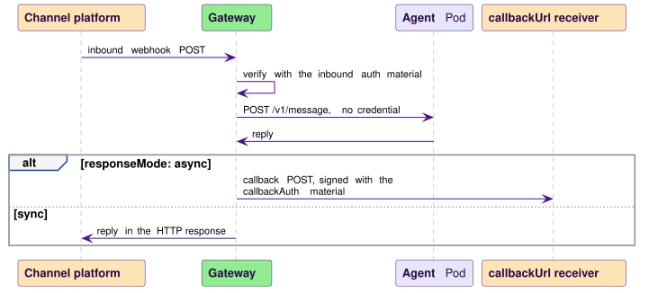

# Credential handling

Kaalm handles three kinds of long-lived secret material: LLM API keys, which authenticate the gateway to model providers; tool server credentials, which authenticate the gateway's broker to MCP tool servers; and channel credentials, which verify inbound webhook callers and sign outbound callbacks. LLM keys and tool credentials live in one namespace, `kaalm-system`, and are never copied. Channel credentials live in each agent's own namespace.

One rule spans all three: agent containers never hold credential material. The gateway is the only component that uses a credential on the data path, and it is a separate Pod in `kaalm-system`, which is what lets a plain NetworkPolicy enforce the separation ([Protecting agent containers from LLM provider access](#protecting-agent-containers-from-llm-provider-access)). The operator reads LLM keys and tool credentials to validate them and to run health probes. The probes are a second egress, bounded to each provider's configured endpoint and, for `google-vertex`, the key's `token_uri` ([Health probes are a second credential egress](#health-probes-are-a-second-credential-egress)).

TLS material (the workload certificates and the CA trust chain) follows a separate lifecycle under cert-manager ([In-cluster TLS](tls.md#in-cluster-tls)). Workload identity, which selects the grants, the budget, and the audit name a credential is used for, is specified on [Workload identity](../gateways/llm/workload-identity.md).

## Lifecycle of an LLM API key

1. **Stored** in a Secret in `kaalm-system` (for example `kaalm-system/anthropic-api-key`), created and managed by platform engineers.
2. **Referenced** by `ModelProvider.spec.credentialsRef`, resolved only in `kaalm-system`. Two ServiceAccounts can read it: the gateway, through its namespaced Role, and the operator, through its own Role in `kaalm-system` ([RBAC and authentication](rbac.md#operator-serviceaccount)).
3. **Loaded.** The gateway reads the Secret on first use and then follows it through a single-object watch, because it holds `get` and `watch` but never `list`. If the watch has not synced within two seconds, the read goes to the API server directly. The operator reads it on every ModelProvider pass to validate it and to run the health probe, which needs the key because `GET /v1/models` requires authentication ([ModelProviderReconciler](../controller/reconcilers.md#modelproviderreconciler), steps 1 and 5). Both components hold the key in process memory: the gateway in its watch cache, the operator in the manager's Secret informer, which covers `kaalm-system` only.
4. **Used.** The agent's request carries no credential. The gateway strips any inbound `Authorization`, `X-Api-Key`, or `Api-Key` header, so a framework SDK's placeholder key never reaches a provider, and injects the provider key on the upstream leg only. The completion returns to the agent without it. Agent Pods have no Secret mounted and no RBAC to fetch one.
5. **Rotated.** An in-place update of the Secret lands on the gateway's watch, and the gateway refreshes in memory without a restart. In-flight requests finish on the old key.
6. **Never copied.** There are no per-agent or per-namespace copies. Rotation is one update and one watch because there is one location.


Vertex providers use the same class: the adapter sends the Secret value as a bearer token, so no separate credential type exists.

## Lifecycle of a tool server credential

A tool credential follows the LLM key's lifecycle on the [tool plane](../gateways/tool-plane.md), with these differences:

- It is referenced by `ToolProvider.spec.credentialsRef`, and the reference is optional. A ToolProvider without one is an unauthenticated tool server, and the broker injects nothing.
- The gateway resolves it per brokered call through the same watch cache and injects it as a bearer token on the upstream leg ([Credential injection](../gateways/tool-plane.md#credential-injection)). The operator reads it for the ToolProvider health probe and Ready validation.
- It is used only on calls the broker admits. A call denied by the namespace gate, the grant chain, or session ownership ends before the credential is read, so a rejected call never spends it.
- A credential the tool server rejects surfaces to the caller as `503 tool_unavailable` and raises a `CredentialsInvalid` Warning event on the ToolProvider, so the platform team learns that the Secret needs rotating. [Failure modes](../gateways/tool-plane.md#failure-modes) lists the signals.

The credential has no path into an agent's namespace: an Agent's `spec.tools` grant names the ToolProvider, and the Secret behind it stays in `kaalm-system`.

## Lifecycle of a channel credential (AgentChannel)

1. **Stored** in a Secret in the agent's namespace (for example `team-support/discord-bot-credentials`), created by the team's credential manager, a person holding `kaalm-secrets-admin` in that namespace, or by a provisioning service. The creator **labels** the Secret `kaalm.io/channel-credential: "true"`, which opts it in to channel use ([rule 45](../resources/validation-and-defaulting.md#cross-resource-validation)). A Secret used as a bearer `callbackAuth` token also lists its approved hosts in the annotation `kaalm.io/callback-hosts` (rule 46). Developers need no Secret access in their namespace, unless the platform team sets `rbac.personas.developerSecrets` ([Roles for people](rbac.md#persona-roles)).
2. **Referenced** by the AgentChannel. A webhook channel names its inbound Secret with `spec.webhook.auth.secretRef` (bearer) or `spec.webhook.auth.hmac.secretRef` (HMAC), and its outbound Secret with `spec.webhook.callbackAuth.secretRef` or `.hmac.secretRef`, which [rule 25](../resources/validation-and-defaulting.md#cross-resource-validation) requires whenever `callbackUrl` is set. A platform channel names one Secret with `spec.discord.credentialsRef` or `spec.whatsapp.credentialsRef`, whose keys are fixed by the type ([rule 40](../resources/validation-and-defaulting.md#cross-resource-validation)).
3. **Granted.** The AgentChannelReconciler ensures a check Role in the channel's namespace, `get, watch` limited by `resourceNames` to every referenced Secret, bound to the operator alone. It reads each Secret once to check the label, the approved callback host, the configured keys and, for Discord, that the public key parses. It then ensures the credential Role, `get, watch` limited to the labeled Secrets, with a RoleBinding each for the gateway and the operator ([Per-channel Roles](rbac.md#operator-serviceaccount)). It follows each Secret through a single-object watch like the gateway's, so the check it repeats every minute costs no API request after the first read ([AgentChannelReconciler](../controller/reconcilers.md#agentchannelreconciler), step 3).
4. **Loaded.** The gateway resolves the Secret on the first request that needs it and follows it through the same single-object watch as an LLM key. It refuses a Secret without the label on every read, and a bearer callback token before every callback attempt unless the Secret lists the callback host. The material is held in process and split by direction: the inbound `auth` material feeds the webhook verifier, and the outbound `callbackAuth` material signs the async callback POST. A platform channel's one Secret splits the same way: the Discord public key or the WhatsApp app secret and verify token feed the inbound verifier, and the bot token or access token is presented on the platform reply.
5. **Rotated.** An in-place update fires the watch, and the gateway refreshes without a restart.




Channel credentials are namespace-scoped so that each namespace holds only the credentials for its own agents' channels, and a leak in one namespace is bounded to that namespace's channels. The label keeps every other Secret in the namespace out of the gateway's reach.

## Health probes are a second credential egress

The rule that the gateway is the only component that uses a credential covers the data path only. The controller's health probes also send a credential to the provider's configured endpoint, in or outside the cluster. Most probes send the provider key or tool credential itself. A `google-vertex` probe sends an assertion signed with the key, and a token minted from it. Kaalm does not route the probes through the gateway, so the controller is a second credential egress.

Each probe is bounded as follows:

- **`anthropic`, `openai`, and `openai-compatible` ModelProviders, and ToolProviders:** the credential goes to `spec.endpoint` and nowhere else. A ToolProvider with no `credentialsRef` sends no credential.
- **`google-vertex`:** the probe makes two requests. It sends a JWT assertion, signed with the service-account key's private key, to the key's `token_uri`, and then sends the minted access token to `spec.endpoint`. The private key is never sent. The bound is `spec.endpoint` plus the key's `token_uri`, and the gateway sends this credential nowhere.
- **Redirects:** a probe never follows one, and a redirect counts as a transient error. A redirecting endpoint cannot move the credential to another host.
- **Time:** each probe, including the Vertex token request, is bounded by `healthCheck.timeoutSeconds` (default 10s).
- **TLS trust:** the probes trust the system roots plus the gateway's upstream trust, which is what forwarding trusts, plus anything the deprecated `controller.trustClusterCAForProbes` and `controller.probeCA` values add ([Probe TLS trust](../controller/reconcilers.md#probe-tls-trust)).

The request each probe sends, including the headers that carry the credential, is specified under [Liveness probe](../controller/reconcilers.md#liveness-probe) and [The google-vertex probe](../controller/reconcilers.md#the-google-vertex-probe) for ModelProviders, and under [ToolProviderReconciler](../controller/reconcilers.md#toolproviderreconciler) for ToolProviders.

## Protecting agent containers from LLM provider access

The synthesized NetworkPolicy is what keeps an agent container from calling a provider directly; [What the synthesized NetworkPolicy protects](../runtime/child-resources.md#what-the-synthesized-networkpolicy-protects) specifies the object. Its rules, for an Agent named `support-assistant`:

```yaml
policyTypes: [Ingress, Egress]
ingress:
  - from:
      - namespaceSelector: { matchLabels: { kubernetes.io/metadata.name: kaalm-system } }
        podSelector: { matchLabels: { app.kubernetes.io/component: gateway } }
    ports:
      - { port: 8080, protocol: TCP }   # the agent's health port: POST /v1/message
egress:
  - to:
      - namespaceSelector: { matchLabels: { kubernetes.io/metadata.name: kaalm-system } }
        podSelector: { matchLabels: { app.kubernetes.io/component: gateway } }
    ports:
      - { port: 8443, protocol: TCP }   # every agent-to-gateway call
  - to:
      - namespaceSelector: { matchLabels: { kubernetes.io/metadata.name: kube-system } }
    ports:
      - { port: 53, protocol: UDP }
      - { port: 53, protocol: TCP }
```

The namespace selector names the operator's namespace, `kaalm-system` on a default install. A `spec.network.egress.allowedCIDRs` entry on the class appends an egress rule to that CIDR on every port, and `spec.network.allowSameNamespaceIngress` appends an ingress rule from the namespace's other agent Pods on the agent's health port ([Network policy](model.md#network-policy)).

Enforcement is between Pods, so standard Kubernetes NetworkPolicy is enough and no service mesh or L7 CNI is required. Both gateway listeners serve TLS with the same `kaalm-gateway-tls` certificate ([TLS on the cluster listener](../gateways/listener-tls.md)), and external webhook traffic reaches the User listener through an Ingress configured for an HTTPS backend ([TLS and Ingress](../gateways/user/overview.md#tls-and-ingress)).

### The DNS egress rule

The DNS rule allows port 53, UDP and TCP, to the Pods the chart value `controller.networkPolicy.dnsSelector` selects: by default the `k8s-app: kube-dns` Pods in `kube-system`, which matches kubeadm, EKS, GKE, AKS, k3s, and the standard CoreDNS chart. A cluster whose DNS runs elsewhere, such as a custom CoreDNS chart in its own namespace, sets the value to match its DNS Pods; until it does, agent Pods cannot resolve names ([Helm chart contents](../operations/deployment.md#helm-chart-contents)). The rule never widens beyond the selected Pods, so an agent cannot reach other workloads in the DNS namespace on port 53.
