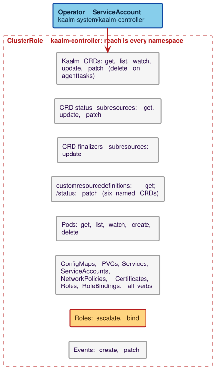
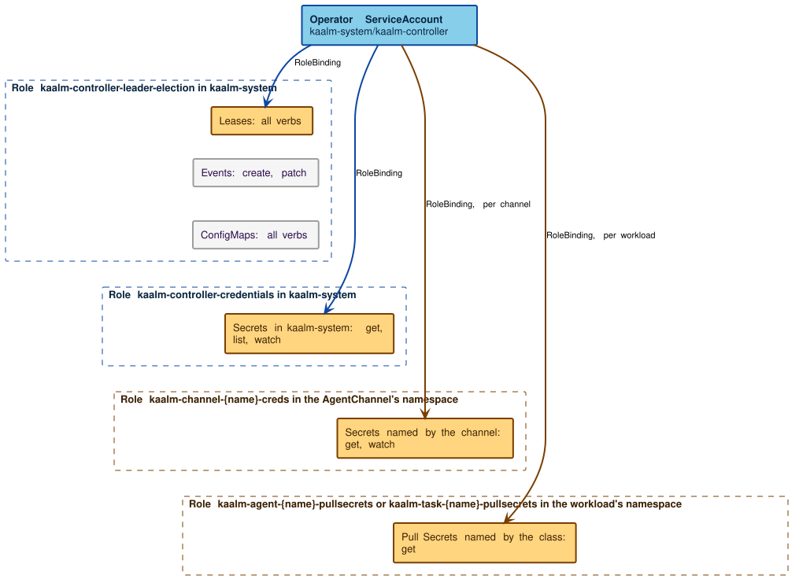
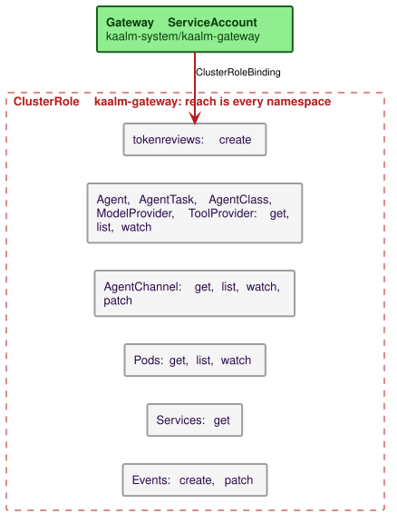
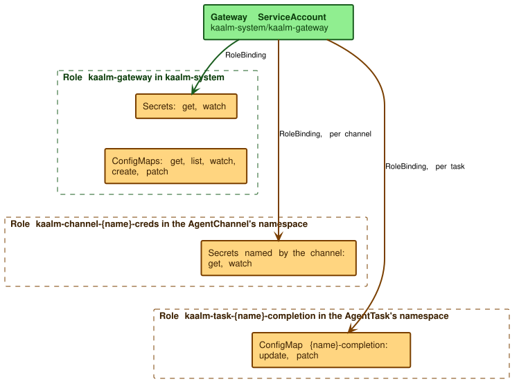

# RBAC and authentication

This page states what each Kaalm identity can do: the operator and gateway ServiceAccounts, the ServiceAccount an agent Pod runs under, and the roles a platform team gives its people. It then states how the gateway and the internal endpoints authenticate their callers. Two Kubernetes facts decide most of the grants:

- A ClusterRole bound with a ClusterRoleBinding applies in every namespace. There is no way to say "this grant, but only in `kaalm-system`". A grant that must stay in one namespace ships as a namespaced Role plus RoleBinding, so both components have a ClusterRole and a Role.
- RBAC `resourceNames` constrains `get`, `update`, `patch`, `delete`, and `watch`, but not `list` and not `create`. A grant scoped to a named object must omit those two verbs, or the scoping is void.

## Operator ServiceAccount

The operator runs as `kaalm-system/kaalm-controller`. It holds the ClusterRole `kaalm-controller`, generated from the reconcilers' RBAC markers and copied into the chart by `make chart-sync`, and the Role `kaalm-controller-leader-election` in `kaalm-system`.

| Resource | Verbs | Why |
|---|---|---|
| The six Kaalm kinds | `get, list, watch, update, patch`; `delete` on `agenttasks` only | Reconciliation; TTL cleanup deletes finished tasks |
| `*/status` subresources | `get, update, patch` | With the status subresource enabled, write access on the main resource does not permit status writes |
| `*/finalizers` subresources | `update` | The reconcilers set ownerRefs with `blockOwnerDeletion: true`, which the `OwnerReferencesPermissionEnforcement` admission plugin authorizes against the owner's finalizers subresource |
| `customresourcedefinitions` and `/status` | `get`; `patch` on status; `resourceNames` limited to the six Kaalm CRDs | The storage-version migrator reads each CRD by name and patches `status.storedVersions` ([API versioning and deprecation](../operations/api-versioning.md#storage-version-migration)) |
| `Pods` | `get, list, watch, create, delete` | The reconcilers create and delete workload Pods in user namespaces. A Pod is replaced, never edited, so `update` and `patch` are absent |
| `ConfigMaps`, `PersistentVolumeClaims`, `Services`, `ServiceAccounts`, `NetworkPolicies`, `Certificates`, `Roles`, `RoleBindings` | all verbs | Child resources the reconcilers create in user namespaces and own through ownerRefs ([Child resources](../runtime/child-resources.md)) |
| `Secrets` | `get, list, watch` | Credential validation and health probes; see the next paragraph |
| `Events` | `create, patch` | [Event emission](../controller/operations.md#event-emission) |

`list` and `watch` on every child kind are what let controller-runtime drive owned-resource reconciliation through informers. `Certificates` are granted cluster-wide because the per-Agent and per-AgentTask `Certificate` objects live beside the workload.

**Secrets.** The read is cluster-wide and read-only. The operator reads a Secret to validate that a ModelProvider or ToolProvider credential exists and to run the provider health probes ([ModelProviderReconciler](../controller/reconcilers.md#modelproviderreconciler), step 1), and to check that an AgentChannel's credential Secret carries the configured keys ([AgentChannelReconciler](../controller/reconcilers.md#agentchannelreconciler), step 3). It never writes or copies one. As shipped, those reads go through the manager's cached client, so the first read starts a cluster-wide Secret informer and the operator process holds every Secret in the cluster in memory from then on. The narrower design, a standing read scoped to `kaalm-system` plus `escalate` and `bind` on `roles` and `rolebindings` so the reconciler can still mint the per-channel Roles, and a live read for the three credential checks, is not what the chart grants. [The threat model](threat-model.md#component-compromise) states what the standing read means for a compromised operator.

**Roles and RoleBindings.** The AgentChannelReconciler and AgentTaskReconciler mint the per-channel and per-task Roles described under [Gateway ServiceAccount permissions](#gateway-serviceaccount-permissions), in whichever user namespace the AgentChannel or AgentTask lives. Kubernetes escalation prevention forbids creating a Role that grants a permission the creator does not hold. Every permission those Roles grant (`get, watch` on named Secrets, `update, patch` on a named ConfigMap) is one the operator holds cluster-wide, so no `escalate` or `bind` verb is granted.

**Leader election.** The Role `kaalm-controller-leader-election` grants all verbs on `Leases` in `kaalm-system`, which controller-runtime's leader-election lock requires; shipping it as a Role is what confines it to the operator's namespace. The Role also lists `Events` and all verbs on `ConfigMaps`. The lock uses Leases, and the operator's ConfigMap work in `kaalm-system` is already covered by the ClusterRole, so the ConfigMap entry grants nothing new.

**Per-channel Role.** For every AgentChannel, the AgentChannelReconciler ensures one Role, `kaalm-channel-{name}-creds`, in the channel's namespace, granting `get, watch` with `resourceNames` limited to the Secrets the channel references, and two RoleBindings, one for the gateway ServiceAccount and one for the operator. All three carry a controller ownerRef to the AgentChannel and are deleted with it. The operator's binding is a mirror of the gateway's: the operator's own reach is the cluster-wide read, so the scoping limits only the gateway.

## Gateway ServiceAccount permissions

The gateway runs as `kaalm-system/kaalm-gateway` and holds the ClusterRole `kaalm-gateway`, the Role `kaalm-gateway` in `kaalm-system`, and the per-object Roles the reconcilers mint.

### Namespaced grants in `kaalm-system`

- `get, watch` on `Secrets`, for LLM provider and tool credentials. `list` is absent, so the gateway runs one single-object watch per referenced Secret ([Credential handling](credentials.md)).
- `get, list, watch, create, patch` on `ConfigMaps`, for three families the gateway writes: `kaalm-budget-{provider}` and `kaalm-agentspend-{provider}`, which each replica server-side-applies its spend partials into ([Budget state management](../gateways/llm/budgets-and-rate-limits.md#budget-state-management)), and `kaalm-async-{requestId}`, created at async acceptance and patched with the payload ([Request flow](../gateways/user/overview.md#request-flow), steps 6 and 10). `delete` and `update` are absent: the ModelProviderReconciler prunes stale budget keys and the AgentChannelReconciler sweeps async ConfigMaps.

### Cluster-wide grants

| Resource | Verbs | Why |
|---|---|---|
| `tokenreviews.authentication.k8s.io` | `create` | Validates projected ServiceAccount tokens from the gateway-only tier ([Mode 2](../gateways/llm/workload-identity.md#mode-2-serviceaccount-bearer-token)). `TokenReview` is a virtual, cluster-scoped resource with no name to scope to |
| `Agent`, `AgentTask` | `get, list, watch` | Resolves the workload named by a client certificate's SAN, in the SAN's namespace, on every request: `spec.providers` and `agentClassRef` for routing, `status.currentPodUID` and `status.phase` for the [task-complete identity gate](../gateways/api/task-complete.md) |
| `AgentClass`, `ModelProvider`, `ToolProvider` | `get, list, watch` | `allowedProviders` on the class, `allowedNamespaces` and the model catalog on the provider, budgets, fallback edges, and the tool broker's grant chain |
| `AgentChannel` | `get, list, watch, patch` | Routes channel messages to an Agent and manages platform connections; `patch` writes only the `kaalm.io/channel-disconnected` annotation during the [delete handshake](../controller/finalizers.md#agentchannel) |
| `Pods` | `get, list, watch` | The source-IP to Pod cross-check on every request and the Mode 2 precheck |
| `Services` | `get` | Resolves an Agent's Service for message delivery. Services carry no secret material, so the cluster-wide reach is harmless |
| `Events` | `create, patch` | `FallbackIneligible` and `CredentialsInvalid` on a ModelProvider during a fallback walk, `CallbackRejected` on an AgentChannel when a platform refuses a reply. ModelProviders are cluster-scoped, so their events land in the `default` namespace |

The gateway does not create the per-task completion ConfigMap and does not set its ownerRef. The AgentTaskReconciler creates it at provisioning time.

### Dynamic per-namespace grants: channel credentials

The gateway holds `get, watch` on the Secrets an AgentChannel references, in the channel's namespace, through the per-channel Role described under the operator. The Role lists every Secret the channel's type references:

- a webhook channel's inbound Secret (`spec.webhook.auth.secretRef` for bearer, `spec.webhook.auth.hmac.secretRef` for HMAC) and, when `callbackUrl` is set, the outbound `spec.webhook.callbackAuth` Secret ([rule 25](../resources/validation-and-defaulting.md#cross-resource-validation)); the same Secret named twice is listed once;
- a platform channel's single `spec.discord.credentialsRef` or `spec.whatsapp.credentialsRef` Secret ([rule 40](../resources/validation-and-defaulting.md#cross-resource-validation)), which backs both the inbound verifier and the outbound reply.

`list` is omitted because `resourceNames` cannot constrain it, and a name-scoped `watch` must set `fieldSelector metadata.name=<secret>` to pass the check. The gateway has no blanket Secret access in user namespaces.

### Dynamic per-namespace grants: task completion ConfigMaps

For an `agentReported` task, the AgentTaskReconciler pre-creates an empty `{taskName}-completion` ConfigMap with an ownerRef to the AgentTask, and a Role `kaalm-task-{taskName}-completion` plus RoleBinding in the task's namespace granting the gateway `update, patch` on that one name ([Completion mailbox and per-task Role](../controller/reconcilers.md#completion-mailbox-and-per-task-role)). Both carry an ownerRef to the AgentTask.

- `get` is omitted because the completion write is a blind merge patch: the gateway sets the `completion` key without reading the object. The identity gate reads the AgentTask through the cluster-wide watch, not the mailbox.
- `create` is omitted because `resourceNames` does not constrain `create`, so granting it would widen the gateway to every ConfigMap in the namespace. Pre-creating the object is what makes the name scoping enforceable.

### Summary of the gateway's reach

The gateway's standing Secret read is `kaalm-system`. In user namespaces it reads only the Secrets each AgentChannel names and writes only the completion ConfigMap each `agentReported` task pre-creates. Async response ConfigMaps live in `kaalm-system` under the gateway's namespaced Role, which is why no per-channel grant exists for them; the AgentChannelReconciler sweeps them by label ([Async response ConfigMaps are swept by label, not owned](../runtime/child-resources.md#async-response-configmaps-are-swept-by-label-not-owned)). Activity tracking writes nothing: the gateway keeps activity timestamps in memory and serves them through the [activity tracking API](../gateways/user/activation-and-activity.md#activity-tracking-api).

## Roles for people

The chart ships RBAC for its own components only: the controller, the gateway, and the console when it is enabled. The two roles that follow are the recommended starting points for a platform team's own RBAC; [Managing team access](https://github.com/win07xp/kaalm/blob/main/guide/src/platform/managing-access.md) in the user guide covers the day-to-day grants.

### Platform engineer role

A ClusterRole (`kaalm-platform-admin`, say), bound with a ClusterRoleBinding to the people who manage platform configuration:

- full access to `AgentClass`, `ModelProvider`, and `ToolProvider`;
- `get, list, watch` on `Agent`, `AgentTask`, and `AgentChannel` cluster-wide, for observability.

Secret management stays out of this ClusterRole, because a ClusterRoleBinding would hand it out in every namespace. A companion Role (`kaalm-secrets-admin`, say, with `create, get, update, delete` on Secrets) is bound in `kaalm-system` for LLM and tool credentials and in each agent namespace that holds channel credentials.

### Agent developer role

A Role (`kaalm-developer`, say) in the team's namespace:

- full access to `Agent`, `AgentTask`, and `AgentChannel`;
- `get, list, watch` on Pods, PersistentVolumeClaims, Services, ConfigMaps, and Events, and `get` on `pods/log`;
- `create` on `pods/exec` for debugging, if the platform team allows it.

A Role cannot grant access to cluster-scoped resources, so catalog visibility is a separate ClusterRole (`kaalm-catalog-reader`, say: `get, list, watch` on `AgentClass`, `ModelProvider`, and `ToolProvider`) bound to developer groups. Developers get no Secret access, no write access to the catalog kinds, and no access to other namespaces.

## Agent Pod ServiceAccount

Each Agent Pod runs as a ServiceAccount of its own, `agent-{agentName}`, which the AgentReconciler creates as an owned child in the Agent's namespace ([AgentReconciler](../controller/reconcilers.md#agentreconciler), step 8); AgentTask Pods run as `task-{taskName}` ([AgentTaskReconciler](../controller/reconcilers.md#agenttaskreconciler), step 5). No RoleBinding is attached, so the workload has no Kubernetes API access. An agent that needs it, such as one that administers the cluster, gets a Role and RoleBinding against that ServiceAccount from the developer or platform team.

As shipped, the Pod does not set `automountServiceAccountToken: false`, so the token is mounted beside the mTLS certificate. The token grants nothing at the API server, and the gateway rejects it on the bearer path ([Auth downgrade to ServiceAccount token](threat-model.md#auth-downgrade-to-serviceaccount-token)).

## Agent to gateway authentication

The gateway accepts two forms of caller identity, one per Helm tier. [Workload identity](../gateways/llm/workload-identity.md) specifies the request-time mechanics for both: SAN parsing, the TokenReview call, the precheck, the cache, and the source-IP cross-check. This section states why each form is designed as it is.

### Mode 1: mTLS client certificate

Pods the reconcilers create authenticate only with the cert-manager-issued certificate at `$KAALM_TLS_CERT`, presented as a client certificate on the gateway's cluster listener. The gateway verifies it against `kaalm-ca` and reads the workload's namespace and name from the SAN: `{name}.{namespace}.svc.cluster.local` for an Agent, `{name}.{namespace}.task.kaalm.io` for an AgentTask ([Mode 1](../gateways/llm/workload-identity.md#mode-1-mtls-client-certificate)). The CA private key is unreachable from any workload Pod, so the identity is attested rather than claimed.

Their ServiceAccount tokens are not accepted. Accepting both would give a compromised workload a second credential to use after its certificate is contained, so the tier's credential surface is one artifact: a namespace-pinned client certificate with a bounded `notAfter`. That bound is containment, not revocation; [Containment, not revocation](tls.md#containment-not-revocation) states what a leaked leaf can still do. As shipped the per-workload `Certificate` duration is fixed at 90 days in the reconciler and has no chart value.

### Mode 2: ServiceAccount bearer token

Workloads in the gateway-only tier have no Agent resource. They mount a projected ServiceAccount token with audience `kaalm-gateway` and send it as `Authorization: Bearer`; the gateway validates it with a `TokenReview` and takes the namespace from the authenticated username ([Mode 2](../gateways/llm/workload-identity.md#mode-2-serviceaccount-bearer-token)). Three properties carry the security argument:

- The mTLS tier is exclusive. Before any `TokenReview`, an uncached precheck resolves the source IP to a Pod and answers `401` if that Pod belongs to an Agent or AgentTask, so a reconciler-created Pod cannot fall back to the token path.
- The audience is bound. The `TokenReview` names audience `kaalm-gateway`, so a token minted for the API server, such as a stolen kubelet token, fails validation.
- The cache TTL is bounded by the token, not by the API. `TokenReviewStatus` returns no expiry, so the TTL comes from the token's own `exp` claim with a safety margin and a cap; opaque tokens get the cap.

### Source-IP cross-check

In both modes the gateway resolves the source IP to a Pod through its informer and requires that Pod to be in the namespace the credential named ([Source-IP cross-check](../gateways/llm/workload-identity.md#source-ip-cross-check-both-modes)). A credential presented from a different Pod fails with `401`. `POST /v1/task/complete` retries the resolution with a live Pod list before failing, so informer lag on a new Pod surfaces as the retryable `403 StalePodCompletion` rather than a terminal `401`.

### Client cert presentation

The [starter templates](../runtime/starter-templates.md) present the client certificate and reload it on rotation. A custom image must present `$KAALM_TLS_CERT` and `$KAALM_TLS_KEY` on every call to the gateway: LLM requests, task completion, and, for Agents, heartbeats.

## Internal endpoint authentication

Five endpoints serve Kaalm's own components: the controller's `POST /v1/activate/{namespace}/{agentName}`, and the gateway's `GET /v1/activity`, `GET /v1/channels/health`, `POST /v1/test-chat`, and `GET /v1/spend`. All five authenticate the caller with mTLS and authorize by the certificate's SAN. There is no shared secret on top of TLS. [Internal endpoints](../gateways/api/internal-endpoints.md) specifies each wire contract.

| Caller and endpoint | Listener | Client certificate | Authorized SAN |
|---|---|---|---|
| Gateway calls `POST /v1/activate` | Controller `:9443` | `kaalm-gateway-tls` | `kaalm-gateway.kaalm-system.svc.cluster.local` or `.svc` |
| Controller calls `GET /v1/activity`, `GET /v1/channels/health` | Gateway `:8443` | `kaalm-controller-tls` | `kaalm-controller.kaalm-system.svc.cluster.local` or `.svc` |
| Console calls `POST /v1/test-chat`, `GET /v1/spend` | Gateway `:8443` | `kaalm-console-tls` | `kaalm-console.kaalm-system.svc.cluster.local` or `.svc` |

Both listeners run `ClientAuth: tls.VerifyClientCertIfGiven` and enforce the certificate per path in middleware: a missing certificate answers `401`, a certificate with the wrong SAN answers `403`. The gateway's listener must accept cert-less handshakes because Mode 2 callers share it ([Per-path client auth enforcement](../gateways/listener-tls.md#per-path-client-auth-enforcement)); the controller's listener runs the same mode. Kubelet probes the manager's plain HTTP listener on `:8081`, not `:9443`. The console certificate exists only when the console is enabled, so on a default install the two console routes have no authorized caller.

All three certificates come from `kaalm-ca-issuer`, live in `kaalm-system`, carry `usages: [server auth, client auth]` because each component also dials another, and rotate under cert-manager ([Trust chain](tls.md#trust-chain)).

Authorization is by SAN, not by possession of a certificate signed by `kaalm-ca`. A per-Agent certificate chains to the same anchor and verifies in the handshake; only its SAN differs, so the SAN check is the whole control and rejects the caller before the handler runs.
