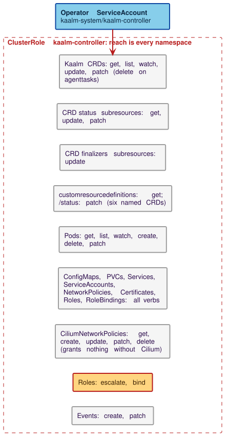
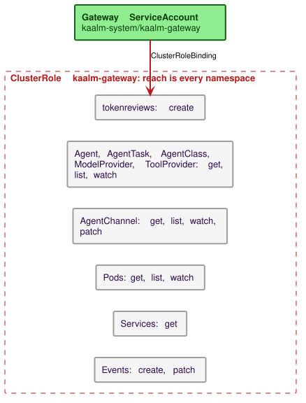

# RBAC and authentication

This page states what each Kaalm identity can do: the operator and gateway ServiceAccounts, the ServiceAccount an agent Pod runs under, and the roles a platform team gives its people. It then states how the gateway and the internal endpoints authenticate their callers. Two Kubernetes facts decide most of the grants:

- A ClusterRole bound with a ClusterRoleBinding applies in every namespace. There is no way to say "this grant, but only in `kaalm-system`". A grant that must stay in one namespace ships as a namespaced Role plus RoleBinding, so both components have a ClusterRole and a Role.
- RBAC `resourceNames` constrains `get`, `update`, `patch`, `delete`, and `watch`, but not `list` and not `create`. A grant scoped to a named object must omit those two verbs, or the scoping is void.

## Operator ServiceAccount

The operator runs as `kaalm-system/kaalm-controller`. It holds the ClusterRole `kaalm-controller` (generated from the reconcilers' RBAC markers and copied into the chart by `make chart-sync`) and two Roles in `kaalm-system`: `kaalm-controller-leader-election` and `kaalm-controller-credentials`.

| Resource | Verbs | Why |
|---|---|---|
| The six Kaalm kinds | `get, list, watch, update, patch`; `delete` on `agenttasks` only | Reconciliation; TTL cleanup deletes finished tasks |
| `*/status` subresources | `get, update, patch` | With the status subresource enabled, write access on the main resource does not permit status writes |
| `*/finalizers` subresources | `update` | The reconcilers set ownerRefs with `blockOwnerDeletion: true`, which the `OwnerReferencesPermissionEnforcement` admission plugin authorizes against the owner's finalizers subresource |
| `customresourcedefinitions` and `/status` | `get`; `patch` on status; `resourceNames` limited to the six Kaalm CRDs | The storage-version migrator reads each CRD by name and patches `status.storedVersions` ([API versioning and deprecation](../operations/api-versioning.md#storage-version-migration)) |
| `Pods` | `get, list, watch, create, delete, patch` | The reconcilers create and delete workload Pods in user namespaces. A Pod's spec is replaced, never edited, so `update` is absent. `patch` rewrites only the two Pod spec hash annotations after an upgrade that changes the hash formula ([Change propagation](../controller/change-propagation.md#an-upgrade-that-changes-the-hash-formula-replaces-no-pod)) |
| `ConfigMaps`, `PersistentVolumeClaims`, `Services`, `ServiceAccounts`, `NetworkPolicies`, `Certificates`, `Roles`, `RoleBindings` | all verbs | Child resources the reconcilers create in user namespaces and own through ownerRefs ([Child resources](../runtime/child-resources.md)) |
| `CiliumNetworkPolicies` (`cilium.io`) | `get, create, update, patch, delete` | The per-workload FQDN egress policy for a class's `allowedHosts` ([FQDN egress policy](../runtime/child-resources.md#fqdn-egress-policy)). No `list` or `watch`: the controller gets each policy by name and does not watch the kind |
| `Roles` | `escalate, bind` | Minting the scoped Roles; see Roles and RoleBindings |
| `Events` | `create, patch` | [Event emission](../controller/operations.md#event-emission) |

`list` and `watch` on every child kind let the reconcilers react to changes in the resources they own. `Certificates` are granted cluster-wide because the per-Agent and per-AgentTask `Certificate` objects live beside the workload.

**CiliumNetworkPolicies.** The rule ships in every install, whatever the CNI. RBAC does not check that an API group exists, so on a cluster without Cilium the rule grants nothing and does no harm, and there is no chart value to turn it off.

**Secrets.** The ClusterRole grants nothing on Secrets. The operator's only standing read is the Role `kaalm-controller-credentials`, which grants `get, list, watch` on Secrets in `kaalm-system`. The operator uses it to validate that a ModelProvider or ToolProvider credential exists, carries the rule 49 label, and lists the endpoint host (rule 50), to run the provider health probes ([ModelProviderReconciler](../controller/reconcilers/modelprovider.md)), and to read the ownerReferences of its own `kaalm-controller-tls` Secret for the `CertificateCleanup` condition. The operator reads a Secret in a user namespace in three cases, each under a Role it mints for exactly the names involved: the Secrets an AgentChannel references, which it reads to check the rule 45 label and the credential keys ([AgentChannelReconciler](../controller/reconcilers/agentchannel.md)); the rule 23 check that a class's image pull Secrets exist; and the Secrets a workload's `spec.env` names, which it reads to check the rule 48 label. Each such Secret is read through a watch on that one Secret, so these Roles grant `get` and `watch`. The operator process therefore holds exactly the user-namespace Secrets that its channels and workloads reference, labeled or not, and drops a Secret after an hour with no read. It never writes or copies a Secret. [The threat model](threat-model.md#component-compromise) states what this means for a compromised operator.

**Roles and RoleBindings.** The reconcilers mint the per-channel, per-task, and per-workload Roles described on this page, in whichever user namespace the resource lives. Kubernetes escalation prevention forbids creating a Role that grants a permission the creator does not hold, and binding a Role the creator could not have created. The operator holds no Secret read outside `kaalm-system`, so the ClusterRole carries `escalate` and `bind` on `roles`. That trades a standing read of every Secret for the ability to grant a named one, and each grant is a Role and a RoleBinding that the API server's audit log records.

![The operator ServiceAccount's namespaced Roles. Two are in kaalm-system: the leader-election Role holding Leases, Events, and ConfigMaps, and the credentials Role holding Secrets with get, list, and watch. Three kinds are minted in user namespaces: the per-channel check Role holding every Secret the channel names with get and watch, the per-workload pull-Secret Role holding the class's named pull Secrets with get and watch, and the per-workload env-Secret Role holding the Secrets the workload's env names with get and watch.](../diagrams/operator-rbac-namespaced.svg)

**Leader election.** The Role `kaalm-controller-leader-election` grants all verbs on `Leases` in `kaalm-system`, which controller-runtime's leader-election lock requires; shipping it as a Role is what confines it to the operator's namespace. The Role also lists `Events` and all verbs on `ConfigMaps`. The lock uses Leases, and the operator's ConfigMap work in `kaalm-system` is already covered by the ClusterRole, so the ConfigMap entry grants nothing new.

**Per-channel Roles.** For every AgentChannel, the AgentChannelReconciler ensures two Roles in the channel's namespace ([Per-channel credential Roles](../controller/reconcilers/agentchannel.md#per-channel-credential-roles) covers how it keeps them current). RBAC cannot grant a read by label, so the operator needs the check Role to see the rule 45 label on each Secret, and the gateway's credential Role then lists only the labeled ones.

| Role | Named | Grants `get, watch` on | Bound to |
|---|---|---|---|
| Check | `kaalm-channel-{channelName}-check` | Every referenced Secret | `kaalm-system/kaalm-controller` only, by a RoleBinding of the same name |
| Credential | `kaalm-channel-{channelName}-creds` | The referenced Secrets that carry the rule 45 label | `kaalm-system/kaalm-gateway` only, by the RoleBinding `kaalm-channel-{channelName}-creds-gateway` |

The operator is not bound to the credential Role: the check Role already grants it every Secret that the credential Role lists. The credential Role has no rules while no referenced Secret is labeled, because a rule with empty `resourceNames` would grant every Secret in the namespace. All the Roles and bindings carry a controller ownerRef to the AgentChannel and are deleted with it. The operator holds no other Secret read in that namespace.

**Per-workload pull-Secret Role.** When a class sets `image.imagePullSecrets`, the AgentReconciler and AgentTaskReconciler ensure one Role per workload, `kaalm-agent-{name}-pullsecrets` or `kaalm-task-{name}-pullsecrets`, granting `get, watch` with `resourceNames` limited to those Secrets, and one RoleBinding of the same name for the operator. Both carry a controller ownerRef to the workload and are deleted with it, and both are removed when the class stops naming a pull Secret. A class with no pull Secrets creates neither. The kubelet, not the operator, uses the Secret to pull the image; the Role exists so that rule 23 can report a missing Secret before the Pod is created.

**Per-workload env-Secret Role.** When a workload's `spec.env` reads a Secret through `valueFrom.secretKeyRef`, the AgentReconciler and AgentTaskReconciler ensure one Role per workload in its namespace, `kaalm-agent-{name}-envsecrets` or `kaalm-task-{name}-envsecrets`, and one RoleBinding of the same name. The Role grants `get, watch` on `secrets` with `resourceNames` set to the Secret names the env lists. The RoleBinding's only subject is the `kaalm-controller` ServiceAccount in the operator namespace. The pair exists only while `spec.env` names a Secret, and is garbage-collected with the workload through its controller ownerRef. A Role or RoleBinding of that name that the workload does not control sets `Ready=False, reason=ChildConflict` and is never changed ([Child ownership](../controller/reconcilers/agent.md#child-ownership)). The operator reads these Secrets whether they carry the label or not, because RBAC cannot grant a read by label and the operator must see the label to enforce [rule 48](../resources/validation/references-and-access.md).

## Gateway ServiceAccount permissions

The gateway runs as `kaalm-system/kaalm-gateway` and holds the ClusterRole `kaalm-gateway`, the Role `kaalm-gateway` in `kaalm-system`, and the per-object Roles the reconcilers mint.

### Namespaced grants in `kaalm-system`

- `get, watch` on `Secrets`, for LLM provider and tool credentials. `list` is absent, so the gateway runs one single-object watch per referenced Secret ([Credential handling](credentials.md)). RBAC covers every Secret in `kaalm-system`. The gateway reads a provider Secret only if it carries the label `kaalm.io/provider-credential: "true"` and lists the provider's endpoint host in its `kaalm.io/provider-hosts` annotation ([rules 49 and 50](../resources/validation/providers.md#provider-credentials)).
- `get, list, watch, create, patch` on `ConfigMaps`, for three families the gateway writes: `kaalm-budget-{provider}` and `kaalm-agentspend-{provider}`, which each replica writes its spend partials into ([Budget state management](../gateways/llm/budgets-and-rate-limits.md#budget-state-management)), and `kaalm-async-{requestId}`, created when an async request is accepted and patched with the payload ([Request flow](../gateways/user/overview.md#request-flow)). `delete` and `update` are absent: the ModelProviderReconciler prunes stale budget keys and deletes a deleted provider's budget and agent-spend ConfigMaps, and the AgentChannelReconciler sweeps async ConfigMaps.

### Cluster-wide grants

| Resource | Verbs | Why |
|---|---|---|
| `tokenreviews.authentication.k8s.io` | `create` | Validates projected ServiceAccount tokens from the gateway-only tier ([Mode 2](../gateways/llm/workload-identity.md#mode-2-serviceaccount-bearer-token)). `TokenReview` is a virtual, cluster-scoped resource with no name to scope to |
| `Agent`, `AgentTask` | `get, list, watch` | Resolves the workload named by a client certificate's SAN, in the SAN's namespace, on every request: `spec.providers` and `agentClassRef` for routing, `status.currentPodUID` and `status.phase` for the [Pod UID check](../gateways/api/task-complete.md#checks-before-the-write) |
| `AgentClass`, `ModelProvider`, `ToolProvider` | `get, list, watch` | `allowedNamespaces` and `allowedProviders` on the class, `allowedNamespaces` and the model catalog on the provider, budgets, fallback edges, and the tool broker's grant chain |
| `AgentChannel` | `get, list, watch, patch` | Routes channel messages to an Agent and manages platform connections; `patch` writes only the `kaalm.io/channel-disconnected` annotation during the [delete handshake](../controller/finalizers.md#agentchannel) |
| `Pods` | `get, list, watch` | The source-IP to Pod cross-check on every request and the Mode 2 precheck |
| `Services` | `get` | Resolves an Agent's Service for message delivery. Services carry no secret material, so the cluster-wide reach is harmless |
| `Events` | `create, patch` | `FallbackIneligible` and `CredentialsInvalid` on a ModelProvider during a fallback walk, `CredentialsInvalid` on a ToolProvider when a brokered call is rejected, `CallbackRejected` on an AgentChannel when a platform refuses a reply. ModelProviders and ToolProviders are cluster-scoped, so their events land in the `default` namespace |

The gateway does not create the per-task completion ConfigMap and does not set its ownerRef. The AgentTaskReconciler creates it at provisioning time.

### Dynamic per-namespace grants: channel credentials

The gateway holds `get, watch` on the Secrets an AgentChannel references and that carry the label `kaalm.io/channel-credential: "true"`, in the channel's namespace, through the per-channel credential Role described under the operator. [Rule 45](../resources/validation/channels.md) lists the Secrets a channel references. `list` is omitted because `resourceNames` cannot constrain it. The gateway has no blanket Secret access in user namespaces.

The Role catches up with a Secret's label as soon as the label changes, because a change to a referenced Secret requeues the channel's reconcile at once ([Timing](../controller/reconcilers/agentchannel.md#timing)). A watch that the gateway opened before the Role shrank can still outlive it. The gateway therefore checks the label itself ([rule 45](../resources/validation/channels.md)): it reads a channel Secret only if the Secret carries the label, even while the Role still grants it, and a bearer callback token only for a host the Secret's `kaalm.io/callback-hosts` annotation lists (rule 46). The gateway's LLM provider and tool credential reads in `kaalm-system` are separate: they fall under the provider label and host annotation of rules 49 and 50, which are not the channel label and annotation.

### Dynamic per-namespace grants: task completion ConfigMaps

For an `agentReported` task, the AgentTaskReconciler pre-creates an empty `{taskName}-completion` ConfigMap with an ownerRef to the AgentTask, and a Role `kaalm-task-{taskName}-completion` plus RoleBinding in the task's namespace granting the gateway `update, patch` on that one name ([Completion mailbox and per-task Role](../controller/reconcilers/agenttask.md#completion-mailbox-and-per-task-role)). Both carry an ownerRef to the AgentTask. While the task has a Pod, an edit to the Role or RoleBinding is reverted, so the gateway's grant stays exactly `update` and `patch` on that task's completion ConfigMap ([Task child-resource convergence](../controller/reconcilers/agenttask.md#task-child-resource-convergence)).

- `get` is omitted because the completion write is a blind merge patch: the gateway sets the `completion` key without reading the object. The completion checks read the AgentTask through the cluster-wide watch, not the mailbox.
- `create` is omitted because `resourceNames` does not constrain `create`, so granting it would widen the gateway to every ConfigMap in the namespace. Pre-creating the object is what makes the name scoping enforceable.

### Summary of the gateway's reach

The gateway's standing Secret read is `kaalm-system`. In user namespaces it reads only the labeled Secrets each AgentChannel names and writes only the completion ConfigMap each `agentReported` task pre-creates. Async response ConfigMaps live in `kaalm-system` under the gateway's namespaced Role, which is why no per-channel grant exists for them; the AgentChannelReconciler sweeps them by label ([Async response ConfigMaps are swept by label, not owned](../runtime/child-resources.md#async-response-configmaps-are-swept-by-label-not-owned)). Activity tracking writes nothing: the gateway keeps activity timestamps in memory and serves them through the [activity tracking API](../gateways/user/activation-and-activity.md#activity-tracking-api).

## Roles for people

The chart ships RBAC for its own components: the controller, the gateway, and the console when it is enabled. It can also install four ClusterRoles for the people who run Kaalm. They are off by default (`rbac.personas.enabled: false`), and off renders nothing. [Managing team access](https://github.com/win07xp/kaalm/blob/main/guide/src/platform/managing-access.md) in the user guide covers the day-to-day grants, and the [Configuration reference](../operations/deployment.md#configuration-reference) lists the values.

### Persona roles

With `rbac.personas.enabled`, the chart installs these four ClusterRoles:

| ClusterRole | Grants | For |
|---|---|---|
| `kaalm-platform-admin` | `*` on `agentclasses`, `modelproviders`, and `toolproviders`; `get, list, watch` on `agents`, `agenttasks`, and `agentchannels` | People who manage platform configuration; the second rule is cluster-wide observability |
| `kaalm-catalog-reader` | `get, list, watch` on `agentclasses`, `modelproviders`, and `toolproviders`, and nothing else | Developers, so they can read the classes and providers they reference by name |
| `kaalm-developer` | `*` on `agents`, `agenttasks`, and `agentchannels`; `get, list, watch` on core `pods`, `persistentvolumeclaims`, `services`, `configmaps`, and `events`; `get` on `pods/log`; with `rbac.personas.developerSecrets`, also `get, list, watch, create, update, patch, delete` on core `secrets` | A team working in its own namespace |
| `kaalm-secrets-admin` | `get, list, watch, create, update, patch, delete` on core `secrets` | The people who manage credentials: LLM and tool credentials in the release namespace, and a team's channel credentials in that team's namespace |

The grants on the Kaalm kinds are in the `kaalm.io` API group. Four properties hold across the set:

- No persona role grants a `/status` subresource.
- Only `kaalm-secrets-admin` grants Secrets, with one exception: `rbac.personas.developerSecrets` adds Secret management to `kaalm-developer`. By default developers get no Secret access, and `kaalm-platform-admin` has none because a ClusterRoleBinding would hand it out in every namespace. Either way, a workload's env reaches only Secrets that someone with Secret write access has labeled ([rule 48](../resources/validation/references-and-access.md)).
- `kaalm-developer` grants no catalog kind, so developers cannot write the catalog.
- None of the four carries an `aggregate-to` label. [Aggregation into the built-in roles](#aggregation-into-the-built-in-roles) is a separate switch.

RBAC cannot restrict which AgentClass a developer names in `agentClassRef`, because it authorizes the `create` verb on an Agent or AgentTask, not the names its spec references. Removing read access to a class does not stop anyone naming it, because the controller resolves `agentClassRef` under its own identity. `kaalm-catalog-reader` exists so developers can look classes up, not to restrict which class they name. To keep a class to chosen teams, set its `allowedNamespaces`, which the controller and the gateway both check ([AgentClass](../resources/agentclass.md#allowednamespaces-keeps-a-class-to-some-teams)).

`kaalm-secrets-admin` lists `patch` because `kubectl apply` on an existing Secret needs it, and `list` because `kubectl get secrets` without a name needs it. `get` already exposes every Secret by name, so `list` widens nothing in the namespace where the role is bound.

`rbac.personas.developerExec` (default `false`) adds `pods/exec` with `get` and `create` to `kaalm-developer` only, for debugging inside an agent container. Both verbs are needed: `kubectl exec` over WebSockets is authorized as `get`, and over SPDY (or with the `AuthorizePodWebsocketUpgradeCreatePermission` feature gate) as `create`. The value has no effect while `rbac.personas.enabled` is `false`.

`rbac.personas.developerSecrets` (default `false`) adds one rule to `kaalm-developer`: core `secrets` with `get, list, watch, create, update, patch, delete`, in every namespace where `kaalm-developer` is bound. The other persona roles do not change, and the value has no effect while `rbac.personas.enabled` is `false`. Use it when a team's developers manage Secrets themselves, for example in a dev loop. The opt-in labels still apply to the Secrets developers create: a channel uses only Secrets labeled `kaalm.io/channel-credential: "true"` ([rule 45](../resources/validation/channels.md)), and a workload's `spec.env` reads only Secrets labeled `kaalm.io/workload-secret: "true"` ([rule 48](../resources/validation/references-and-access.md)).

### Bindings come from values

Each binding comes from a value, and an empty or missing list renders no binding:

| Value | Renders |
|---|---|
| `rbac.personas.platformAdmins` | ClusterRoleBinding `kaalm-platform-admin` |
| `rbac.personas.catalogReaders` | ClusterRoleBinding `kaalm-catalog-reader` |
| `rbac.personas.secretsAdmins` | A list of subjects. RoleBinding `kaalm-secrets-admin` in the release namespace only, for provider and tool credentials |
| `rbac.personas.namespaceSecretsAdmins` | A map of namespace to subject list. Each namespace whose list is not empty gets a RoleBinding `kaalm-secrets-admin` in that namespace, for that team's channel credentials |
| `rbac.personas.developers` | A map of namespace to subject list. Each namespace whose list is not empty gets a RoleBinding `kaalm-developer` in that namespace |

Subjects are `rbac.authorization.k8s.io/v1` Subject objects, rendered verbatim. Subject values set while `rbac.personas.enabled` is `false` are ignored.

The chart never binds `kaalm-developer` or `kaalm-secrets-admin` with a ClusterRoleBinding. A ClusterRole bound by a RoleBinding grants only in that namespace, so a developer has no access to other namespaces, and credential management is limited to the namespaces you choose. `kaalm-platform-admin` and `kaalm-catalog-reader` are the roles bound with ClusterRoleBindings, because the catalog kinds are cluster-scoped and a RoleBinding cannot grant them. `kaalm-platform-admin` also reads Agent, AgentTask, and AgentChannel in every namespace.

Each team's credential manager owns that team's channel credentials: bind `kaalm-secrets-admin` to them in the team's namespace with `rbac.personas.namespaceSecretsAdmins`. The platform team holds no Secret rights in team namespaces. `rbac.personas.secretsAdmins` stays a list and covers the release namespace only, which holds the LLM and tool credentials. The credential manager labels each channel Secret (rule 45) and, for a bearer callback token, annotates it with the approved hosts (rule 46). It also labels each Secret a team's workloads read in their env (rule 48). In the release namespace, the same people label each provider and tool Secret `kaalm.io/provider-credential: "true"` and annotate it with the endpoint hosts of the providers that use it (rules 49 and 50). `kaalm-platform-admin` holds no Secret rights, so a person who writes providers cannot point one at another Secret in `kaalm-system`, such as `kaalm-gateway-session-key` or a cert-manager `*-tls` Secret, or send a credential to a host that the credential manager did not approve.

These lifecycle rules follow from rendering the bindings:

- Each namespace in `rbac.personas.developers` and `rbac.personas.namespaceSecretsAdmins` must already exist, or `helm install` and `helm upgrade` fail. For a namespace created later, add an entry and upgrade.
- `rbac.personas.namespaceSecretsAdmins` must be a map of namespace to a list of subjects, and it must not list the release namespace (use `rbac.personas.secretsAdmins` for that). Either mistake fails the render.
- A RoleBinding `kaalm-secrets-admin` that someone made by hand in a listed namespace makes `helm install` and `helm upgrade` fail, because the hand-made binding lacks the ownership label and annotations Helm puts on the objects of a release, so Helm refuses to take it over. Its `roleRef` matches the chart's, so add those label and annotations to adopt it into the release, or delete it ([Managing team access](https://github.com/win07xp/kaalm/blob/main/guide/src/platform/managing-access.md)).
- Removing an entry on upgrade deletes that RoleBinding, which revokes the access.
- Turning `rbac.personas.enabled` off deletes the four ClusterRoles. A hand-written binding that references them dangles and grants nothing.

### Aggregation into the built-in roles

`rbac.aggregateToDefaultRoles` (default `false`) adds the namespaced Kaalm kinds to the Kubernetes built-in `view`, `edit`, and `admin` roles. It works without `rbac.personas.enabled`. It renders two ClusterRoles on the `agents`, `agenttasks`, and `agentchannels` resources:

| ClusterRole | Labels | Verbs |
|---|---|---|
| `kaalm-aggregate-to-view` | `rbac.authorization.k8s.io/aggregate-to-view: "true"` | `get, list, watch` |
| `kaalm-aggregate-to-edit` | `rbac.authorization.k8s.io/aggregate-to-edit: "true"` and `rbac.authorization.k8s.io/aggregate-to-admin: "true"` | `get, list, watch, create, update, patch, delete, deletecollection` |

The catalog kinds (`AgentClass`, `ModelProvider`, `ToolProvider`) and Secrets are never aggregated. `edit` and `admin` are often bound to tenants per namespace, and a catalog write is cluster-wide policy.

## Agent Pod ServiceAccount

Each Agent Pod runs as a ServiceAccount of its own, `agent-{agentName}`, which the AgentReconciler creates as an owned child in the Agent's namespace ([Agent child resources](../runtime/child-resources.md#agent-child-resources)); AgentTask Pods run as `task-{taskName}` ([AgentTask child resources](../runtime/child-resources.md#agenttask-child-resources)). No RoleBinding is attached, so the workload has no Kubernetes API access.

By default, Agent and AgentTask Pods set `automountServiceAccountToken: false`, so no token is mounted and the mTLS certificate is the workload's only credential. An agent that needs API access, such as one that administers the cluster, runs under a class that sets `security.automountServiceAccountToken: true` ([AgentClass](../resources/agentclass.md#automountserviceaccounttoken-is-the-opt-in-for-api-access)). Its Pods then mount the token, and a Role and RoleBinding against the workload's ServiceAccount from the developer or platform team give the agent that access. The gateway rejects a workload token on the bearer path in any case ([Auth downgrade to ServiceAccount token](threat-model.md#auth-downgrade-to-serviceaccount-token)). A change to the setting replaces every running Agent Pod of the class ([Spec change handling](../controller/change-propagation.md#spec-change-handling)).

## Agent to gateway authentication

The gateway accepts two forms of caller identity, one per Helm tier. [Workload identity](../gateways/llm/workload-identity.md) specifies the request-time mechanics for both: SAN parsing, the TokenReview call, the precheck, the cache, and the source-IP cross-check. This section states why each form is designed as it is.

### Mode 1: mTLS client certificate

Pods the reconcilers create authenticate only with the cert-manager-issued certificate at `$KAALM_TLS_CERT`, presented as a client certificate on the gateway's cluster listener. The gateway verifies it against `kaalm-ca` and reads the workload's namespace and name from the SAN ([Mode 1](../gateways/llm/workload-identity.md#mode-1-mtls-client-certificate) gives the SAN shapes). The CA private key is unreachable from any workload Pod, so the identity is attested rather than claimed.

Their ServiceAccount tokens are not accepted. Accepting both would give a compromised workload a second credential to use after its certificate is contained, so the tier's credential surface is one artifact: a namespace-pinned client certificate with a bounded `notAfter`. That bound is containment, not revocation; [Containment, not revocation](tls.md#containment-not-revocation) states what a leaked leaf can still do. A shorter certificate lifetime narrows that window ([Rotation defaults](tls.md#rotation-defaults) lists the lifetimes and the chart values that set them).

### Mode 2: ServiceAccount bearer token

Workloads in the gateway-only tier have no Agent resource. They mount a projected ServiceAccount token with audience `kaalm-gateway` and send it as `Authorization: Bearer`; the gateway validates it with a `TokenReview` and takes the namespace from the authenticated username ([Mode 2](../gateways/llm/workload-identity.md#mode-2-serviceaccount-bearer-token)). Three properties carry the security argument:

- The mTLS tier is exclusive. Before any `TokenReview`, an uncached precheck resolves the source IP to a Pod and answers `401` if that Pod belongs to an Agent or AgentTask, so a reconciler-created Pod cannot fall back to the token path.
- The audience is bound. The `TokenReview` names audience `kaalm-gateway`, so a token minted for the API server, such as a stolen kubelet token, fails validation.
- The cache TTL is bounded by the token, not by the API. `TokenReviewStatus` returns no expiry, so the TTL comes from the token's own `exp` claim with a safety margin and a cap; opaque tokens get the cap.

### Source-IP cross-check

In both modes the gateway resolves the source IP to a Pod through its informer and requires that Pod to be in the namespace the credential named ([Source-IP cross-check](../gateways/llm/workload-identity.md#source-ip-cross-check-both-modes)). A credential presented from a different Pod fails with `401`.

### Client cert presentation

The [starter templates](../runtime/starter-templates.md) present the client certificate and reload it on rotation. A custom image must present `$KAALM_TLS_CERT` and `$KAALM_TLS_KEY` on every call to the gateway: LLM requests, task completion, and, for Agents, heartbeats.

## Internal endpoint authentication

Five endpoints serve Kaalm's own components: the controller's `POST /v1/activate/{namespace}/{agentName}`, and the gateway's `GET /v1/activity`, `GET /v1/channels/health`, `POST /v1/test-chat`, and `GET /v1/spend`. All five authenticate the caller with mTLS and authorize by the certificate's SAN. There is no shared secret on top of TLS. [Internal endpoints](../gateways/api/internal-endpoints.md) specifies each wire contract.

| Caller and endpoint | Listener | Client certificate | Authorized SAN |
|---|---|---|---|
| Gateway calls `POST /v1/activate` | Controller `:9443` | `kaalm-gateway-tls` | `kaalm-gateway.kaalm-system.svc.cluster.local` or `.svc` |
| Controller calls `GET /v1/activity`, `GET /v1/channels/health` | Gateway `:8443` | `kaalm-controller-tls` | `kaalm-controller.kaalm-system.svc.cluster.local` or `.svc` |
| Console calls `POST /v1/test-chat`, `GET /v1/spend` | Gateway `:8443` | `kaalm-console-tls` | `kaalm-console.kaalm-system.svc.cluster.local` or `.svc` |

Both listeners verify a client certificate when one is presented and enforce it per path in middleware: a missing certificate answers `401`, a certificate with the wrong SAN answers `403`. On the gateway, the source IP must also resolve to a Pod in `kaalm-system`, or the request answers `401`. The gateway's listener must accept cert-less handshakes because Mode 2 callers share it ([Per-path client auth enforcement](../gateways/listener-tls.md#per-path-client-auth-enforcement)); the controller's listener runs the same mode. Kubelet probes the manager's plain HTTP listener on `:8081`, not `:9443`. The console certificate exists only when the console is enabled, so on a default install the two console routes have no authorized caller.

All three certificates come from `kaalm-ca-issuer`, live in `kaalm-system`, carry `usages: [server auth, client auth]` because each component also dials another, and rotate under cert-manager ([Trust chain](tls.md#trust-chain)).

Authorization is by SAN, not by possession of a certificate signed by `kaalm-ca`. A per-Agent certificate chains to the same anchor and verifies in the handshake; only its SAN differs, so the SAN check is the whole control and rejects the caller before the handler runs.
