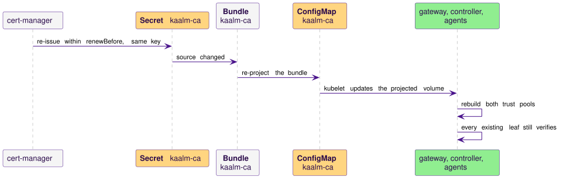

# TLS and certificates

This page is the reference for Kaalm's in-cluster trust chain: how the Kaalm CA is created, how leaf certificates are issued and rotated, how trust reaches workload namespaces, and what to do when the CA itself must be replaced. [TLS on the cluster listener](../gateways/listener-tls.md) specifies the gateway listener's TLS configuration and reload, and [Deployment](../operations/deployment.md#certificate-lifecycle) carries the chart values; both link here.

## In-cluster TLS

Every hop that carries agent, user, or tool traffic is TLS. Kaalm uses cert-manager, with trust-manager, as its only CA and leaf-certificate stack, and both are required dependencies. The chart ships the Kaalm-specific `ClusterIssuer`, `Certificate`, and `Bundle` resources, never the controllers themselves, so both must already run in the cluster. Kaalm registers no admission webhooks; cert-manager also serves the CRD conversion webhook's `caBundle` (step 5 of the [trust chain](#trust-chain)).

cert-manager must run with `--enable-certificate-owner-ref=true` (Helm: `extraArgs={--enable-certificate-owner-ref=true}`). Deleting an Agent or AgentTask cascade-deletes its `Certificate`, and this flag is what makes cert-manager delete the output Secret one hop later. The flag is off by default, so without it every deleted workload orphans a TLS Secret in its namespace. If you reuse an existing cert-manager install, verify the flag: as shipped nothing in Kaalm checks it.

### Trust chain

1. The chart installs a self-signed `ClusterIssuer` named `kaalm-selfsigned`.
2. The chart installs a `Certificate` named `kaalm-ca` with `isCA: true`, the Kaalm root. Its `issuerRef` is `kaalm-selfsigned`. The `Certificate` and the `kaalm-ca` Secret it writes live in cert-manager's cluster resource namespace (Helm value `certManager.clusterResourceNamespace`, default `cert-manager`), not in `kaalm-system`, because of step 3.
3. The chart installs a `ClusterIssuer` named `kaalm-ca-issuer` whose `ca.secretName` is `kaalm-ca`. cert-manager resolves a `ClusterIssuer`'s CA Secret only in its cluster resource namespace (the `--cluster-resource-namespace` flag); the reference has no namespace field. A CA Secret anywhere else leaves the issuer `Ready=False, reason=SecretNotFound` and fails issuance cluster-wide. A `ClusterIssuer` rather than a namespaced `Issuer` is used because a `Certificate`'s `issuerRef` cannot cross a namespace boundary, and the per-workload certificates live in user namespaces.
4. The chart installs the gateway serving certificate `kaalm-gateway-tls`, issued from `kaalm-ca-issuer`. It serves both gateway listeners; [Where the listener's TLS material comes from](../gateways/listener-tls.md#where-the-listeners-tls-material-comes-from) lists its SANs and the `gateway.externalHostnames` value that extends them.
5. The chart installs the controller certificate `kaalm-controller-tls`. The controller's `:9443` listener serves it for the activator, and the conversion webhook listener on `:9444` serves the same certificate to the API server. cert-manager's cainjector copies the CA from this Secret's `ca.crt` into each Kaalm CRD's `spec.conversion.webhook.clientConfig.caBundle` (annotation `cert-manager.io/inject-ca-from: kaalm-system/kaalm-controller-tls`) and keeps it current ([API versioning and deprecation](../operations/api-versioning.md#where-the-conversion-webhook-runs)).
6. When the [console](../console/overview.md) is enabled, the chart installs `kaalm-console-tls` from the same issuer. A default install never creates it, so the gateway's console-only routes have no authorized caller.
7. The [AgentReconciler](../controller/reconcilers.md#agent-certificate) and [AgentTaskReconciler](../controller/reconcilers.md#agenttask-certificate) create a `Certificate` per workload and hold the Pod until it is Ready; see [Lifecycle of an Agent TLS serving certificate](#lifecycle-of-an-agent-tls-serving-certificate).

The gateway, controller, and console certificates carry `usages: [server auth, client auth]`, because each also presents its certificate as a client on another component's authenticated endpoint ([Internal endpoint authentication](rbac.md#internal-endpoint-authentication)). Neither the gateway nor the controller reads the CA Secret. Their trust material arrives as the projected `kaalm-ca` ConfigMap, so no Kaalm component needs RBAC outside `kaalm-system` for trust distribution.

### Trust bundle projection

The chart installs a trust-manager `Bundle` named `kaalm-ca` that projects the CA certificate into a ConfigMap named `kaalm-ca`. trust-manager reads `Bundle` sources only from its trust namespace (`--trust-namespace`, default `cert-manager`). That must be, and by default is, the same cluster resource namespace that holds the CA Secret, so one copy serves both controllers. If you run either controller with a non-default namespace, set `certManager.clusterResourceNamespace` to match; otherwise issuance fails cluster-wide with `SecretNotFound`.

As shipped the `Bundle` has no namespace selector, so trust-manager projects the ConfigMap into every namespace, `kube-system` included, and into namespaces created after install. The CA certificate is public material, and the broad projection means the operator needs no permission on Namespaces. To narrow it, set the Helm value `trustManager.bundleSelector` (an object with `matchLabels` or `matchExpressions`, passed verbatim as the `Bundle`'s `target.namespaceSelector`). The selector must still match `kaalm-system`: the gateway and controller mount the projected ConfigMap from there, and a selector that excludes it leaves both without trust material.

Agent and AgentTask Pods mount the ConfigMap at `/var/run/kaalm/ca.crt`, where `$KAALM_CA_CERT` points, and verify the gateway's certificate against it. The ConfigMap and the workload's own certificate Secret arrive as one projected volume at `/var/run/kaalm/` ([TLS material layout](../runtime/contract.md#tls-material-layout)).

### Traffic directions

| Hop | Server certificate | Client certificate | Client verification |
|---|---|---|---|
| Agent to gateway, cluster listener `:8443` | `kaalm-gateway-tls` | `{name}-tls`, required per path | The agent verifies the gateway against the projected CA |
| Gateway-only workload to gateway `:8443` | `kaalm-gateway-tls` | none; a bearer token ([Mode 2](../gateways/llm/workload-identity.md#mode-2-serviceaccount-bearer-token)) | Against the projected CA |
| Ingress to the User listener `:8080` | `kaalm-gateway-tls` | none | The Ingress's backend trust ([TLS and Ingress](../gateways/user/overview.md#tls-and-ingress)) |
| Gateway to agent, `POST /v1/message` | `{name}-tls` | `kaalm-gateway-tls`, required on that path | The agent requires the gateway Service SAN ([The runtime contract](../runtime/contract.md), item 4) |
| Gateway to controller `:9443` | `kaalm-controller-tls` | `kaalm-gateway-tls`, required on `/v1/activate` | Both verify against the projected CA |
| Controller to gateway `:8443` | `kaalm-gateway-tls` | `kaalm-controller-tls`, required on the internal paths | Both verify against the projected CA |
| Console to gateway `:8443` | `kaalm-gateway-tls` | `kaalm-console-tls`, required on the console paths | Both verify against the projected CA |
| API server to the conversion listener `:9444` | `kaalm-controller-tls` | none | The `caBundle` cainjector keeps in each CRD |

The listeners that require a client certificate on some paths run `ClientAuth: tls.VerifyClientCertIfGiven` and enforce the requirement in per-path middleware ([Per-path client auth enforcement](../gateways/listener-tls.md#per-path-client-auth-enforcement)). The two metrics ports, controller `:8080` and gateway `:9090`, are plain HTTP and carry no agent, user, or tool traffic ([Helm chart contents](../operations/deployment.md#helm-chart-contents)).

### Rotation defaults

cert-manager re-issues each leaf within `spec.renewBefore` of its expiry.

| Certificate | `spec.duration` | `spec.renewBefore` | Set by |
|---|---|---|---|
| `kaalm-ca` | `43800h` (5y) | `8760h` (1y) | The chart |
| `kaalm-gateway-tls`, `kaalm-controller-tls`, `kaalm-console-tls` | `2160h` (90d) | `720h` (30d) | The chart |
| `{name}-tls` per Agent, `{taskName}-tls` per AgentTask | `2160h` (90d) | `720h` (30d) | The reconcilers, from the chart values `controller.certificate.duration` and `controller.certificate.renewBefore` |

The controller refuses to start when `renewBefore` is not shorter than `duration`. A changed lifetime applies to Certificates the reconcilers create after the change; an existing Certificate keeps its lifetime until its workload is re-created.

When cert-manager rewrites a certificate's Secret, kubelet updates the projected volume in every Pod that mounts it, and the consumer reloads from disk. The gateway and controller compare the files' modification times on each new handshake, connection, and dial and re-read when they change ([Reload mechanism](../gateways/listener-tls.md#reload-mechanism)). An agent carries the same obligation under [the runtime contract](../runtime/contract.md), and the [starter templates](../runtime/starter-templates.md) watch the mount directory, because kubelet swaps the whole directory on an update.

The gateway, the controller, and every agent both serve TLS and dial TLS peers, so each holds two trust pools built from the same CA bundle: `ClientCAs` for verifying callers and `RootCAs` for verifying peers it dials. A CA bundle change must rebuild both. Rebuilding one leaves the other stale, which surfaces during a re-key as a one-directional failure. The runtime contract's item 4 states the obligation for agent images.

### CA renewal and re-key

`kaalm-ca` pins `spec.privateKey.rotationPolicy: Never`, cert-manager's default made explicit. Renewal within `spec.renewBefore` reuses the CA key pair, so every leaf issued before the renewal keeps verifying against the renewed CA certificate. The only observable change is the new CA bytes in the projected bundle. cert-manager does not re-issue leaves on CA renewal and trust-manager keeps no automatic dual-CA overlap; neither is needed under key reuse, and no reconciler takes part.

A CA re-key, for compromise recovery, is a manual runbook. Adding a source to the `Bundle` changes only what consumers trust, never what `kaalm-ca-issuer` signs with, so the new key must land in the `kaalm-ca` Secret and the old certificate must be kept trusted separately:

1. Copy the current CA certificate from the `kaalm-ca` Secret into a ConfigMap in the trust namespace and add it as a second source on the `Bundle`. From now on the bundle carries the old CA twice.
2. Delete the `kaalm-ca` Secret. cert-manager re-issues the CA with a new key pair, because `rotationPolicy: Never` has no existing key to reuse, and trust-manager re-projects the bundle as new CA plus the old copy. Every consumer rebuilds both pools.
3. Run `cmctl renew` on every leaf `Certificate`: the chart's three, and every `{name}-tls` and `{taskName}-tls`. The re-issued leaves chain to the new key.
4. Remove the old CA source once no live leaf chains to it. The window closes.

An agent that missed the bundle change at step 2 fails at step 3, in both directions: its `RootCAs` rejects the re-issued gateway leaf, and its `ClientCAs` rejects the gateway's re-issued client certificate. The window is finite, so the agent does not recover on its own.

As shipped the chart hard-codes the `Bundle`'s single source, so the second source from step 1 is an edit to a Helm-managed object and the next `helm upgrade` removes it. Finish the runbook, or re-add the source, before upgrading.

The CRD `caBundle` is the one consumer that does not read the `Bundle`: cainjector refreshes it from `kaalm-controller-tls`'s `ca.crt` when step 3 re-issues that leaf, while the controller picks up the leaf through its projected volume. For up to the kubelet sync period, about a minute, the API server may trust only the new CA while a replica still serves the old leaf. During that gap only `v1alpha1` requests fail; `v1beta1` traffic never touches the webhook ([What depends on the webhook](../operations/api-versioning.md#what-depends-on-the-webhook)).

No operator code implements renewal or re-key. An operator-managed CA was considered and rejected: the code to manage CA generation, bundle rotation, staged leaf re-issuance, and cross-namespace distribution would be large and would duplicate what cert-manager and trust-manager already do.

### Containment, not revocation

Re-issuing a leaf does nothing to the old one. There is no CRL or OCSP, and Go's `crypto/tls` performs no revocation checking, so a leaked certificate and key stay valid until their `notAfter` regardless of rotation. That is why the mTLS tier's credential surface is one artifact, a namespace-pinned client certificate with a bounded `notAfter`, 90 days by default ([Agent to gateway authentication](rbac.md#agent-to-gateway-authentication)). A known-compromised leaf is invalidated only by the re-key runbook or by waiting out `notAfter`. To shorten that bound, lower `controller.certificate.duration` and `controller.certificate.renewBefore` ([Rotation defaults](#rotation-defaults)).

### Dependency failure modes

Both controllers are cluster-critical dependencies. Monitor them as such.

- **cert-manager not installed or unhealthy.** Chart install fails if `kaalm-ca-issuer` cannot be created. A mismatched `certManager.clusterResourceNamespace` surfaces as the issuer stuck `Ready=False, reason=SecretNotFound`. At runtime, new Agent and AgentTask provisioning holds at `CertificateNotReady` and rotation stops, but running workloads continue until their current certificates expire.
- **trust-manager not installed or unhealthy.** Chart install fails if the `Bundle` cannot be created. At runtime the CA ConfigMap stops appearing in new namespaces, so Pods scheduled there fail to mount `/var/run/kaalm/ca.crt` and cannot verify the gateway. Namespaces that already hold the ConfigMap are unaffected until the next CA change.

## Lifecycle of an Agent TLS serving certificate

1. **Created** by the AgentReconciler before the Pod ([AgentReconciler](../controller/reconcilers.md#agentreconciler), step 7): a `Certificate` named `{agentName}-tls` in the Agent's namespace with an ownerRef to the Agent, `issuerRef` `kaalm-ca-issuer` (`ClusterIssuer`), SANs `{name}.{namespace}.svc.cluster.local`, `{name}.{namespace}.svc`, and `{name}.{namespace}`, and usages `server auth` and `client auth`.
2. **Stored.** cert-manager writes the output Secret, named by `spec.secretName` (for example `team-support/support-assistant-tls`), in the Agent's namespace. The reconciler holds the Pod with `Ready=False, reason=CertificateNotReady`, requeued every five seconds, until the `Certificate` is Ready.
3. **Mounted** into the Pod at `/var/run/kaalm/tls.crt` and `/var/run/kaalm/tls.key`. The agent serves HTTPS with it and presents it as a client certificate on every call to the gateway.
4. **Verified** by the gateway against `kaalm-ca` on every inbound call, and on `POST /v1/message` delivery the gateway verifies the agent's serving certificate the same way.
5. **Rotated.** cert-manager re-issues within `renewBefore`, kubelet updates the projected volume, and the agent reloads on its directory watch. The same watch covers the CA ConfigMap, so a bundle change rebuilds both pools.
6. **Deleted.** Deleting the Agent cascade-deletes the `Certificate` through its ownerRef, and the Secret follows one hop later through the ownerRef cert-manager sets on it when `--enable-certificate-owner-ref=true`.

## Lifecycle of an AgentTask TLS client certificate

1. **Created** by the AgentTaskReconciler ([AgentTaskReconciler](../controller/reconcilers.md#agenttaskreconciler), step 4): a `Certificate` named `{taskName}-tls` in the task's namespace with an ownerRef to the AgentTask, the same `issuerRef`, one SAN `{taskName}.{namespace}.task.kaalm.io`, and usage `client auth` only. A task has no Service and is never a delivery target, so the certificate never serves TLS.
2. **Stored** as `{taskName}-tls` in the task's namespace, with the same Ready gate as an Agent.
3. **Mounted** at the same paths. The task presents the certificate on LLM requests and task completion. Tasks send no heartbeats: a task certificate on `/v1/agent/heartbeat` is rejected with `403`.
4. **Verified** by the gateway against `kaalm-ca` on every call, reading the namespace from the SAN.
5. **Rotated** as an Agent certificate is: the task's HTTP client reloads on the directory watch.
6. **Deleted** with the task through the ownerRef, the Secret one hop later.

## The two lifecycles side by side

| | Agent | AgentTask |
|---|---|---|
| SAN | `{name}.{namespace}.svc.cluster.local`, `.svc`, `{name}.{namespace}` | `{taskName}.{namespace}.task.kaalm.io` |
| Usages | `server auth`, `client auth` | `client auth` |
| Serves TLS | Yes, `POST /v1/message` | No |
| Presents on | LLM requests, heartbeats, tool calls | LLM requests, task completion, tool calls |
| Heartbeat | Accepted | `403` |

Every difference follows from one fact: an Agent has a Service and is a delivery target, and an AgentTask is neither. The Ready gate is identical, and it is what keeps a Pod from starting against a Secret cert-manager has not written.
